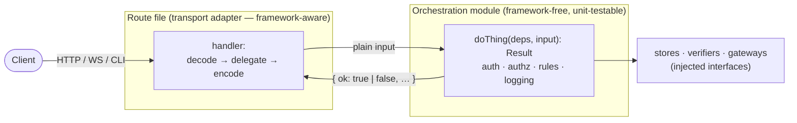

# Architecture Rules

Enforceable, measurable rules that govern how code is structured across this repo.
Each rule states **what** to do, **why**, and a **checklist** you can score any file
against — in review, in an automated linter prompt, or when planning new work. These
extend the prose conventions in `AGENTS.md` §Code Quality and the doc taxonomy in
`docs/documentation-rules.md`; for the system's components and flows see
`docs/architecture.md`. Rules are numbered (`R1`, `R2`, …) so reviews can cite them.

> A rule here is a **fitness function**: if you cannot answer "yes" to every checklist
> item, the code does not pass — regardless of whether it works.

---

## R1 — Transport handlers are thin adapters; domain logic lives in framework-free modules

### Rule

A request handler at a transport edge — an HTTP route (`app.get/post/...`), a WebSocket
method, a CLI command, a queue/job consumer — **only adapts transport to domain and
back**. It does three things and no more:

1. **Decode** the transport input into framework-free values (headers/body/params →
   plain objects; see the `AuthRequest` seam in `auth/jwt-verifier.ts`).
2. **Delegate** the actual decision to a single call into a domain/orchestration module.
3. **Encode** that module's typed result back onto the transport (status code, envelope
   shape, cookie, WS frame).

All authentication gating, authorization, business rules, sequencing of stores/services,
signing, and the logging of those outcomes live in the **module**, not the handler. The
module imports nothing from the web framework (no `Fastify*` types, no `reply`), takes
plain inputs, and returns a typed [discriminated-union `Result`](#result-contract) the
handler maps mechanically.

This is the same boundary `AGENTS.md` §Code Quality states as "separate orchestration
from computation" and "never signal failure with `null`" — R1 is where those land at the
transport edge.



### Why

- **SRP** — the handler has one reason to change (the transport contract); the module has
  one reason to change (the domain rule). Today they change together and force re-reading
  unrelated concerns.
- **DIP / testability** — a framework-free module is unit-testable with a plain input
  object and fakes (per `AGENTS.md` §Unit Testing Philosophy), with no Fastify `inject`
  harness. The transport gets one thin integration test; the branches get fast unit tests.
- **DRY** — result-to-response mapping and the gating sequence are written once, in one
  place, instead of being re-spelled in every handler.
- **ISP** — the module declares a narrow deps interface (only the stores/config fields it
  uses), so collaborators are explicit and swappable.
- **Reuse across surfaces** — the same domain decision can back HTTP **and** WS **and** a
  job consumer when it isn't welded to one framework's request object.

### Checklist (score every handler against this)

- [ ] The handler body is **decode → one delegate call → encode**, with no business
      branching of its own beyond mapping the result.
- [ ] No `reply`, `FastifyRequest`/`FastifyReply`, or other framework type appears in the
      domain module.
- [ ] The domain function returns a **discriminated-union `Result`** — never a bare
      `null`/`undefined`/boolean to signal an expected failure (see Result Contract).
- [ ] Status codes / envelope shaping happen **only** in the handler; the module carries
      transport-agnostic data (e.g. `status` as data, `expiresInSec`, not `expires_in`).
- [ ] Error/outcome **logging lives at the point of the decision** (in the module), with
      `operation` + relevant ids, at the right level (routine churn `info`, anomalies
      `error`) — per `~/.claude/rules/common/logging.md`.
- [ ] The module's deps are a **narrowed interface** (`Pick<...>` / focused interface),
      not the whole `AppDeps`, so only what it uses is visible.
- [ ] The domain logic has **unit tests** that call the module directly with fakes; the
      route has at most a thin integration test for wiring + transport mapping.

### Result Contract

The module returns the repo's `ok`-tagged shape so the handler has a single
`if (!result.ok)` branch and the type system forces both arms to be handled:

```ts
type Result =
  | { readonly ok: true;  /* domain payload */ }
  | { readonly ok: false; readonly status: 400 | 401 | 403 | 409; readonly error: string };
```

Carry the **status as data** when the transport is HTTP so the handler stays mechanical;
for non-HTTP edges carry a `reason` enum the adapter maps. See
`~/.claude/rules/typescript/coding-style.md` §Error Handling for the rationale.

### Reference implementation

`POST /internal/discord/token` is the canonical example of R1 done right:

- **Adapter:** `packages/api/src/routes/discord.routes.ts` — `toAuthRequest` (decode) →
  `mintDiscordToken` (delegate) → snake_case envelope / `reply.code` (encode).
- **Module:** `packages/api/src/auth/discord-token-mint.ts` — `mintDiscordToken(deps,
  request): Promise<DiscordTokenMintResult>`, framework-free, owns the four auth/authz
  gates + signing + logging, declares a `Pick`-narrowed `DiscordTokenMintDeps`.

`issueSession` / `rejectForeignOrigin` in `auth.routes.ts` are the same idea applied to
shared helpers; R1 generalizes it to **every** handler's primary logic.

### Known violations to migrate

These handlers currently interleave transport and domain logic and should be brought to
R1 (extract the gating/orchestration into a framework-free module returning a `Result`):

| Handler | File | What to extract |
| --- | --- | --- |
| `PUT /uploads/local/:uploadId` | `packages/api/src/routes/source.routes.ts` | key-parse + ownership + size validation + `writeAt` orchestration → an upload-sink module returning a `Result` |
| WS methods | `packages/api/src/ws/methods.ts` | confirm each method delegates to a domain module rather than embedding rules inline |

> When you touch a route for any reason, leave it at R1 — do not add new logic to a fat
> handler. New transport edges must be born compliant.

---

## When to update this doc

- A new cross-cutting structural rule is agreed → add `R<n>` with the same
  **Rule / Why / Checklist** shape.
- A known violation is migrated → remove its row (or the table when empty).
- A rule here changes the meaning of `AGENTS.md` §Code Quality → update both in the same
  change; `AGENTS.md` stays the short pointer, this doc holds the measurable detail.
