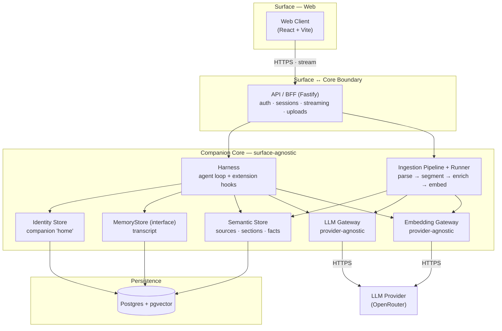
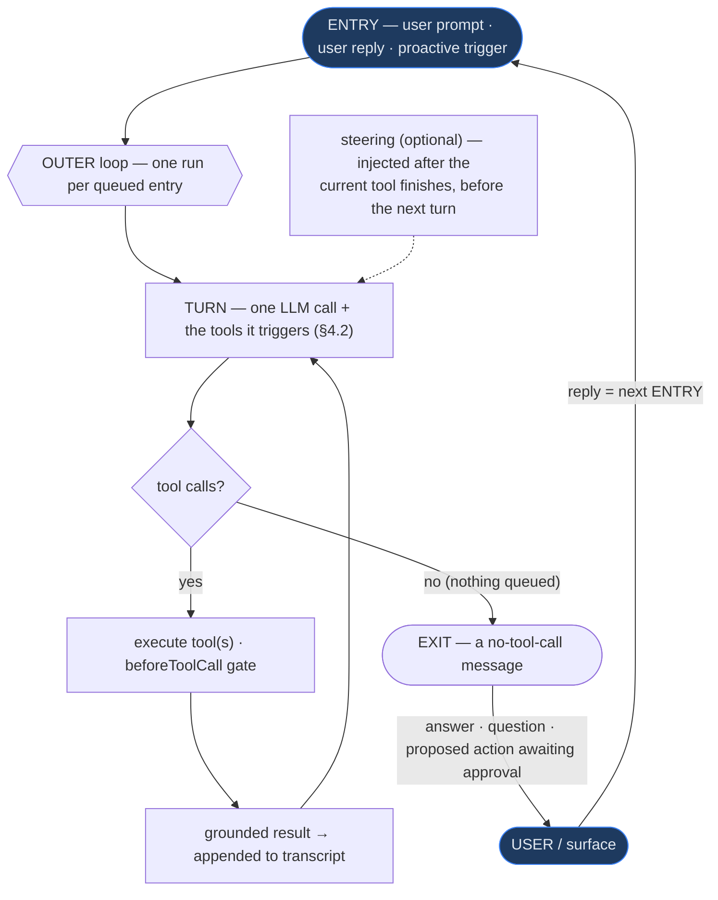
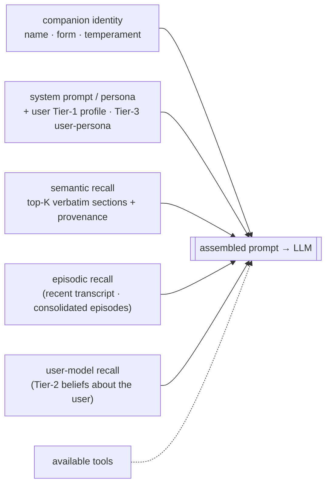
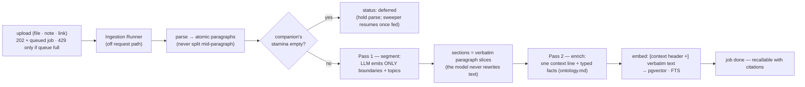
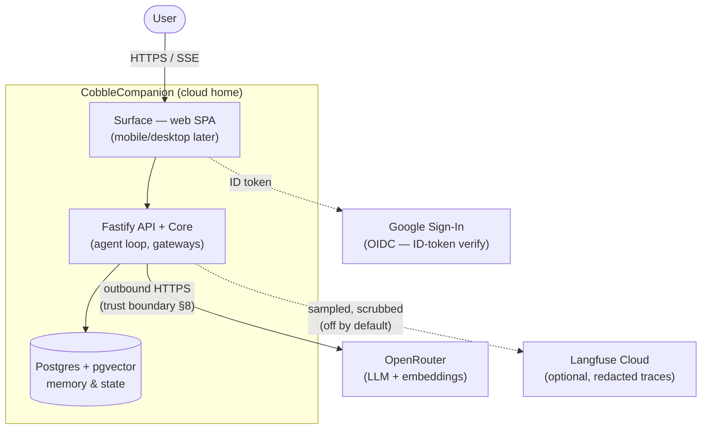

# CobbleCompanion — Technical Architecture

> **What it is:** components, responsibilities, interactions, and flows — enough for a new
> engineer to draw the system on a whiteboard. For the product's *what & why* see
> `product-overview.md`; for *scope & priorities* see `development-plan.md`; for *internal
> mechanisms* (data models, schemas, config, security implementation) see `implementation.md`.
>
> The **Architectural Invariants** (§2) are the load-bearing boundaries — the one-way-door
> decisions that hold across the system.

## 1. Purpose & Scope

CobbleCompanion is **one cloud-resident companion** (`model + harness + memory`) reached through
**surfaces** it embodies in, one at a time (`product-overview.md` §2). The architecture keeps that
companion *core* surface-agnostic, so surfaces (web today; mobile and desktop as future clients)
plug in without a core rewrite. A user creates a Cobble on the **web** surface and holds a
persisted, single continuous conversation (§2, invariant #6).

The companion is a **knowledge organism**: sources are ingested into **semantic memory** (§4.8) and
chat answers ground themselves in them with citations. A background pass consolidates the transcript
into **episodic memory** (recalled by topic, §4.3), and the companion's **personality evolves** from
those episodes. The loop runs a real **inner loop** that calls tools (§4.1–4.2); the
**propose→approve** gate holds every effectful action in an **approval queue** for one-tap
confirmation (§4.4); a **lead inventory** (reading list) and **procedural memory** form the body that
the will drives.

That **will** is a **motivation engine** filling the `Initiator` seam (§4.5): on a lazy idle/return
tick it **reads the lead inventory into memory on its own** (no approval — autonomy is autonomy),
spending real tokens from its **stamina/energy** vitality wallets (§4.8), then posts an in-character
report note. A **reinforcement** loop learns per-drive weights from the **change** in the user's mood
across their reaction to that note — sensed in the agent loop on every turn, which also **attunes**
each reply to the user's mood (full mechanism → `companion-motivation.md`).

**Bond & growth** is a `GrowthService` that derives the four MIRROR axes (knowledge, bond,
initiative, character) + an observed-capabilities checklist from substrate that already exists — a
readout that may move either way, never floored. Alongside it (decoupled) a feeding economy lets the
user spend typed foods from a per-user pantry to refill the two vitality wallets, and a
retrieval-as-hint arm makes procedural memory functional (§4.3) — all
without changing the loop.

Scope boundaries and what lies beyond this release are collected in §9; the roadmap is owned by
`development-plan.md`.

## 2. Architectural Invariants (design decisions)

These preserve extensibility: the implementation behind a seam may evolve, but the **boundary**
does not move — these are the one-way-door decisions.

1. **Core ↔ surface boundary.** The companion core is surface-agnostic and exposed only through
   the API (§5). Surfaces are clients with no companion logic → native surfaces are added as
   clients, never as a core rewrite.
2. **Memory behind an interface.** All memory is reached through a `MemoryStore` boundary; new
   memory kinds are added implementations, not caller changes.
3. **Harness with explicit extension points.** The agent loop defines named hooks for memory
   retrieval, tool invocation, and proactive initiation (§4); filling them is additive.
4. **Companion identity is the canonical "home."** A persisted companion record is the source of
   truth a surface loads from; one active embodiment at a time; surfaces hold no authoritative
   state (see State Management, §6).
5. **Multi-tenant from day one, and per-companion by default.** All state is scoped by `user` or
   `companion`, and the boundary is principled: **per-companion** is anything that is part of a
   companion's identity, memory, mood-reading, **vitality**, behaviour, or growth (a user may own
   several companions — the PoC ships one, but the data model must not assume it). **Per-user** is
   reserved for genuine account / identity / auth / **billing** concerns. Both **vitality** pools
   (stamina + energy, §4.8) are per-companion; a real-money account spend ceiling, if ever needed,
   is a *separate* per-user concept (deferred, §9) — never folded into a companion's stamina.
6. **One continuous conversation per companion.** A companion holds exactly one lifelong
   conversation with its user — there is no conversation/session/thread entity. Transcript
   messages attach directly to the companion, never to a session (the `messages` schema and the
   query shape that reconstructs the conversation → `implementation.md` §1). This is a product
   decision (`product-overview.md` §2) enforced structurally so duplicate/empty sessions cannot exist.
   (The PoC ships one companion per user, but ownership is modelled M:1 — `companions.owner_id` — so
   this per-companion invariant holds unchanged when a user owns several.)

## 3. Component Map

The components and the layers they belong to. The diagram shows the core request path; the full
component set follows in the table below it.



| Component | Owns | Notes |
|---|---|---|
| **Web Client** | Chat UI (incl. citations, in-chat ingestion-status panel, persisted upload turns + live proactive notes), create-a-companion, auth flows, sources page, memory browser + search | Thin client over the API (invariant #1) |
| **API / BFF** | Auth, sessions, routing, response streaming, source intake (multipart), memory routes | The only thing surfaces talk to |
| **Harness** | The agent loop; defines memory/tool/initiation hooks | See §4; the memory hook is filled with semantic recall |
| **LLM Gateway** | Provider-agnostic chat-model access | Default OpenRouter; provider pluggable |
| **Prompt Registry** | Code-as-truth, versioned prompts (`core/src/prompts`) — every system/tool prompt is a typed `PromptTemplate` rendered at its call site | Single source for prompt wording; each LLM call stamps the `promptRef` (semver + content hash) that produced it. See `guide-prompts.md` |
| **Embedding Gateway** | Provider-agnostic embedding access | OpenRouter `/embeddings`; deterministic fake for tests |
| **MemoryStore** | Boundary for the transcript (episodic substrate) | The companion's single transcript (`messages`), keyed by `companion_id`; a turn may carry an optional `source_id` (an upload's attachment + acknowledgement) so the chat reconstructs them on reload |
| **Ingestion Announcer** | Proactive transcript note when a read ends (§4.8) | On `done`/`failed`, posts an in-character, **metered** assistant turn (canned fallback when stamina is empty / on failure); fired by the pipeline, decoupled from it |
| **Semantic Store** | Sources (verbatim), sections (vector + FTS), fact overlay, ingestion jobs | Hybrid retrieval with provenance; contract → `ontology.md` |
| **Ingestion Pipeline + Runner** | Two-pass source reading off the request path (§4.8) | Durable status in `ingestion_jobs`; replaceable by a real worker |
| **Episodic Store** | Consolidated, time-anchored episodes (vector + FTS) + the consolidation cursor | Derived from the transcript (rebuildable); hybrid recall by topic (§4.3) |
| **Consolidation Service + Runner** | Off-request reflection: transcript window → consolidated episodes, filler dropped | Mirrors the ingestion runner — coalesced, serial, quota-gated; post-turn trigger + startup/periodic sweep |
| **Personality Evolver** | Re-synthesizes `evolvedPersona` from episodes after consolidation | Cursor-gated, metered; blended into the persona prompt beside the seed |
| **User-Model Store** | The companion's structured + synthesized understanding of its user — `user_facts` (Tier-1 core profile **incl. the name** + the Tier-2 learned-belief overlay; `companions.user_persona` Tier-3 is _designed, not built_) | Behind the MemoryStore seam (invariant #2); **one ontology, the user is a privileged entity** (`ontology.md`); `user_facts` is **per-user** (objective truths, shared across the user's companions), Tier-3 is per-companion. Tier-1 facts **replace** on revision, except `languages`/`relationships` which accrete (`MULTI_VALUED_PREDICATES`); Tier-2 beliefs hybrid-recalled (§4.3), reconciled current-state (last-wins **replace**; the superseded chain is dropped in Phase 13 — timeline lives in episodic memory), salience **decays lazily**. **Built: Phases 11–12 (Tier-1 + Tier-2)** — see `companion-memory.md` §4 Status. Schema → `implementation.md` §1; mechanism → `companion-memory.md` §4 |
| **User-Fact Extractor** | Inline salient capture: a post-turn perception step that writes explicit, high-signal user-facts (sibling to affect sensing) | Conservative — explicit statements only; metered. Dedup/inference/hygiene deferred to the reflector (§4.3, §4.5); gated by the `user-extract` eval (`howto-run-evals.md`) |
| **User-Model Reflector** _(Phase 12 beliefs built · Phase 13 persona designed)_ | Background reflection over the **raw transcript window** → inferred Tier-2 beliefs (`add`/`reinforce`/`replace` reconciliation, embedding dedup); a sibling **`LlmUserPersonaSynthesizer`** synthesizes the Tier-3 `user_persona` on its **own cursor** (`user_model_updated_through_seq`), additively blended beside `evolvedPersona` (Phase 13) | Extends the Consolidation Service pattern (off-request, **own cursor `user_facts_through_seq`**, metered); reads the un-summarized transcript (not episodes) so implicit-belief signal survives; the mirror of the Personality Evolver, modelling the user instead of the self (`companion-memory.md` §4 Status) |
| **Identity Store** | Companion "home" record (incl. `evolvedPersona` + evolution/consolidation cursors; `user_persona` + the user-model cursor are _designed, not built_ — Phase 13) | Source of truth surfaces load from |
| **Stamina Wallet** (`VitalityStore`) | The user-initiated half of a companion's vitality — a per-companion token balance (§4.8) | Postgres-backed (`companions.stamina_balance_tokens`); spend decrements (floor 0), feeding adds; routes 429 at the boundary when empty |
| **Persistence** | Relational + vector storage | Postgres + `pgvector`; schemas → `implementation.md` |
| **Eval Harness** | Offline dataset/scorer/runner eval framework (`packages/eval`) | Not on the serving path; live OpenRouter. memory-recall + stateless + injection datasets. See `companion-memory.md` §5, `howto-run-evals.md` |
| **Trace Sink** | Online tracing seam (`core/src/tracing`) — per-turn trace with assemble_context/llm_call/tool_call spans | No-op by default; the Langfuse Cloud adapter lives in `api/src/tracing`, sampled + redacted. See `runbook-tracing.md` |
| **Tool Registry + Tools** | The tools a turn advertises + dispatches (`core/tools/`): `web_fetch`, `memory_search` (read-only), `ingest_source` (effectful) | Read-only tools run freely; the gate holds effectful ones (§4.4). `web_fetch` reuses the link resolver; `ingest_source` reuses the ingestion pipeline |
| **Approval Queue + Gate** | The `beforeToolCall` gate + the `proposals` store — holds effectful calls for one-tap approval, resolved exactly once | The mechanical realization of propose→approve (§4.4); confirm executes via `dispatchTool` |
| **Tool-Call Log** | Append-only audit of every executed tool call (`tool_calls`) | The `afterToolCall` hook records all calls — every tool call is logged |
| **Lead Inventory** | The companion's reading list (`leads`) — discovered-but-unread URLs | Populated by `web_fetch` link harvest; worked on command (`/explore`) and by the motivation engine on idle (§4.5) |
| **Procedural Store** | Learned, reusable workflows seeded from approved actions (`procedural_memories`) | Browseable, and surfaced as a `RetrieveContext` hint arm (§4.3) so a routine resurfaces and is reused |
| **Motivation Engine** | Fills the `Initiator` seam — drives × presence → bounded autonomous explore burst | Reads the lead inventory into memory on its own (no approval), bounded by energy; posts an in-character report note. Includes presence, change-as-reward reinforcement, and an off-request runner/sweep. Mechanism → §4.5, `companion-motivation.md` |
| **Energy Wallet** | The self-initiated half of the §4.8 two-wallet vitality (`companions.energy_balance_tokens`) | Per-companion token balance; a separate wallet from stamina (the `Stamina Wallet` above), metered by the same `VitalityStore`, so autonomy can't starve interaction |
| **Food Pantry** | The user's seeded inventory of typed foods (`user_food`) — the feeding economy's supply | Per-user counts of `ration`/`spark`/`treat`; `POST /feed` consumes one and refills the fed companion's wallet(s) (`companion-economy.md`) |
| **Growth Service** | Derives the four MIRROR axes (knowledge, bond, initiative, character) + the observed-capabilities checklist from substrate | Growth is DERIVED — a readout that may move either way, never scored or floored. Recompute is post-turn and token-free; the read is a snapshot. Decoupled from feeding. Mechanism → §4.3; data model → `implementation.md` §1 |

## 4. The Agent Loop & Harness

The harness is the companion's "nervous system" and the most product-defining part of the
architecture. It adopts a proven agentic-loop pattern — **turn primitive · outer + inner loops ·
steering · before/after-tool hooks · failures-as-data · transcript-as-truth · the human as the
loop's exit/entry boundary** — the same lineage as the sibling **CobbleTradeAdvice** project,
adapted here for a **cloud, multi-tenant, proactive** companion (the two adaptations: propose→approve
realized as a `beforeToolCall` gate, §4.4; and **proactive initiation** as a non-human loop entry,
§4.5).

The **loop shape is an architectural invariant** (§2 #3): the same shape carries an empty-tool-set
turn (the inner loop turns once and exits), a multi-tool inner loop, and a proactive (non-human)
entry alike. The §4.6 sequence diagram shows a concrete single-pass realization. *(Hook signatures +
concrete context assembly: `implementation.md` §2.)*

### 4.1 The loop (outer + inner)

The **outer loop** drains queued entries (one run each); the **inner loop** turns. *A turn = one LLM
call plus the tool executions it triggers.* The inner loop keeps turning while the model keeps
calling tools and stops when the model returns a message with **no tool calls** — that stopping point
is the **EXIT**, where control returns to the user (or surface).



> When the tool set is empty, `tool calls? → no` always holds — the inner loop turns once and exits.
> Otherwise the inner loop is real: the model may call tools, each runs (read-only) or is held by the
> gate (effectful), the result re-enters as the next turn, bounded by a max-iteration + token ceiling
> (§4.7). Proactive entries arrive the same way.

### 4.2 The turn (the primitive)

One turn, as a state machine. This is where the **before/after-tool hooks** and grounding live —
the seams Phases 1/3 fill (invariant #3).


> With no tools, every turn is `context → LLM → message → EXIT`. The right-hand branch —
> `validate args → beforeToolCall (gate) → execute → afterToolCall (log)` — runs when the model calls
> tools; tool calls/results are replayed to the provider in the OpenAI tool-call wire shape, and the
> gateway accumulates streamed `tool_calls` fragments (`implementation.md` §2).

### 4.3 Context assembly (what enters each turn)

Each turn rebuilds context from the companion's "home" + its memory. The dashed inputs are the
**memory-retrieval hook**, filled per phase.



> **Semantic arm.** The memory-retrieval hook embeds the user's question, hybrid-searches the
> semantic store (vector + lexical + metadata, fused), and prepends each hit as a
> provenance-carrying grounding block; the hit's citations are streamed to the client before
> the answer. Retrieval failure degrades to recency-only — recall never breaks the
> conversation. (Hook signature → `implementation.md` §2.1.)

> **Episodic arm.** The same hook carries an **episodic arm** composed ahead of the semantic arm
> (`composeRetrieveContext`, so the recency window is still appended once, last): it embeds the
> turn, hybrid-searches the **episode store** (consolidated, time-anchored memories), and prepends
> each as a fenced "memory from your shared history" block. Episodic recall is **topic-only**: the
> same vector + FTS hybrid (RRF) as the semantic arm. Episodes carry a wall-clock span (rendered as
> the block's date) and a self-reported salience, but neither steers recall — the span is a date
> annotation and RRF ranks by fused vector/FTS rank alone (filler is dropped at consolidation, not
> down-weighted at recall; see §9). The episodes themselves are formed **off the request path** by a
> background **consolidation** pass (reflection over the transcript → consolidated summaries with
> filler dropped, embedded; cursor-driven, idempotent, quota-gated — the ingestion runner/sweeper
> shape), triggered post-turn and on a startup/periodic sweep. Consolidation also drives
> **personality evolution**: an `evolvedPersona` re-synthesized from episodes and blended into the
> persona prompt (input #1) beside the immutable seed temperament. Episodic recall degrades to no
> episodic blocks on failure — recall never breaks the conversation.

> **Affect-attunement line.** Prompt assembly (`assembleContext`) also injects a short
> **affect-attunement** system line built from the companion's rolling read of the user's mood
> (`companion_affect`, sensed in the loop the prior turn) — "the user has recently seemed {note};
> attune your tone and detail." The mood *note* is surfaced; the valence number never is. Omitted
> when there's no meaningful read, and loaded best-effort so a store hiccup costs attunement, never
> the reply. This is the **fast loop** of the affect mechanism (§4.5, `companion-motivation.md` §7).

> **Procedural arm.** The same hook carries a **procedural arm** composed ahead of the semantic arm
> (grounding-only, so the recency window still appends last). It surfaces a relevant **learned
> routine** (`procedural_memories`) as a "you've done this before, like so" system hint, matched
> cheaply by title/keyword overlap (no embeddings — procedures are short and few). This is what makes
> the **capabilities** checklist *functional* rather than only observed: a learned workflow resurfaces
> and can be reused. Degrades to no hint on failure (recall never breaks the conversation). No loop
> change — another arm in the one memory hook (invariant #3).

> **User-model arms (knowing the user).** The companion's understanding of its user enters a turn in
> three ways, two of them here. **Tier-1 (core profile)** — the current identity attributes from
> `user_facts` (`name`, pronouns, `bornOn`, `livesIn`, `worksAs`, …; the name is just one such fact,
> not a `users` column) — is rendered into the **persona system prompt** (input #1), small enough to
> carry every turn (no retrieval). Most are singular (a new value replaces the old); `languages` and
> `relationships` are multi-valued and accrete. The persona renders **Tier-1 only** — a non-Tier-1
> predicate (a future Tier-2 belief sharing the table) is filtered out, never leaking into the
> every-turn prompt. **Tier-3 (user persona)** — `companions.user_persona`, the synthesized
> "who you are to me" — is blended into that same persona beside `evolvedPersona`, the symmetric
> self-model. **Tier-2 (learned beliefs)** — `prefers`/`interestedIn`/`believes` user-facts, too many
> for context — is a **retrieval arm**: it embeds the user's turn and hybrid-searches the *current*
> Tier-2 `user_facts` (vector + FTS, RRF — the semantic/episodic pattern), prepending
> the top-K as a fenced "what I know about you" block. The vector arm carries a **relevance floor** (a
> max cosine distance, `implementation.md` §1): a belief farther than the floor is dropped, not pulled in
> to fill the top-K — so the block is what's *relevant now*, not every belief while the user has ≤ topK of
> them. **Unlike** the semantic/episodic arms (which rank
> by fused relevance alone), the belief arm then tilts the fused score by `salience` (`1 + 0.5·salience`,
> `implementation.md` §1) — a gentle prior, so a reinforced belief rises and a cut one sinks among
> comparably-relevant hits, without dragging in beliefs no arm found relevant. **From Phase 13 the
> salience used here is the *effective* (lazily-decayed) value** — `salience × decay(now − updated_at)`,
> a uniform half-life computed at read time (no sweeper) — so a belief that hasn't been reinforced fades
> from the block on its own, and below a floor drops out entirely (`implementation.md` §1). **From Phase
> 13 the arm also renders by certainty:** a fresh/reinforced belief is stated as known, a faded or
> low-confidence one as a hunch (and the companion is licensed to ask to confirm) — so forgetting is
> graceful and self-correcting, never a confident wrong assertion. Reads the **current overlay** (last-wins
> *replace*, not a superseded chain — `user_facts` holds *now*; the "loved coffee → quit" timeline lives in
> episodic memory). Composed ahead of the semantic arm so the recency window
> still appends last; degrades independently (recall never breaks the conversation). The facts
> themselves are written by **inline salient capture** (post-turn perception widened in Phase 12 to
> explicit beliefs, §4.5) and refined by **background reflection** (the User-Model Reflector, which
> reads the **raw transcript window** under its own cursor `user_facts_through_seq`, reconciles
> `add`/`reinforce`/`replace`, and later synthesizes Tier-3 — same off-request, quota-gated shape as
> the Personality Evolver). One ontology, the user a privileged entity (`ontology.md`); mechanism
> end-to-end → `companion-memory.md` §4.

### 4.4 Human-in-the-loop & propose→approve

There are **no dedicated "ask" or "confirm" steps** — the loop runs until it has something to say,
then EXITs with a plain message; the user's reply is the next ENTRY. The product's **propose→approve**
trust model (`product-overview.md` §5.3) is realized mechanically as the `beforeToolCall` gate: a
read-only tool runs freely, but an **effectful/costly** tool call (book · send · pay) is **blocked**,
forcing an exit-to-approve. **Every** effectful call in the turn is held — the loop collects them all
rather than bailing on the first — and each is written to the transcript as a `proposal` row so the
held action survives a reload.

On **approval**, the confirm route resolves the proposal exactly once, executes the held call
(`dispatchTool`), logs it, records a friendly outcome row, and then **re-enters the agent loop**
(`Harness.continueAfterApproval`): the outcome is injected as an ephemeral observation, so the
companion *narrates* the result and continues whatever the user asked ("…then summarize what you
saved") — rather than the conversation dead-ending on a raw tool line. No suspended generator is
resumed; the transcript is the only state (§4.7). Approving an action mid-continuation can itself
produce a new proposal — the gate re-applies. **Reject** resolves the proposal without executing.
When the proposal is **explore-origin** (it carries the originating `lead_id`), resolving it also
closes that lead's lifecycle — confirm→`ingested`, reject→`discarded` — so a worked lead leaves the
reading list instead of being stranded at `read` (best-effort; never fails the user's action).

> **Approval gates *consequence*, not *cost*.** The gate exists to stop the companion
> taking a **consequential, outward** action (book · send · pay) without sign-off. It is **not** what
> bounds *cost* — that is the energy/stamina budget (§4.8). So **autonomous work is not gated**: the
> motivation engine (§4.5) **reads** leads into the companion's own memory on its own, bounded by
> energy, with no proposal — autonomy is autonomy. The approval queue remains for **chat**-origin
> effectful calls and the user-initiated **`/explore`** command; it would also catch any future
> outward/irreversible tool, which don't exist yet (revisited when they do).
>
> **Post-approval "what next" (chat vs explore).** On a **chat**-origin approval the confirm route
> re-enters the loop so the companion narrates the result and continues the ask ("remember it **and**
> summarize it") — terminality isn't knowable at propose time, so the model must get the post-approval
> turn. On an **explore**-origin approval (the user-initiated reading-list command) there is no
> conversational task to continue, so confirm executes + advances the lead and returns without
> re-entering. The `proposals.origin` marker (`chat` | `explore` | `autonomous`) carries this;
> autonomous reads run free and create no proposal, so a held proposal is `chat`- or `explore`-origin.


> **Generalized invariant:** the companion never executes a consequential, outward action
> without explicit user approval. Realized as the `beforeToolCall` gate: an effectful tool call is
> written to the `proposals` queue and the loop EXITs; the confirm route resolves it **exactly once**
> (a conditional `pending→approved` claim) and runs the held call. Reject drops it. Data model +
> exactly-once mechanics → `implementation.md` §`proposals`.

### 4.5 Proactive initiation

The companion-specific extension of the pattern: an outer-loop **ENTRY can be generated by the
motivation engine**, not only by a human. This is what makes the companion proactive rather than
passive (`product-overview.md` §5.4).


> The motivation engine (`packages/core/src/motivation/`) fills the `Initiator` hook
> (architecture.md invariant #3). It is the **"will"** of a deliberate **body-then-will split**: the
> *body* is the tools, the propose→approve gate (§4.4), the tool-call audit log, and the **lead
> inventory** (a persistent frontier of discovered-but-unread leads, e.g. URLs spotted while reading);
> the *will* drives that body on its own. An autonomous, exploring, token-*spending* companion is
> acceptable because its self-initiated work is **inherently bounded** — it only **reads into its own
> memory** (nothing outward), **every tool call is logged**, and **energy caps how much it can do**
> (§4.8). Outward/irreversible acts still route through the approval gate (§4.4); none exist yet. The
> read loop is *identical* whether a human or the engine triggers it — worked **on the user's
> command** ("go through your reading list", which proposes for review) it is the same path the engine
> runs **on an idle tick**, freely.

> **The reward is conversational (paired with §4.4), and sensed in the loop.** After the
> engine reads, it posts **one in-character report note** ("here's what I read"). The harness senses
> the user's mood on **every** turn (`perceiveAndLearn`); when a note is awaiting a reaction, the
> **change** in mood across that reaction is the reward that nudges the served drive's weight
> (reinforcement mechanism → `companion-motivation.md` §7) — no separate critic call, no
> approve/reject button. **The same per-turn perception also runs the User-Fact Extractor** (§4.3):
> alongside reading mood, it conservatively captures explicit user-facts from the exchange (sibling
> call site, also stamina-metered) — inline salient capture, with inference and hygiene left to the
> background reflector. There is no approval round-trip
> for autonomous work to "continue" from — the engine sees the **full** updated state on its own
> cadence and decides the next move itself. (The confirm route still re-enters for `chat`-origin
> approvals — a present partner to reply to, §4.4.)

**Full mechanism — the drive taxonomy, the arbitration math, seeding from temperament, the learning
loop, and worked examples — is canonical in `companion-motivation.md`.** This section is the
loop-integration overview.

The engine's parts (each additive, no loop change):

- **Trigger (lazy, web-appropriate)** — the engine ticks on **user activity + on return** (the
  request path) and on a **periodic sweep** across companions worth ticking (the background-runner +
  sweep pattern already used for consolidation, §4.3). Each tick asks "is there anything worth
  doing?" → emit a non-human ENTRY, or stay idle. It is **not** an always-on per-companion drain.
  (On web, away-work is unseen until return, so it folds into the return tick; see §9.)
- **Environment & presence (the dominant context)** — behaviour is shaped first by a **presence
  spectrum**: *active* (typing / just sent) · *attentive* (here but idle — the best moment for a
  tip/question) · *away-short* · *absent-long*. Derived from a client **heartbeat** (tab
  focus/visibility) + last-activity recency — a volatile signal, not persisted. Present → engage the
  user, don't wander into solo work unasked; away/absent → do solo work that surfaces on return; and
  **idle is always allowed**. Other environment inputs: available tools, the lead frontier, and
  remaining energy (below).
- **Drives (what it wants)** — **learned** user interests (from Phase 12, sourced from the explicit
  **Tier-2 `interestedIn`/`prefers` belief set** rather than scraped out of episodic memory — a sharp,
  typed signal of what the user actually cares about; **Phase 13 ranks these candidates by *effective*
  (lazily-decayed) salience**, so a stale interest stops driving bursts — §4.3) +
  understanding-the-user + the companion's
  personality (seed temperament + evolved persona, §4.3) + pending **leads** (the inventory) + bond
  maintenance (time since last contact) + pending work/opportunities + an **approval/reinforcement**
  drive learned from feedback (below) (`product-overview.md` §5.4).
- **Arbitration (cheap gate, then a burst)** — a **token-free heuristic gate** scores candidate
  actions by drive × salience (against presence, the dial, and remaining energy) and decides
  *whether* to act — so **"idle" is a valid, free outcome**. Only when it commits does the burst run
  the chosen move (the only token spend), **bounded by what energy can afford** (§4.8).
- **Attention model (the "creature")** — each initiation is a **bounded burst**, never a full drain
  of the inventory. **Focus length** (the burst size before re-deciding) shapes it, running at shared
  default constants (`companion-motivation.md` §6). The companion scopes the burst to what energy can
  afford rather than draining the whole inventory.
- **Budget (stamina & energy)** — self-initiated work spends **real tokens** drawn from the
  **energy** pool (§4.8); each autonomous read is billed to energy via a per-run meter override on
  the shared ingestion pipeline. When energy is exhausted the engine stops initiating (the gate
  idles) while chat still runs on **stamina**, so autonomy can never starve interaction. The burst is
  **energy-aware**: it plans no more reads than energy can afford (the exact sizing bound lives in
  `companion-motivation.md` §6).
- **Reinforcement (learning what lands)** — the companion learns from **conversation**,
  like a person: the harness senses the user's mood on **every** turn (`motivation/affect.ts`, in the
  agent loop) and feeds the prior read forward to **attune** the next reply (the fast loop). After it
  reads and posts a report note, the **change** in mood across the user's reaction is the reward → an
  **additive nudge** to the served **drive weight** (the delta is sensed in the loop; the exact
  signal and how it moves weights → `companion-motivation.md` §7; a zero change is a no-op, so
  neutrality needs no threshold). No critic
  call, no approve/reject button. Learning fires on such a drive-serving act; ordinary chat senses but
  does not move weights. Weights are interpretable and seed the relationship-growth axis. **From Phase
  12 the reward also targets the *belief* that drove the act:** when the burst was belief-driven, the
  same mood-change reward adjusts that Tier-2 belief's **salience** — reinforced when appreciated,
  weakened when unwelcome (a flat reaction moves nothing) — so beliefs are learned from how the user *reacts to the companion acting on
  them*, not only from what they say (the belief-learning loop, `companion-motivation.md` §7).
- **Output** — the engine **reads** the next leads into the companion's own memory
  **with no approval** (autonomy is autonomy, §4.4), then posts **one in-character report note** to
  the transcript; a belief-driven burst tags the note with its originating belief
  (`proactive_outcomes.driven_by_user_fact_id`) so the reaction can be credited back to it. Outward/irreversible
  acts (none exist yet) would still pass the §4.4 gate.
- **Tunability** — a per-companion **frequency/intensity dial** (off / gentle / active) scaling
  initiation rate and energy spend.

The engine plugs into the **lead inventory** and the `Initiator` contract. What lies beyond this
release — unprompted conversation beyond the report note, continuous work-while-away, deeper RL — is
collected in §9.

### 4.6 A single-pass turn (end-to-end)

The loop instantiated across the real components for a no-tool turn — single-pass, with streaming:

```mermaid
sequenceDiagram
    actor User
    participant Web as Web Client
    participant API as API / BFF
    participant H as Harness
    participant Id as Identity Store
    participant Mem as MemoryStore
    participant GW as LLM Gateway
    participant LLM as LLM Provider

    User->>Web: send message
    Web->>API: POST message (authed)
    API->>H: ENTRY → dispatch turn
    H->>Id: load companion "home"
    H->>Mem: retrieve context (recent transcript)
    Note over H: context assembled (§4.3); tool set empty
    H->>GW: invoke model
    GW->>LLM: HTTPS (streamed)
    LLM-->>GW: token stream
    GW-->>H: stream
    H-->>API: stream tokens
    API-->>Web: SSE / WebSocket
    Note over H: no tool calls → EXIT
    H->>Mem: persist turn
```

### 4.7 Loop invariants

- **Termination.** *Normal:* the model stops calling tools, or the gate forces an exit (a held
  proposal). *Abnormal — a no-progress dead loop:* guarded by a **max tool-iteration
  count + a per-run token budget**; hitting either ends in **exit-to-user-with-partial** (logged).
- **Failures are data.** A provider error or a tool throw becomes an ordinary turn outcome (an error
  message / an error result) that re-enters the loop — uniform recovery, and gaps are surfaced, never
  fabricated.
- **Transcript is the source of truth.** Append-only; reconstructable into context. **The rendered
  conversation — live *and* after reload — is a projection of the transcript, never a richer separate
  reality.**
  So everything the user sees is a persisted row: a grounded answer carries its `citations` (metadata),
  a read-only look-up is a `tool_step` row, a held action is a `proposal` row. Rows carry a **`kind`**
  (`message` | `tool_step` | `proposal`) and `metadata`; the **LLM-context projection includes only
  `message` rows** (tool steps + proposals are UI chrome and never re-enter the model's context, nor
  episodic consolidation). Live streaming is a *progressive preview* of rows that will be persisted; a
  turn that produced tool-step/proposal rows reconciles the surface against the transcript on settle.
- **State is authoritative only at the home.** Surfaces never hold loop state (§6); a run reads from
  and writes back to the cloud home.

### 4.8 Ingestion flow

How a source becomes semantic memory — **two output-bounded reading passes** off the request
path. The economics are deliberate: input tokens are cheap and output tokens are the cost
lever, so the model *reads everything* but *emits almost nothing* (~1% of input in Pass 1,
~10% in Pass 2).



Design rules (the "improved staged hybrid"; memory guide → `companion-memory.md`):

- **Original text is canonical.** Sources are stored verbatim; sections are verbatim paragraph
  slices; the fact overlay (`ontology.md`) is an index *into* the text, rebuildable from it.
- **Paragraphs are atomic.** Segmentation groups whole paragraphs into cohesive sections —
  blind fixed-size chunking is structurally impossible.
- **Embedding input ≠ stored text.** The optional Pass-2 context header is prefixed onto the
  *embedding input only* (it injects the entities unresolved pronouns hide from the encoder);
  stored and displayed text is always pure original. Header on/off is an eval A/B knob.
- **Dual retrieval.** Semantic (vector cosine) + lexical (FTS) fused by reciprocal rank, plus
  metadata paths (source, fact-overlay entity) — every hit carries provenance (source, chapter,
  paragraph/page range) so answers cite and can show the original passage.
- **Failures are data.** A failed run lands on the job as a user-safe error; the durable
  status surface (`ingestion_jobs`) is what makes the in-process runner replaceable by a real
  worker with no schema or API change (§8). It also makes restart recovery clean: interrupted
  in-flight jobs are failed on startup (re-upload), while `deferred` jobs keep their parse and
  resume.
- **The companion speaks up when a read ends.** On a terminal outcome (`done`/`failed`, never
  `deferred`), the pipeline asks the **Ingestion Announcer** to post a short, in-character
  assistant turn to the transcript ("By the way — I've finished reading X…"). It is generated in
  the companion's voice through the metered gateway (so its tokens are spent from stamina)
  and **falls back to a canned line** when stamina is empty, generation fails, or there is no
  persona — the user is always told, the companion never goes silent. The note is appended **before**
  the job flips to its terminal status, so a client polling the job sees the note already in the
  transcript; an announcement failure is logged and never changes the job's recorded outcome.
  Surfacing: the upload's own attachment + acknowledgement turns are persisted (`messages.source_id`)
  too, and the open chat pulls the proactive note in live off the ingestion-status poll.
- **Re-running a source is idempotent.** A run writes a source's whole section set in one call,
  *replacing* (not appending to) any prior sections for that source — so a re-run never duplicates
  sections/facts or inflates counts (orphaned facts cascade with their sections). This holds
  however a re-run is triggered, which lets the in-process runner give way to an at-least-once
  worker without a dedupe layer. The deferred-job sweeper reinforces this upstream: it **atomically
  claims** each parked job (`deferred → queued`, conditional) before enqueue, so two overlapping
  sweeps can't resume — and re-bill — the same job twice.
- **Vitality wallets = the spend control.** The real resource is LLM/embedding **tokens**, so each
  companion holds two token **wallets** it spends down as it works — there is no cap and no daily
  window. A wallet only goes **down** (each LLM/embedding call subtracts its tokens, floored at zero —
  a turn that overshoots just empties it, never goes negative) and **up** by **feeding** (the only way
  it refills — §`companion-economy.md`). Wallet state lives in Postgres as two columns on the
  companion row (`companions.stamina_balance_tokens` / `energy_balance_tokens`), so it is correct
  across replicas — unlike a per-instance request limiter. Each
  route enforces it inline: **chat & search** pre-flight-check and return **429** when the wallet is
  empty; **ingestion defers** (see below) until the wallet has tokens again (i.e. after feeding) —
  the sweeper resumes it. Actual token counts come from the provider's `usage` (estimated only if a
  model omits it). Because **ingestion is serial** and **chat is turn-based**, there is no in-app
  concurrency to outrun the post-hoc accounting — the serialization *is* the burst backstop (threat
  model: legitimate-user cost control via a finite wallet, not attacker resistance). The runner still
  caps queued+in-flight runs (`INGESTION_QUEUE_MAX`) as a memory backstop. Knobs →
  `implementation.md` §config.
  - **Abandoned chat turns are metered by cause.** A turn the **client aborts** mid-stream (it stops
    reading — a disconnect) still **spends** the tokens already streamed (estimated from the deltas
    seen), so a client can't stream a full answer and drop before the provider's trailing usage frame
    to get it free. A turn that breaks on a **provider/infra fault** (the stream throws) is **not**
    spent for the failed part — we err in the user's favor on our own failures; in a multi-turn tool
    run the already-completed turns are still spent, only the broken one is free. The metering wrapper
    (`meteredLlmGateway`, `usage.ts`) makes the distinction: a thrown error leaves the in-flight turn
    out of the accumulator, a consumer `.return()` deposits the estimate.
  - **Stamina & energy (two wallets).** Both are facets of a **companion's** *vitality* — its capacity
    to act, denominated in tokens — so both are columns on the **companion** row; they split by *who
    initiated* the work. **Stamina** is the user-initiated wallet (chat, assigned tasks —
    `stamina_balance_tokens`). **Energy** is the self-initiated wallet (the motivation engine's
    proactive turns and exploration — `energy_balance_tokens`). What guarantees autonomous work can
    **never starve interaction** is that they
    are **separate wallets**: when energy is empty the engine stops initiating (`Initiator` idles,
    §4.5) while chat keeps running on stamina. (A real-money **account** spend ceiling across all of a
    user's companions would be a *separate* per-user concept — deferred, §9; it is not the companion's
    stamina.) The user replenishes both by **feeding** from a per-user **pantry** of typed foods
    (`ration`→stamina, `spark`→energy, `treat`→both; `POST /feed`, mechanism → `companion-economy.md`)
    — there is no currency and no auto-refill. **Autonomous reads spend real tokens** drawn from energy
    via a per-run **meter override** on the shared ingestion pipeline — the run spends the companion's
    energy wallet instead of its stamina and skips deferral (the engine gates on energy itself,
    per-lead; the override wiring is an implementation detail, `implementation.md` §3). The burst is
    **energy-aware** — it scopes the number of reads to what energy affords (§4.5) — so the companion
    scopes its work to its means, not just stopping at zero. The per-turn **affect read** that senses
    the user's mood rides on the chat turn, so it spends **stamina**. User-initiated work (chat,
    `/explore` approvals) spends stamina; the engine's self-initiated reads spend energy.

#### Supported source formats (acceptance contract)

A source reaches a parser through one of **three input channels** — a **file upload**
(`POST .../sources/file`, multipart), a **typed note** (JSON `text`), or a **link** (fetched
URL). All three converge on **one content-type → parser registry**, so a format is parsed the
same way no matter how it arrived. The channels differ only in how they *identify* content:

- **Upload** — content type follows from the filename extension, then **confirmed against magic
  bytes — never the extension alone** (the route rejects a `.docx` that isn't a zip, a `.pdf`
  without `%PDF-`, etc.).
- **Link** — the resolver fetches the URL (SSRF-guarded, size-capped) and **detects the content
  type**: the HTTP `Content-Type` header first, then a magic-byte sniff, then the URL extension,
  then a plain-text fallback. So a link to a **PDF, Markdown, or plain-text** resource is read
  with that format's parser — not assumed to be HTML.

`INGESTION_MAX_BYTES` caps every upload and every fetched link body. This table is the canonical
list of what the system accepts; **Content type** is the registry key, reachable by any channel
whose check resolves to it.

| Content type | Extension(s) | MIME / magic | Reachable via | Parser |
|---|---|---|---|---|
| `pdf` | `.pdf` | `application/pdf`; magic `%PDF-` | upload, link | `unpdf` (pdf.js), page-aware provenance |
| `html` | — | `text/html`, `application/xhtml+xml` | link | fetch → Mozilla Readability |
| `text` | `.txt` | `text/plain`; rejected if it looks binary (NUL byte without a Unicode BOM) | upload, link, note | BOM-aware UTF-8/UTF-16 decode → paragraph split (the note parser) |
| `markdown` | `.md`, `.markdown` | `text/markdown` | upload, link | markdown stripped to prose → paragraph split |
| `docx` | `.docx` | wordprocessingml MIME; zip magic `PK` | upload, link | `mammoth` raw-text body extract |
| `pptx` | `.pptx` | presentationml MIME; zip magic `PK` | upload, link | per-slide `<a:t>` extract, slide → page provenance |

**Explicitly out of scope** (unsupported uploads get a 400; unidentifiable link bodies are
rejected): legacy OLE binaries (`.doc`, `.ppt`), spreadsheets/tabular data (`.xlsx`, `.csv` —
the paragraph model doesn't fit rows), and binary link content with no recognized type (images,
video, archives). `.docx`/`.pptx` share the zip `PK` magic, so the extension (upload) or MIME
header (link) is the discriminator; the parser confirms the inner structure. The decoupled
design lives in `content-parser.ts` (registry), `source-parser.ts` (payload → document facade
the pipeline depends on), and `link-resolver.ts` (fetch + detect). Every parser's output is
control-character-sanitized at the boundary (`text/sanitize.ts`): extracted text routes through
`sanitizeText`, which drops NUL and other C0/C1 control characters (PDF/pdf.js extraction is the
common source of embedded NUL) so the canonical `raw_text` and everything derived from it is safe
for the Postgres `text` store — a NUL would otherwise abort the write. The persistence layer also
applies a NUL-only guard on write as a last line of defense.

> **Empty-stamina deferral.** Parsing is free (no tokens); the **AI passes** (segment/enrich/embed)
> are the cost. When the companion's stamina is empty, the pipeline parses the source,
> persists the parsed paragraphs on the job (`ingestion_jobs.parsed_doc`), sets status `deferred`,
> and stops — no re-upload needed. A periodic sweeper resumes deferred jobs (serially, re-checking
> stamina) once the companion is fed, so the queue drains incrementally. Users can delete a parked job
> (`DELETE …/sources/:id`). This is why an upload with no stamina still returns **202**, not 429.

> **Format handling (design note):** a source carries its format inline on the `sources` record
> rather than in a separate type table, so widening the accepted set needs **no migration**. The
> column's value-set, its typed-but-free-text mechanism, and the per-field provenance semantics
> (`origin`, `page`) are field-level detail owned by `implementation.md` §`sources`.

## 5. Stack & Technology Decisions

Resolves the items flagged in `development-plan.md` §5. (Field-level config/env → `implementation.md`.)

| Concern | Decision | Why |
|---|---|---|
| Language / runtime | **TypeScript end-to-end** (Node + React) | I/O-bound LLM workload (single-thread is a non-issue); richest agent/tool/**MCP** + LLM ecosystem; shared types across surfaces |
| API framework | **Fastify** (Node) | TS-first, fast, light; swappable behind the API package |
| Web client | **React + Vite** (SPA) | Thin client; keeps the core↔surface boundary explicit. Next.js considered; SPA keeps the boundary cleaner |
| Store engine | **Postgres + `pgvector`** | Multi-tenant cloud home; one store for relational + vectors; scales across phases |
| Data access | Type-safe query layer (Drizzle) | Explicit types end-to-end; no raw SQL by default |
| LLM access | **Provider-agnostic gateway, default OpenRouter** | Swap models/providers without touching the harness |
| Embeddings | **Provider-agnostic gateway, OpenRouter `/embeddings`** — default `perplexity/pplx-embed-v1-0.6b` | Single vendor with the LLM gateway; dimensions pinned to the vector column (`implementation.md` §3) |
| Auth | **Google Sign-In (OIDC)** | No auth service to run, no tenant, no extra Pulumi stack — the SPA gets a Google ID token and the API verifies it then JIT-provisions users by email. The token's unverified `name` claim **seeds a Tier-1 `name` `user_fact`** (`source = auth_seed`, modest confidence — `implementation.md` §1), so first contact has a name; a name the user states or edits later supersedes it. There is no `display_name` column — the name lives in `user_facts` like every other identity fact. Token verification, client persistence, and expiry handling → `implementation.md` §5. `dev_bypass` mode for local/tests |

## 6. Interactions, Boundary & State

**System context.** The companion is a self-contained cloud system with exactly one required
external dependency — the LLM/embedding provider — plus one optional, redacted export for tracing.
The user reaches it through a surface; everything inside the boundary is ours:



- **Surface ↔ core contract.** The core is reached only through the API; the request/response
  and streaming contract lives in shared types. No surface-specific logic crosses into the core
  (invariant #1). Future mobile and desktop surfaces consume the *same* contract; their OS access
  is exposed *to the core as tools*, not as new core APIs.
- **Streaming.** Chat responses stream to the client (SSE or WebSocket) so the UI shows tokens as
  they arrive despite multi-second model latency.
- **External services.** The **LLM Provider** (OpenRouter) is the only external dependency —
  outbound HTTPS via the LLM Gateway. User content crossing to the provider is an
  explicit trust boundary (§8).
- **State management.** Authoritative state lives in the cloud "home" (Postgres), scoped per
  `user`/`companion`. Surfaces are stateless views that load from and write back to the core;
  with one embodiment active at a time there is no cross-surface state to reconcile (invariants
  #4, #5).

## 7. Folder Structure

```
/                      repo root
  docs/                canonical documentation
  packages/            TS monorepo (workspaces)
    core/              the companion (surface-agnostic) — invariant #1
      harness/         agent loop + extension hooks (§4); semantic + episodic recall (§4.3)
      llm/             provider-agnostic LLM gateway
      prompts/         code-as-truth versioned prompt registry (catalog + render/version) — guide-prompts.md
      tracing/         online-tracing seam (TraceSink + noop, redaction, sampling) — runbook-tracing.md
      embedding/       provider-agnostic embedding gateway (request-path memoizing wrapper)
      ingestion/       parse → segment → enrich → embed pipeline + runner + deferred-job sweeper (§4.8)
      memory/          MemoryStore (transcript) + SemanticMemoryStore + EpisodicMemoryStore + consolidation service/runner
      user-model/      UserModelStore (user_facts: Tier-1 profile + Tier-2 beliefs) + inline User-Fact Extractor + background User-Model Reflector (Tier-2 beliefs + reconciliation; Tier-3 user_persona) (§4.3/§4.5)
      tools/           tool framework + registry, the three tools, the approval gate, proposal/tool-call/lead/procedural stores (§4.2/§4.4)
      personality/     evolvedPersona synthesis from episodes
      identity/        companion "home" model + store
      motivation/      the "will" (§4.4–§4.5): drives × presence arbitration, autonomous explore burst, engine runner/sweep, affect perception + change-as-reward reinforcement
      growth/          four mirror axes derived from substrate (§4.3 hint arm) + the feeding economy: axis readings (band+fill), capabilities registry, growth store/service/runner, foods, the per-user food pantry/store (§4.8)
      quota/           per-companion vitality wallets (stamina + energy) (§4.8)
    api/               BFF / surface boundary (Fastify); memory + source + usage + proposal/inventory routes; presence + proactivity (dial/energy) routes; growth + feed routes
      tracing/         Langfuse Cloud TraceSink adapter (fetch-based; sampling + redaction before export) — runbook-tracing.md
    web/               React web client; chat w/ citations + ingestion-status panel + approval cards, sources page, memory browser (incl. editable user-model profile/beliefs panel), usage badge; vitality meter + proactivity dial; growth view + kitchen
    shared/            shared TS types / contracts
    eval/              dataset/scorer/runner offline eval framework: memory-recall + stateless (affect-sense, user-extract) + injection red-team (→ companion-memory.md §5)
  db/                  migrations & schema (→ implementation.md)
  scripts/             dev / seed / ops scripts
```
> Add new components here and to the Component Map (§3) when introduced (`CLAUDE.md` "When to
> Update Docs").

## 8. Deployment & Trust Model

**Deployment approach.** A single **GCP Cloud Run** service (the Fastify API, which also serves the
built React SPA from the same origin) runs the container image; `min_instances = 1` keeps the hot
chat **API** warm so the first message after idle isn't a cold start. **Background workers** (later:
ingestion, proactivity) will be async and scale to zero for cost. The workload is I/O-bound (mostly
awaiting the LLM), so a single Node process holds many concurrent conversations and scales
horizontally with replicas; CPU-heavy work (future PDF parse/embedding) moves off the request path
to workers. Infrastructure is managed as code with **Pulumi** under `infra/` (`infra/gcp` for Cloud
Run + Artifact Registry + Secret Manager); auth is Google Sign-In (no auth service to provision);
managed Postgres is Supabase (pgvector). (Specific tuning params, image build → `implementation.md` and `infra/*/README.md`.)

**Trust model.** Design-level boundaries; the security *implementation* lives in
`implementation.md`, and hardening that is out of scope here is collected in §9.

- **Tenancy isolation** — all state scoped by `user`/`companion`; authorization enforced at the
  API boundary before the core is reached.
- **Transport** — HTTPS/TLS everywhere; secure DB connections.
- **Input validation** — all client and external (LLM) data validated at the boundary before use.
- **Server-side fetch boundary (SSRF)** — link ingestion fetches user-supplied URLs from the
  server, so destinations are restricted to public HTTP(S): the URL is checked for scheme and
  blocked host/IP literals, **and the connection-layer DNS lookup re-validates every resolved
  address** so a public hostname cannot rebind to a private/metadata IP; redirects are refused
  and the body is read under a byte ceiling (`implementation.md`).
- **LLM provider trust boundary** — user content sent to the provider is an explicit external
  trust boundary; provider data-handling assumptions documented in `implementation.md`.
- **Tracing-export trust boundary (Langfuse Cloud)** — online tracing can ship turn telemetry to
  **Langfuse Cloud**, a third party, and is a **deliberate departure from the default data posture**:
  the companion's canonical self and conversational content otherwise stay within our own
  cloud. The export is therefore **off by default** and gated three ways — provider (`none`),
  sample rate (`0`), and redaction (`strict`, so no conversational content leaves the process,
  only structure + metadata + opaque UUIDs). Operating procedure, residual-risk notes, and the
  self-hosted alternative live in `runbook-tracing.md`.

## 9. Beyond the PoC

This release is the PoC. The boundaries below are out of scope here; the roadmap and sequencing are
owned by `development-plan.md`.

**Built, not yet wired (gaps).**
- **Episodic recall steering.** `EpisodicStore.searchEpisodes` accepts a wall-clock time-window
  filter, but no recall path passes one — production episodic recall is topic-only and the
  `occurred_*` span is only a date annotation. RRF also ignores the stored salience (§4.3,
  `implementation.md` §1).
- **Boredom & distractibility knobs.** The two personality knobs are persisted but inert; only
  **focus length** drives the burst today (`companion-motivation.md` §6).

**Out of scope / future.**
- **Proactivity reach** — unprompted conversation beyond the report note (tips, questions,
  check-ins) and a stronger sense of purpose/agenda; continuous work-while-away (needs push for an
  audience); a deeper contextual-bandit reinforcement policy (`companion-motivation.md`).
- **Onboarding personality seed** — drive weights stay neutral so the character card is *earned*.
- **Runtime tool acquisition** — letting the toolset **grow at runtime without code or redeploy**,
  so the companion *acquires* new primitives (not only *combines* the three it ships with). The
  shared spine: **`search_tools`**/**`load_tool`** discovery meta-tools; a **catalog** of whitelisted
  tools indexed off-context (so hundreds of tools cost no per-turn tokens); a per-companion
  **equipped set** the model loads into on demand; and a **dynamic registry** composed behind the
  existing registry interface (§3) but **resolved per model step** so a tool loaded mid-turn is
  callable on the next loop iteration — the loop *shape* is unchanged (§4.7), this stays within the
  tool-invocation extension point (invariant #3). `search_tools` is a cheap off-loop LLM lookup over
  the lightweight catalog (no embeddings on the critical path). Trust is a **developer-whitelist** —
  binary allow/deny defining the catalog — sitting *beside* propose→approve (§4.4), not replacing it.
  Server-host only; tool outputs treated as untrusted (`implementation.md` §2.1). **Both tracks are
  built** (`development-plan.md` Phases 9–10), each off by default: the **MCP-connector** executor
  (HTTP/SSE + SSRF-guarded, §8) and the **CLI sandbox** executor (no-shell subprocess, scrubbed
  env, per-tenant ephemeral cwd, time/output ceilings — portable tier; OS-level/network/filesystem
  isolation deferred to §9 / `development-plan.md` Phase 8 hardening). CLI tools are developer-described folders under `CLI_TOOLS_PATH`, each
  surfacing as its own callable `cli__<ref>`, so they flow through the same spine as MCP tools. Design → `companion-tools.md`; scope/sequencing →
  `development-plan.md`.
- **Multiple companions per user & an account spend ceiling** — ownership is already modelled M:1
  (`companions.owner_id`), so the data model supports several companions per user; the PoC just
  ships one. When multiple lands, a real-money **account-level** token cap (across all of a user's
  companions) becomes worthwhile — a *separate* per-user guardrail layered over the per-companion
  vitality wallets (§4.8), never folded into a companion's stamina.
- **Food economy: earning, buying, monetization.** The PoC seeds a fixed per-user food pantry and
  never replenishes it (a user who runs out asks a developer to raise the count). A real product needs
  a way to *get more food* — earned, purchased, or granted — and the currency/monetization model that
  implies. Out of scope here (`companion-economy.md` §7).
- **Native surfaces** — Mobile/Desktop clients, OS-tool bridges, and the Sync Courier.
- **Transcript compaction** — summarizing the compactible remainder when the context window fills.
- **Security hardening** — encryption-at-rest specifics, data inspection/management/delete controls,
  on-device data-locality for native surfaces, and propose→approve audit-trail hardening (§8).
