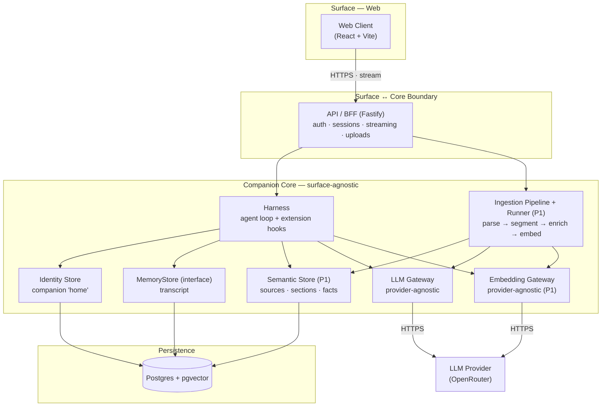
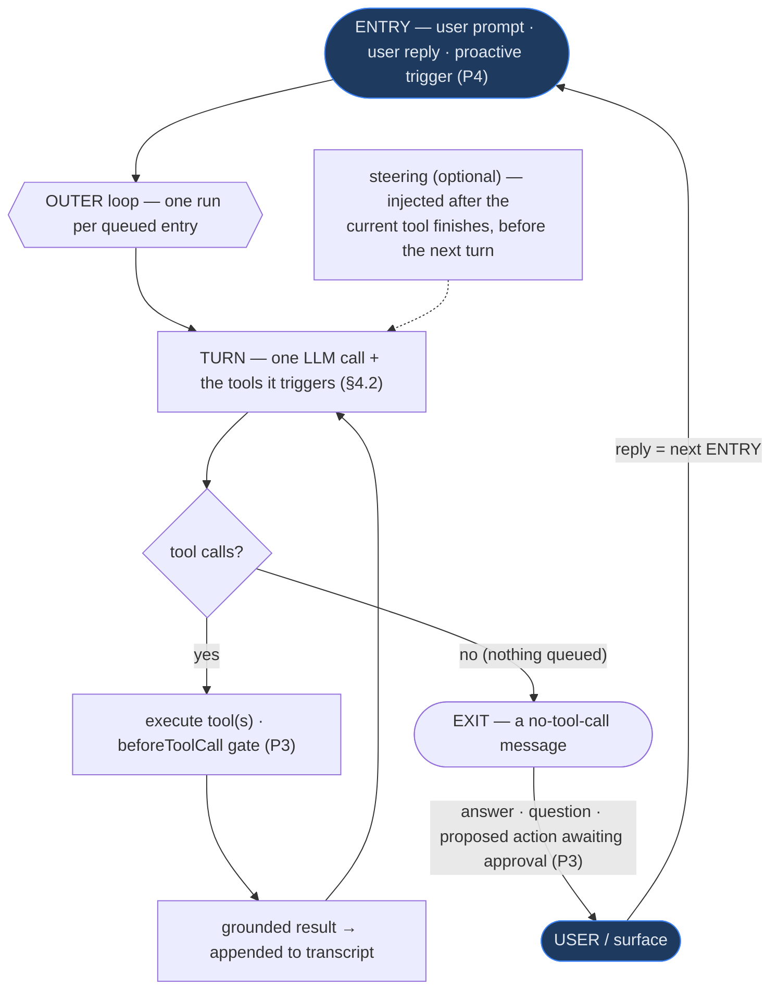
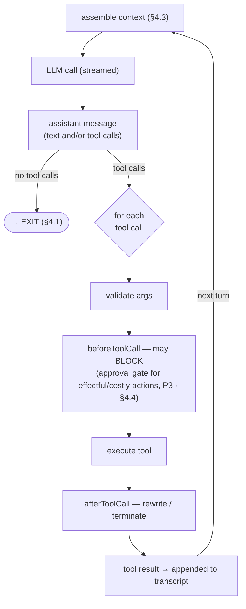
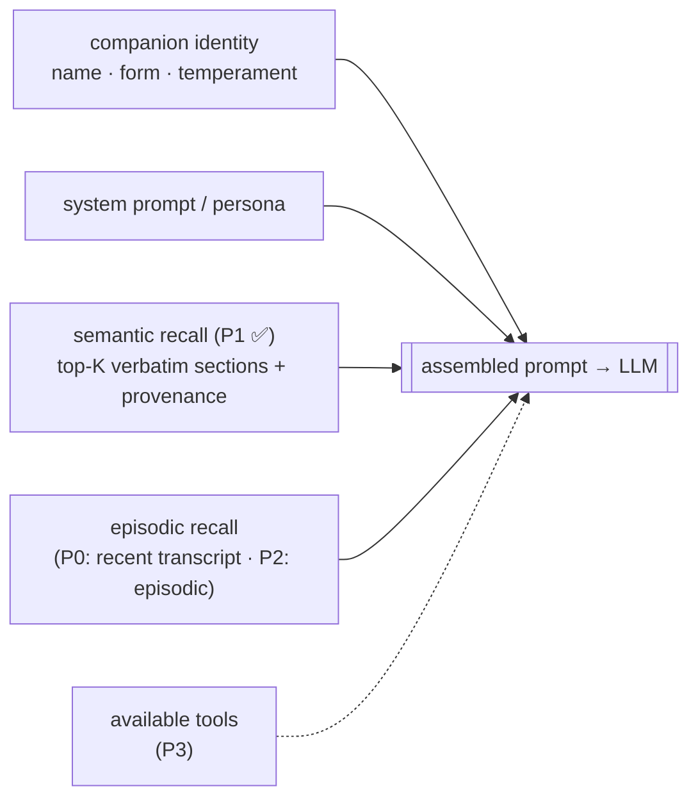
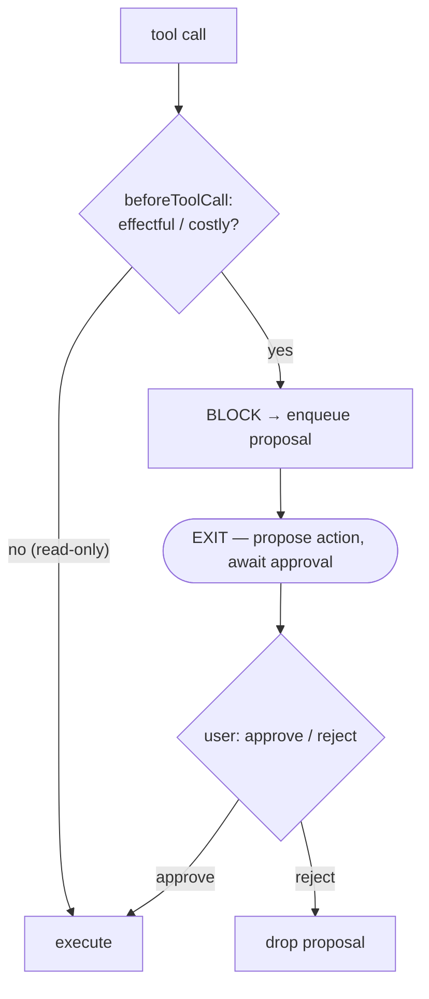
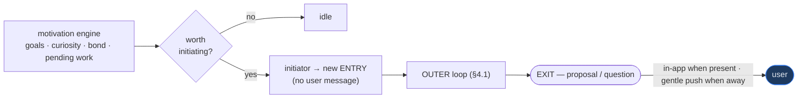
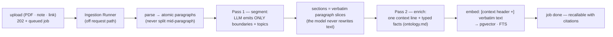

# CobbleCompanion — Technical Architecture

> **What it is:** components, responsibilities, interactions, and flows — enough for a new
> engineer to draw the system on a whiteboard. For the product's *what & why* see
> `product-overview.md`; for *scope & priorities* see `development-plan.md`; for *internal
> mechanisms* (data models, schemas, config, security implementation) see `implementation.md`.
>
> **Status: incremental.** Built up phase by phase; currently specifies **Phases 0–1**
> (`development-plan.md` §3). Content for later phases is marked **_Deferred — Phase N_**. The
> **Architectural Invariants** (§2) are the exception — load-bearing boundaries fixed now.

## 1. Purpose & Scope

CobbleCompanion is **one cloud-resident companion** (`model + harness + memory`) reached through
**surfaces** it embodies in, one at a time (`product-overview.md` §2). The architecture's job is
to keep that companion *core* surface-agnostic so surfaces (web now; mobile, desktop later) plug
in as clients. **Phase 0** delivered the smallest end-to-end slice: a user creates a Cobble on the
**web** surface and holds a persisted, single continuous conversation (§2, invariant #6).
**Phase 1** adds the knowledge organism: sources are ingested into **semantic memory** (§4.8) and
chat answers ground themselves in them with citations.

**Non-goals / scope boundaries (Phases 0–1):** no episodic store beyond the transcript (Phase 2),
no tools/MCP or approval queue (Phase 3), no proactivity (Phase 4), no growth/visual system
(Phase 5), no native surfaces or OS tools (Phase 6–7). See `development-plan.md`.

## 2. Architectural Invariants (design decisions)

Fixed now to preserve extensibility. The implementation behind a seam may be a Phase 0 stub, but
the **boundary** does not move — these are the one-way-door decisions; everything else is
deferred to the phase that needs it.

1. **Core ↔ surface boundary.** The companion core is surface-agnostic and exposed only through
   the API (§5). Surfaces are clients with no companion logic → native surfaces are added as
   clients, never as a core rewrite.
2. **Memory behind an interface.** All memory is reached through a `MemoryStore` boundary; new
   memory kinds are added implementations, not caller changes.
3. **Harness with explicit extension points.** The agent loop defines named hooks for memory
   retrieval, tool invocation, and proactive initiation (§4); filling them is additive.
4. **Companion identity is the canonical "home."** A persisted companion record is the source of
   truth a surface loads from; one active embodiment at a time; surfaces hold no authoritative
   state (see State Management, §6).
5. **Multi-tenant from day one.** All state is scoped by `user` and `companion`.
6. **One continuous conversation per companion.** A companion holds exactly one lifelong
   conversation with its user — there is no conversation/session/thread entity. Transcript
   messages attach directly to the companion (`messages.companion_id`); the conversation *is*
   `messages WHERE companion_id = ? ORDER BY seq`. This is a product decision
   (`product-overview.md` §2) enforced structurally so duplicate/empty sessions cannot exist.
   (In the MVP a user owns a single companion; multiple companions per user is a future
   capability and does not change this per-companion invariant.)

## 3. Component Map

Phase 0–1 components and the layers they belong to. Components introduced in later phases are
listed below the diagram, not yet wired.



| Component | Owns | Notes |
|---|---|---|
| **Web Client** | Chat UI (incl. citations), create-a-companion, auth flows, sources page, memory browser + search | Thin client over the API (invariant #1) |
| **API / BFF** | Auth, sessions, routing, response streaming, source intake (multipart), memory routes | The only thing surfaces talk to |
| **Harness** | The agent loop; defines memory/tool/initiation hooks | See §4; P1 fills the memory hook with semantic recall |
| **LLM Gateway** | Provider-agnostic chat-model access | Default OpenRouter; provider pluggable |
| **Embedding Gateway** | Provider-agnostic embedding access (P1) | OpenRouter `/embeddings`; deterministic fake for tests |
| **MemoryStore** | Boundary for the transcript (episodic substrate) | The companion's single transcript (`messages`), keyed by `companion_id` |
| **Semantic Store** | Sources (verbatim), sections (vector + FTS), fact overlay, ingestion jobs (P1) | Hybrid retrieval with provenance; contract → `ontology.md` |
| **Ingestion Pipeline + Runner** | Two-pass source reading off the request path (P1, §4.8) | Durable status in `ingestion_jobs`; replaceable by a real worker |
| **Identity Store** | Companion "home" record | Source of truth surfaces load from |
| **Persistence** | Relational + vector storage | Postgres + `pgvector`; schemas → `implementation.md` |
| **Eval Harness** | Offline memory-vs-performance evaluation (`packages/eval`) | Not on the serving path; live OpenRouter. See `companionmemory.md` §5 |

**_Deferred — later phases:_** Episodic Store (P2), Tool Registry / MCP & Approval Queue (P3),
Proactivity Scheduler & Motivation Engine (P4), Growth/Progression service (P5), Mobile/Desktop
clients, OS-tool bridges & Sync Courier (P6–7).

## 4. The Agent Loop & Harness

The harness is the companion's "nervous system" and the most product-defining part of the
architecture. It adopts a proven agentic-loop pattern — **turn primitive · outer + inner loops ·
steering · before/after-tool hooks · failures-as-data · transcript-as-truth · the human as the
loop's exit/entry boundary** — the same lineage as the sibling **CobbleTradeAdvice** project,
adapted here for a **cloud, multi-tenant, proactive** companion (the two adaptations: propose→approve
realized as a `beforeToolCall` gate, §4.4; and **proactive initiation** as a non-human loop entry,
§4.5).

The **loop shape is an architectural invariant** (§2 #3): it does not change between phases — each
phase only fills in more of it. **Phase 0 exercises only the trivial path** (empty tool set → the
inner loop turns exactly once → exit; proactive entry arrives in Phase 4). The §4.6 sequence diagram
shows that concrete Phase 0 realization. *(Hook signatures + concrete context assembly:
`implementation.md` §2.)*

### 4.1 The loop (outer + inner)

The **outer loop** drains queued entries (one run each); the **inner loop** turns. *A turn = one LLM
call plus the tool executions it triggers.* The inner loop keeps turning while the model keeps
calling tools and stops when the model returns a message with **no tool calls** — that stopping point
is the **EXIT**, where control returns to the user (or surface).



> **Phase 0:** the tool set is empty, so `tool calls? → no` always holds — the inner loop turns once
> and exits. The loop shape is unchanged when tools (P3) and proactive entries (P4) arrive.

### 4.2 The turn (the primitive)

One turn, as a state machine. This is where the **before/after-tool hooks** and grounding live —
the seams Phases 1/3 fill (invariant #3).



> **Phase 0:** no tools, so every turn is `context → LLM → message → EXIT`. The right-hand branch is
> wired (typed hooks) but never taken until P3.

### 4.3 Context assembly (what enters each turn)

Each turn rebuilds context from the companion's "home" + its memory. The dashed inputs are the
**memory-retrieval hook**, filled per phase.



> **Phase 1:** the memory-retrieval hook embeds the user's question, hybrid-searches the
> semantic store (vector + lexical + metadata, fused), and prepends each hit as a
> provenance-carrying grounding block; the hit's citations are streamed to the client before
> the answer. Retrieval failure degrades to recency-only — recall never breaks the
> conversation. (Hook signature → `implementation.md` §2.1.)

### 4.4 Human-in-the-loop & propose→approve

There are **no dedicated "ask" or "confirm" steps** — the loop runs until it has something to say,
then EXITs with a plain message; the user's reply is the next ENTRY. The product's **propose→approve**
trust model (`product-overview.md` §5.3) is realized mechanically as the `beforeToolCall` gate: a
read-only tool runs freely, but an **effectful/costly** tool call (book · send · pay) is **blocked**,
forcing an exit-to-approve. The user's approval re-enters as the next turn and the action executes.



> **Generalized invariant (stated now so the architecture is correct by construction):** the
> companion never executes a consequential, outward action without explicit user approval. The gate
> arrives in P3; the rule holds from the start.

### 4.5 Proactive initiation (Phase 4)

The companion-specific extension of the pattern: an outer-loop **ENTRY can be generated by the
motivation engine**, not only by a human. This is what makes the companion proactive rather than
passive (`product-overview.md` §5.4).



### 4.6 Phase 0 realization (end-to-end)

The same loop, instantiated across the real Phase 0 components — single-pass, with streaming:

```mermaid
sequenceDiagram
    actor User
    participant Web as Web Client
    participant API as API / BFF
    participant H as Harness
    participant Id as Identity Store
    participant Mem as MemoryStore
    participant GW as LLM Gateway
    participant LLM as LLM Provider

    User->>Web: send message
    Web->>API: POST message (authed)
    API->>H: ENTRY → dispatch turn
    H->>Id: load companion "home"
    H->>Mem: retrieve context (recent transcript)
    Note over H: context assembled (§4.3); tool set empty
    H->>GW: invoke model
    GW->>LLM: HTTPS (streamed)
    LLM-->>GW: token stream
    GW-->>H: stream
    H-->>API: stream tokens
    API-->>Web: SSE / WebSocket
    Note over H: no tool calls → EXIT
    H->>Mem: persist turn
```

### 4.7 Loop invariants

- **Termination.** *Normal:* the model stops calling tools, or a gate forces an exit (approve, P3).
  *Abnormal — a no-progress dead loop:* guarded later (P3+) by a progress meter and a per-run budget
  ceiling, ending in **exit-to-user-with-partial**. (Not needed in P0: one turn always terminates.)
- **Failures are data.** A provider error or a tool throw becomes an ordinary turn outcome (an error
  message / an error result) that re-enters the loop — uniform recovery, and gaps are surfaced, never
  fabricated.
- **Transcript is the source of truth.** Append-only; reconstructable into context; compaction
  summarizes the compactible remainder when the window fills (P-later).
- **State is authoritative only at the home.** Surfaces never hold loop state (§6); a run reads from
  and writes back to the cloud home.

### 4.8 Ingestion flow (Phase 1)

How a source becomes semantic memory — **two output-bounded reading passes** off the request
path. The economics are deliberate: input tokens are cheap and output tokens are the cost
lever, so the model *reads everything* but *emits almost nothing* (~1% of input in Pass 1,
~10% in Pass 2).



Design rules (the "improved staged hybrid"; memory guide → `companionmemory.md`):

- **Original text is canonical.** Sources are stored verbatim; sections are verbatim paragraph
  slices; the fact overlay (`ontology.md`) is an index *into* the text, rebuildable from it.
- **Paragraphs are atomic.** Segmentation groups whole paragraphs into cohesive sections —
  blind fixed-size chunking is structurally impossible.
- **Embedding input ≠ stored text.** The optional Pass-2 context header is prefixed onto the
  *embedding input only* (it injects the entities unresolved pronouns hide from the encoder);
  stored and displayed text is always pure original. Header on/off is an eval A/B knob.
- **Dual retrieval.** Semantic (vector cosine) + lexical (FTS) fused by reciprocal rank, plus
  metadata paths (source, fact-overlay entity) — every hit carries provenance (source, chapter,
  paragraph/page range) so answers cite and can show the original passage.
- **Failures are data.** A failed run lands on the job as a user-safe error; the durable
  status surface (`ingestion_jobs`) is what makes the in-process runner replaceable by a real
  worker with no schema or API change (§8).

## 5. Stack & Technology Decisions

Resolves the items flagged in `development-plan.md` §5. (Field-level config/env → `implementation.md`.)

| Concern | Decision | Why |
|---|---|---|
| Language / runtime | **TypeScript end-to-end** (Node + React) | I/O-bound LLM workload (single-thread is a non-issue); richest agent/tool/**MCP** + LLM ecosystem; shared types across surfaces |
| API framework | **Fastify** (Node) | TS-first, fast, light; swappable behind the API package |
| Web client | **React + Vite** (SPA) | Thin client; keeps the core↔surface boundary explicit. Next.js considered; SPA keeps the boundary cleaner |
| Store engine | **Postgres + `pgvector`** | Multi-tenant cloud home; one store for relational + vectors; scales across phases |
| Data access | Type-safe query layer (Drizzle) | Explicit types end-to-end; no raw SQL by default |
| LLM access | **Provider-agnostic gateway, default OpenRouter** | Swap models/providers without touching the harness |
| Embeddings | **Provider-agnostic gateway, OpenRouter `/embeddings`** — default `perplexity/pplx-embed-v1-0.6b` | Single vendor with the LLM gateway; dimensions pinned to the vector column (`implementation.md` §3) |
| Auth | **Google Sign-In (OIDC)** | The SPA gets a Google ID token (Google Identity Services); the API verifies it against Google's JWKS (`aud=GOOGLE_CLIENT_ID`, `email_verified`) and JIT-provisions users by email. No third-party auth service, no tenant, no extra Pulumi stack. `dev_bypass` mode for local/tests |

## 6. Interactions, Boundary & State

- **Surface ↔ core contract.** The core is reached only through the API; the request/response
  and streaming contract lives in shared types. No surface-specific logic crosses into the core
  (invariant #1). Mobile (P6) and desktop (P7) will consume the *same* contract; their OS access
  is exposed *to the core as tools* (P3 framework), not as new core APIs.
- **Streaming.** Chat responses stream to the client (SSE or WebSocket) so the UI shows tokens as
  they arrive despite multi-second model latency.
- **External services.** The **LLM Provider** (OpenRouter) is the only external dependency in
  Phase 0 — outbound HTTPS via the LLM Gateway. User content crossing to the provider is an
  explicit trust boundary (§8).
- **State management.** Authoritative state lives in the cloud "home" (Postgres), scoped per
  `user`/`companion`. Surfaces are stateless views that load from and write back to the core;
  with one embodiment active at a time there is no cross-surface state to reconcile (invariants
  #4, #5).

## 7. Folder Structure (Phases 0–1)

```
/                      repo root
  docs/                canonical documentation
  packages/            TS monorepo (workspaces)
    core/              the companion (surface-agnostic) — invariant #1
      harness/         agent loop + extension hooks (§4); semantic recall (P1)
      llm/             provider-agnostic LLM gateway
      embedding/       provider-agnostic embedding gateway (P1)
      ingestion/       parse → segment → enrich → embed pipeline + runner (P1, §4.8)
      memory/          MemoryStore (transcript) + SemanticMemoryStore (P1)
      identity/        companion "home" model + store
    api/               BFF / surface boundary (Fastify); memory + source routes
    web/               React web client; chat w/ citations, sources page, memory browser
    shared/            shared TS types / contracts
    eval/              live memory-vs-performance harness (→ companionmemory.md §5)
  db/                  migrations & schema (→ implementation.md)
  scripts/             dev / seed / ops scripts
```
> Add new components here and to the Component Map (§3) when introduced (`CLAUDE.md` "When to
> Update Docs").

## 8. Deployment & Trust Model

**Deployment approach.** A single **GCP Cloud Run** service (the Fastify API, which also serves the
built React SPA from the same origin) runs the container image; `min_instances = 1` keeps the hot
chat **API** warm so the first message after idle isn't a cold start. **Background workers** (later:
ingestion, proactivity) will be async and scale to zero for cost. The workload is I/O-bound (mostly
awaiting the LLM), so a single Node process holds many concurrent conversations and scales
horizontally with replicas; CPU-heavy work (future PDF parse/embedding) moves off the request path
to workers. Infrastructure is managed as code with **Pulumi** under `infra/` (`infra/gcp` for Cloud
Run + Artifact Registry + Secret Manager); auth is Google Sign-In (no auth service to provision);
managed Postgres is Supabase (pgvector). (Specific tuning params, image build → `implementation.md` and `infra/*/README.md`.)

**Trust model (Phase 0 baseline).** Design-level boundaries; the security *implementation* and
the full threat model live in `implementation.md` and Phase 8 respectively (`development-plan.md` §4).

- **Tenancy isolation** — all state scoped by `user`/`companion`; authorization enforced at the
  API boundary before the core is reached.
- **Transport** — HTTPS/TLS everywhere; secure DB connections.
- **Input validation** — all client and external (LLM) data validated at the boundary before use.
- **LLM provider trust boundary** — user content sent to the provider is an explicit external
  trust boundary; provider data-handling assumptions documented in `implementation.md`.

**_Deferred — Phase 8:_** encryption-at-rest specifics, data inspection/management/delete
controls, on-device data-locality for native surfaces, propose→approve audit-trail hardening.
