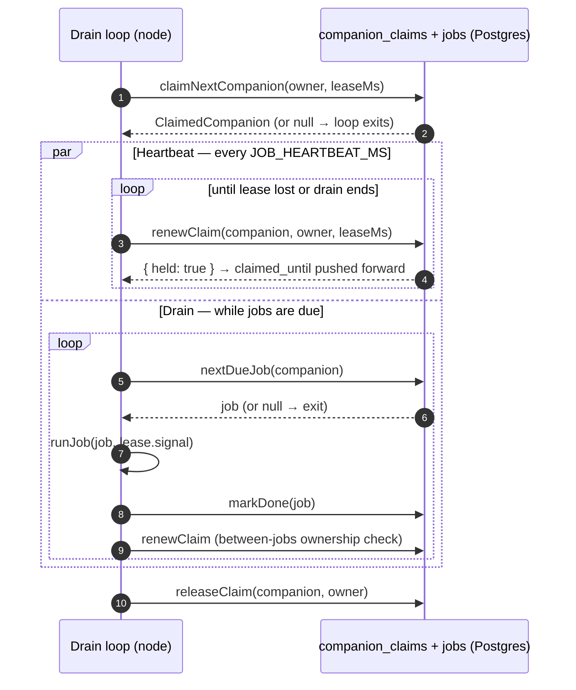
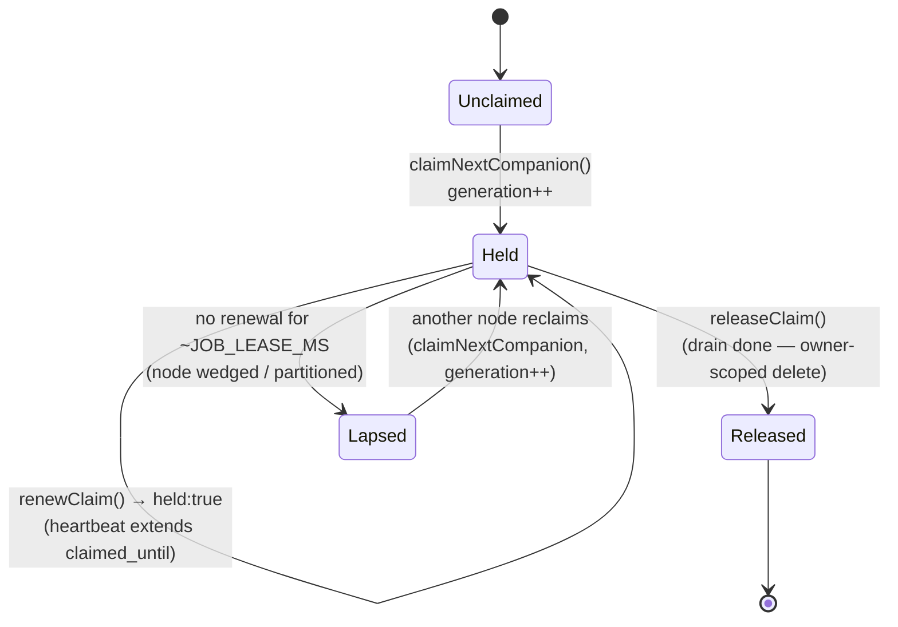
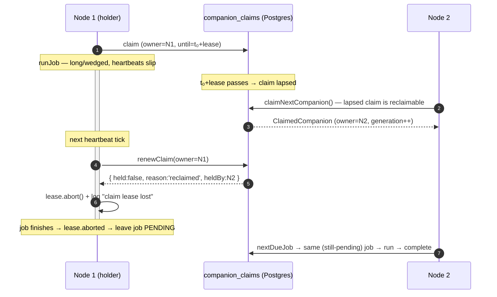
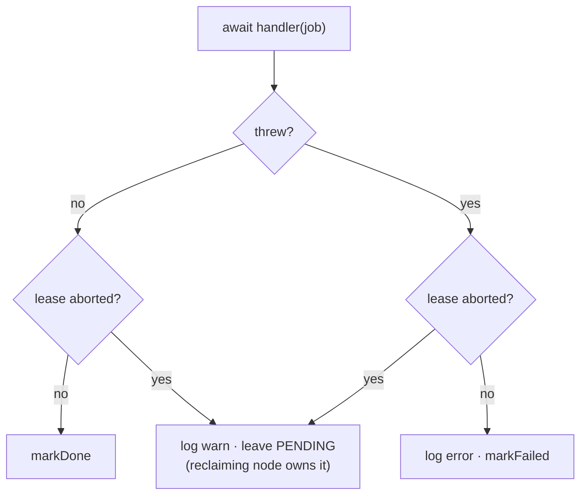

# CobbleCompanion — The Background-Job Lease & Abort

> **Canonical source for the background-job *lease mechanism*** — how a node claims a companion's
> background work, keeps that claim alive with a heartbeat *while a job runs*, and what happens when
> the claim is lost mid-run (the abort path). This is the single-writer guarantee that lets the same
> background work (`consolidate`, `motivation`, `ingest`, `reaction_learn`) run on a fleet of nodes
> without running twice.
>
> For the *broader job-queue design* and decision log (why a Postgres queue, claiming at companion
> granularity, coalescing) see `plans/deliver-scalability.md` §5.1. For the **schema** of the `jobs`
> and `companion_claims` tables see `implementation.md` §1. For the **tunable values** see
> `packages/api/src/config.ts` (the `JOB_*` env vars). For the *analogous* lease on the live
> WebSocket connection — same "newer wins" principle, different table — see `architecture.md` §6 and
> `plans/embodiment-handoff-fencing.md`. The code lives in
> `packages/core/src/jobs/job-processor.ts` (the drain loop + heartbeat) and `job-queue.ts`
> (`claimNextCompanion` / `renewClaim` / the claim SQL).
>
> Each fact lives in one place: this doc owns the **lease lifecycle, the heartbeat, and the abort**;
> it does not redefine the table schema, the config values, or the queue's coalescing rules.

---

## 1. Why a lease

Background work is triggered from every node (a chat turn schedules `consolidate`, a reaction
schedules `reaction_learn`, an upload schedules `ingest`). Without coordination, two nodes would run
the same companion's work in parallel — double-consolidating, double-nudging, duplicating sections.

The coordination primitive is a **per-companion lease**: a row in `companion_claims` that one node
holds for a bounded time. A node must hold a companion's lease before it touches that companion's
background state, so **exactly one node fleet-wide drains a given companion at a time**. The lease is
deliberately at *companion* granularity (not per-job) so a companion's jobs drain **in order** under
one claim.

---

## 2. The drain lifecycle

A node's `JobProcessorPool` keeps up to `JOB_CONCURRENCY` ephemeral drain loops alive. Each loop
claims one companion, drains its due jobs in order, and exits when nothing is left. A coarse poll
(`JOB_POLL_INTERVAL_MS`) and an enqueue "nudge" wake the pool.

Two independent things keep the claim fresh:

- **The heartbeat** (the `par` branch) renews the lease every `JOB_HEARTBEAT_MS` *regardless of what
  the job is doing* — this is what lets a single long job (a slow `ingest`) outlive the raw lease
  duration without losing its claim.
- **The between-jobs check** renews synchronously after each job, so a takeover that happens *between*
  jobs is caught immediately rather than waiting for the next heartbeat tick.

---

## 3. The claim's states

`renewClaim` reports one of four outcomes, which drive every transition below. The lease is **live
only while `now() < claimed_until`**; a node that stops renewing (wedged, GC-paused, or partitioned
from the DB) lets its claim lapse, and another node may then reclaim it.

The key relationship between the two timers: **`JOB_HEARTBEAT_MS` < `JOB_LEASE_MS`** (enforced at
config load). The heartbeat renews several times per lease, so a single slow or dropped renewal never
expires the claim. A reclaim therefore only happens after the holder has been silent for roughly a
full `JOB_LEASE_MS` — i.e. it is genuinely wedged or partitioned, not merely slow.

> Note: because another node can only reclaim a **lapsed** claim (the takeover SQL gates on
> `claimed_until < now()`), a reclaim is always preceded by the holder going silent. A node cannot
> snatch a live claim.

---

## 4. Losing the lease — the abort

A long job runs *concurrently* with the heartbeat. If a heartbeat tick discovers the claim is gone,
it trips an `AbortController` (`lease` in `drainCompanion`). The abort is **triggered only by the
heartbeat**, on either of these:

| Trigger | `renewClaim` result | What it means |
|---|---|---|
| Reclaimed | `{ held:false, reason:'reclaimed', heldBy }` | our lease lapsed and another node took the companion |
| Lapsed | `{ held:false, reason:'lapsed' }` | our `claimed_until` is in the past; no taker yet |
| Released | `{ held:false, reason:'released' }` | the claim row is gone entirely |
| DB error | `renewClaim` throws | we cannot reach Postgres to *prove* we still hold it → abort defensively |

The abort does **not** interrupt the running handler (handlers do not receive the signal). Its only
effects are: stop the drain loop from taking new jobs, and make `runJob` decline to record an outcome
for the in-flight job. The handoff between two nodes:

Because Node 1 records **no outcome** (see §5), the job stays `pending` and Node 2 — the legitimate
holder — runs it cleanly. Node 1 never silently marks done a job it no longer owns.

---

## 5. Job outcome on completion

`runJob` decides what to record by crossing two facts: did the handler throw, and did we still hold
the lease when it finished?

The bottom-right path (`leave PENDING` when the lease was lost) is the correctness fix: a job whose
lease vanished mid-run is **never** marked done or failed by the losing node — recording an outcome
would race the node that now owns the job. Leaving it `pending` is safe because the work is
at-least-once (§8): an idempotent handler re-runs cleanly, and `ingest`'s own status machine fails an
interrupted partial for re-upload rather than duplicating it (`ingestion/ingest-job.ts`).

---

## 6. Tunables

All four knobs are env-overridable (`packages/api/src/config.ts`); defaults in parentheses.

| Env var | Config field | Default | Role |
|---|---|---|---|
| `JOB_LEASE_MS` | `jobLeaseMs` | 60 000 | How long a claim stays live without renewal — the **silence tolerance** before another node may reclaim. |
| `JOB_HEARTBEAT_MS` | `jobHeartbeatMs` | 20 000 | How often a live drain renews its claim. **Must be `< JOB_LEASE_MS`** (validated at load). |
| `JOB_POLL_INTERVAL_MS` | `jobPollIntervalMs` | 30 000 | Coarse clock for idle / future-dated work (no local nudge). |
| `JOB_CONCURRENCY` | `jobConcurrency` | 4 | Max simultaneous companion drains per node (K), sized to resource ceilings. |

Sizing rule: the lease no longer has to exceed the slowest job (the heartbeat keeps it alive
mid-run). It only has to comfortably exceed a few heartbeat intervals, so a momentary renewal hiccup
does not expire a live claim.

---

## 7. Observability

Every lease transition logs with a reason (`logging.md` — no silent failures, background paths
included):

| Event | Level | Message | Context |
|---|---|---|---|
| Heartbeat finds the lease gone | `warn` | `claim lease lost; aborting drain` | `companionId`, `owner`, `reason`, `reclaimedBy?` |
| Heartbeat renewal throws (DB) | `error` | `claim heartbeat failed` | `companionId`, `error` |
| Lease lost between jobs | `info` | `claim moved between jobs; stopping drain` | `companionId`, `owner`, `reason`, `reclaimedBy?` |
| Job ran but lease was lost | `warn` | `job lease lost mid-run; leaving pending for reclaim` | `jobId`, `type`, `companionId` |
| Handler failed (lease held) | `error` | `job failed` | `jobId`, `type`, `companionId`, `error` |
| A node reclaims a lapsed claim | `warn` | `job claim reclaimed` | `companionId`, `owner`, `generation` (logged by the *winning* node, in `job-queue.ts`) |

The `reason` distinguishes `reclaimed` (with `reclaimedBy`) from `lapsed` and `released`, so a lost
lease on the losing node can be correlated by `companionId` with the winning node's
`job claim reclaimed`.

---

## Beyond the PoC

- **Bounded one-iteration overlap remains, by design.** The heartbeat shrinks — but does not
  eliminate — the window where a job runs on a node that has lost its lease (e.g. a DB partition
  during the job, or the brief gap between a heartbeat detecting loss and the job completing). The
  work is therefore **at-least-once**, not at-most-once.
- **Handlers must absorb a re-run.** Safety rests on handlers being idempotent/convergent or fencing
  their non-idempotent writes: `insertSections` replaces a source's whole set (no duplication);
  `reinforceFromDelta` claims its outcome with an atomic CAS (`setReward`) so a second run does not
  double-nudge. The known residual is the ingestion **announcer**, whose transcript note is not yet
  deduplicated — a rare double-claim in the startup window can post it twice.
- **The durable backstop is a generation fence.** `companion_claims.generation` is a fencing token
  already bumped on every (re)claim. Threading it into the handlers' writes (commit only while the
  claim still names this owner) would make the residual harmless even under partition — the shared
  "fence-on-token" helper called for in `plans/embodiment-handoff-fencing.md` §4.
- **Advisory locks were considered and rejected** as the claim primitive — they break Supabase's
  transaction-mode pooler and need a pinned connection held for the whole run. The leased row is
  pooler-safe and crash-safe via lease expiry. Decision log: `plans/deliver-scalability.md` §5.1.5.
