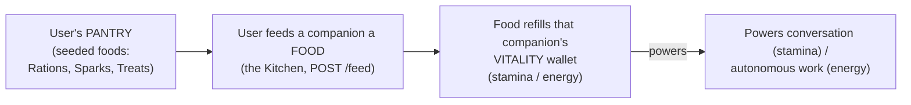

# CobbleCompanion — The Feeding Economy

> **Canonical source for the feeding economy *mechanism*** — how the user holds a pantry of **foods**
> and spends them to refill a companion's two **vitality** wallets (stamina & energy). This is the one
> **deliberately gamified loop** in the PoC; it does not *reflect* anything about the companion
> (unlike the four growth axes, which are a mirror — see below).
>
> For *scope and sequencing* see `development-plan.md` §3; for the `user_food` and vitality **schema**
> and the atomic consume/refill mechanics see `implementation.md` §1; for the **tunable constants**
> (food grants, the food seed) see `packages/core/src/growth/config.ts` (`DEFAULT_GROWTH_CONFIG`) and
> the food catalogue in `packages/shared/src/contracts.ts` (`FOODS`); for the **stamina/energy wallet
> model** these foods refill — what each pool powers and why — see `architecture.md` §4.8 and
> `companion-motivation.md` §7–§8. Each fact lives in exactly one place: this doc owns the **feed
> loop** and the **food catalogue's behaviour**; it does not redefine the schema, the constants, or
> the wallets.
>
> **Where it lives.** `packages/core/src/growth/economy.ts` (the feed), the per-user food store in
> `packages/core/src/quota/` (the pantry + atomic consume), the food catalogue in `contracts.ts`
> (`FOODS`), and the route `POST /companions/:companionId/feed`
> (`packages/api/src/routes/growth.routes.ts`). The Growth view's "Kitchen"
> (`packages/web/src/pages/Growth.tsx`) is the one mutating affordance.

## 1. What it is

Vitality is a **spend-down resource**: a companion's stamina and energy are token wallets that only
go down (running LLM work) and only come back up by **feeding** — there is no auto-refill
(`architecture.md` §4.8). The feeding economy is the loop that puts those wallets back: the **user**
holds a **pantry** of typed **foods**, and spends a food to top up one or both of a companion's
wallets. Feeding is the only way vitality is restored, which is what makes the otherwise-invisible
token budget tangible and gives the growth surface something to *do*.

It is **not a mirror.** The four growth axes (knowledge, bond, initiative, character) are a *readout*
of the companion's accumulated state — they describe what is true and may move in either direction.
The economy is the opposite: an *incentive loop* deliberately laid on top. Growth and feeding are
fully **decoupled** — growing earns no food, and feeding changes no axis. See §6.

## 2. The loop

The only manual action is **feeding**: choosing a food from the pantry, which consumes one of that
food and adds its tokens to the chosen companion's wallet(s).

## 3. The pantry — how the user has food

Food is a **per-user** inventory: the user holds counts of each food type and may spend them on
**any** of their companions (a user-level resource, distinct from the per-companion wallets it
refills — `architecture.md` §2 invariant #5). Each user's pantry is **seeded once** at signup and is
not replenished in the PoC.

| Source            | Constant         | Default | Notes                                                                 |
|-------------------|------------------|---------|-----------------------------------------------------------------------|
| Starting pantry   | `initialFood`    | `10` each | Seeded on the user's first creation, so feeding works on day one.   |

> Values are illustrative of the current defaults; `config.ts` is the canonical, tunable source.

There is **no currency and no buying** in the PoC. When a user runs out of a food type, that food is
unavailable until a developer raises the count in the database directly. Earning, buying, and
monetization are out of scope — see §7.

## 4. Foods — the catalogue

A food is a typed top-up that adds tokens to one or both wallets. The catalogue is a shared product
contract (`FOODS` in `contracts.ts`) so the client's Kitchen and the server's refill logic never
drift; token grants are product constants single-sourced there.

| Food         | Stamina | Energy  | Intent                                          |
|--------------|---------|---------|-------------------------------------------------|
| 🍞 Ration    | +200k   | —       | Favours **stamina** — so you can keep talking.  |
| ⚡ Spark      | —       | +200k   | Favours **energy** — so it can go explore.      |
| 🍪 Treat     | +80k    | +80k    | Feeds **both** a little.                         |

> Token grants are illustrative of the current `FOODS` defaults; `contracts.ts` is canonical.

## 5. Spending — the feed flow

Feeding is `POST /companions/:companionId/feed` (owner-scoped; body `{ food: 'ration' | 'spark' |
'treat' }`). The mechanism (`economy.ts` `feed`) is **consume-first, atomically guarded**, so a food
is never granted for free:

1. Resolve the food definition; unknown food → `ok: false`.
2. **Consume one of that food** from the **user's** pantry — an atomic, count-guarded decrement. If
   the user has none, nothing else happens and the route returns **409** ("out of \<food\>"); the
   wallets are untouched.
3. Only on a successful consume, **add** the food's grants to the **companion's** wallet(s):
   `staminaTokens` → the companion's stamina wallet, `energyTokens` → its energy wallet — keyed by the
   fed companion, so a food only ever refills the companion it was given to.

The route replies with the fed companion's updated vitality **and** the user's remaining pantry, so
the Kitchen reflects the spend immediately.

## 6. Design note

The economy is the one piece of the growth surface that is a **genuine game loop** rather than a
reflection, and that is intentional — it makes the invisible token budget tangible and gives the
growth surface something to *do*. Worth recording as an honest caveat: the grant numbers are
arbitrary **game-balance** values (a Ration = 200k tokens), single-sourced as product constants in
`config.ts` / `contracts.ts`. Because growth and feeding are decoupled, growing no longer hands the
user operating budget — the previous "growth rewards you with tokens" tension is gone.

## 7. Beyond the PoC

- **Earning, buying, and monetization.** The PoC seeds a fixed pantry and never replenishes it; a
  user who runs out contacts a developer. A real product needs a way to *get more food* — earned
  through use, purchased, or granted — and the currency/monetization model that implies. Out of scope
  here; planned as a future phase (`development-plan.md`).
- **Whether the mirror should keep a game at all.** The honest alternative is to surface vitality
  directly as a *readout* with a plain top-up control, dropping the food metaphor entirely. The four
  growth axes already use no game vocabulary; feeding is the deliberate exception. Revisit before the
  engine is reused under a real game.
