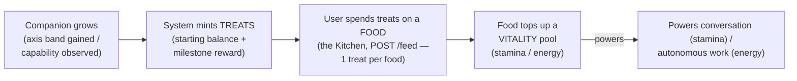

# CobbleCompanion — The Feeding Economy

> **Canonical source for the feeding economy *mechanism*** — how the companion earns **treats**,
> and how the user spends them on **foods** to top up the two **vitality** pools (stamina & energy).
> This is the one **deliberately gamified loop** in the PoC; it does not *reflect* anything about the
> companion (unlike the four growth axes, which are a mirror — see below).
>
> For *scope, acceptance, and sequencing* see `development-plan.md` §3; for the
> `companion_growth` **schema** and the atomic treat/feed mechanics see `implementation.md` §1; for
> the **tunable constants** (treat rewards, food grants) see `packages/core/src/growth/config.ts`
> (`DEFAULT_GROWTH_CONFIG`) and the food catalogue in `packages/shared/src/contracts.ts` (`FOODS`);
> for the **stamina/energy two-pool budget** these foods feed — what each pool powers and why — see
> `architecture.md` §4.8 and `companion-motivation.md` §7–§8. Each fact lives in exactly one place:
> this doc owns the **earn→spend loop** and the **food catalogue's behaviour**; it does not redefine
> the schema, the constants, or the budget pools.
>
> **Where it lives.** `packages/core/src/growth/economy.ts` (the feed),
> `growth-store.ts` (the `treats` balance + atomic spend), the food catalogue in `contracts.ts`
> (`FOODS`), and the route `POST /companions/:companionId/feed`
> (`packages/api/src/routes/growth.routes.ts`). The Growth view's "Kitchen"
> (`packages/web/src/pages/Growth.tsx`) is the one mutating affordance.

## 1. What it is

The feeding economy is a **thin game layer over the existing vitality budget**. The companion
*earns* a soft currency — **treats** — as a by-product of growth, and the user *spends* treats by
giving the companion **foods**, each of which tops up one or both vitality pools (the real token
budgets that power conversation and autonomous work). Treats are plentiful by design (a starting
balance plus milestone rewards), so feeding stays demonstrable while making the otherwise-invisible
budget tangible and connecting growth to vitality.

It is **not a mirror.** The four growth axes (knowledge, bond, initiative, character) are a *readout*
of the companion's accumulated state — they describe what is true and may move in either direction.
The economy is the opposite: an *incentive loop* deliberately laid on top. See §6 for the design
note and §7 for the open question it raises.

## 2. The loop

The user never *works* to earn treats — they accrue automatically from the companion growing. The
only manual action is **feeding**: choosing a food, which debits treats and refills vitality.

## 3. Treats — how they are earned

Treats are a per-companion balance persisted on the `companion_growth` row (schema:
`implementation.md` §1; the column moves only by guarded atomic SQL increment/decrement, never below
zero). They come from two sources, both centralized in `config.ts` (`DEFAULT_GROWTH_CONFIG`):

| Source                | Constant              | Default | Notes                                                                       |
|-----------------------|-----------------------|---------|-----------------------------------------------------------------------------|
| Starting balance      | `initialTreats`       | `5`     | Seeded on the row's first creation, so feeding works on day one.            |
| Per growth milestone  | `treatsPerBand`       | `2`     | Granted once per axis band gained (knowledge / bond / initiative).          |
| Per capability        | `treatsPerCapability` | `1`     | Granted once the companion is first observed demonstrating it.              |

> Values are illustrative of the current defaults; `config.ts` is the canonical, tunable source.

Milestone rewards are awarded **exactly once** per genuine forward step. This is guaranteed by the
`companion_growth` high-water mark — a compare-and-set on the monotonic band indices + observed-
capability set — so two concurrent post-turn recomputes (e.g. overlapping post-turn stream tails) can
never double-award. (`GET /growth` is read-only and never recomputes.) The mark's mechanics live in `implementation.md` §1; the growth-derivation pass that
drives it lives in `packages/core/src/growth/service.ts`.

## 4. Foods — the catalogue

A food is a typed top-up. Each costs **1 treat** and adds tokens to one or both pools. The catalogue
is a shared product contract (`FOODS` in `contracts.ts`) so the client's Kitchen and the server's
grant logic never drift; token grants are product constants single-sourced there (the per-day pool
**caps** remain server config — see `architecture.md` §4.8).

| Food         | Cost     | Stamina | Energy  | Intent                                          |
|--------------|----------|---------|---------|-------------------------------------------------|
| 🍞 Ration    | 1 treat  | +200k   | —       | Favours **stamina** — so you can keep talking.  |
| ⚡ Spark      | 1 treat  | —       | +200k   | Favours **energy** — so it can go explore.      |
| 🍪 Treat     | 1 treat  | +80k    | +80k    | Feeds **both** a little.                         |

> Token grants are illustrative of the current `FOODS` defaults; `contracts.ts` is canonical.

## 5. Spending — the feed flow

Feeding is `POST /companions/:companionId/feed` (owner-scoped; body `{ food: 'ration' | 'spark' |
'treat' }`). The mechanism (`economy.ts` `feed`) is **debit-first, atomically guarded**, so a food
is never granted for free:

1. Resolve the food definition; unknown food → `ok: false`.
2. **Spend the treat cost** via `growth.spendTreats` — an atomic, balance-guarded decrement. If the
   balance can't cover it, nothing else happens and the route returns **409** ("not enough treats");
   the vitality pools are untouched.
3. Only on a successful debit, **top up** the favoured pool(s): `staminaTokens` → the per-user
   stamina pool (`TokenQuotaStore.topUp`), `energyTokens` → the per-companion energy pool
   (`CompanionEnergyStore.topUp`). Both top-ups mirror the energy/stamina atomic-increment model.

The route replies with the updated vitality meter **and** the full growth standing, so the Kitchen
reflects the spend immediately.

## 6. Design note

The economy is the one piece of the growth surface that is a **genuine game loop** rather than a
reflection, and that is intentional — it makes the invisible token budget tangible and gives the
growth surface something to *do*. Two things are worth recording as honest caveats, because they are
in tension with the engine's logic and with the mirror framing of the axes:

- **It rewards growth with operating budget.** There is no real-world reason a companion that has
  grown should receive *more tokens to spend*. Vitality is a *cost/resource* the companion consumes
  (`companion-motivation.md` §7–§8); here, growth *hands the user more of it* as a prize. That is a
  game incentive, not a truth about the companion.
- **The grant numbers are arbitrary game-balance values** (1 treat = 200k tokens), single-sourced as
  product constants in `config.ts` / `contracts.ts`.

## 7. Beyond the PoC

**Open question:** whether the mirror should keep a currency game at all. The honest alternative is
to surface vitality directly as a *readout* — "budget remaining today to talk / to explore" — with a
direct top-up control rather than an earned-and-spent currency, decoupling growth (a reflection) from
vitality (a resource). The four growth axes use no game vocabulary; the economy is the deliberate
exception. Revisit before the engine is reused under a real game.
