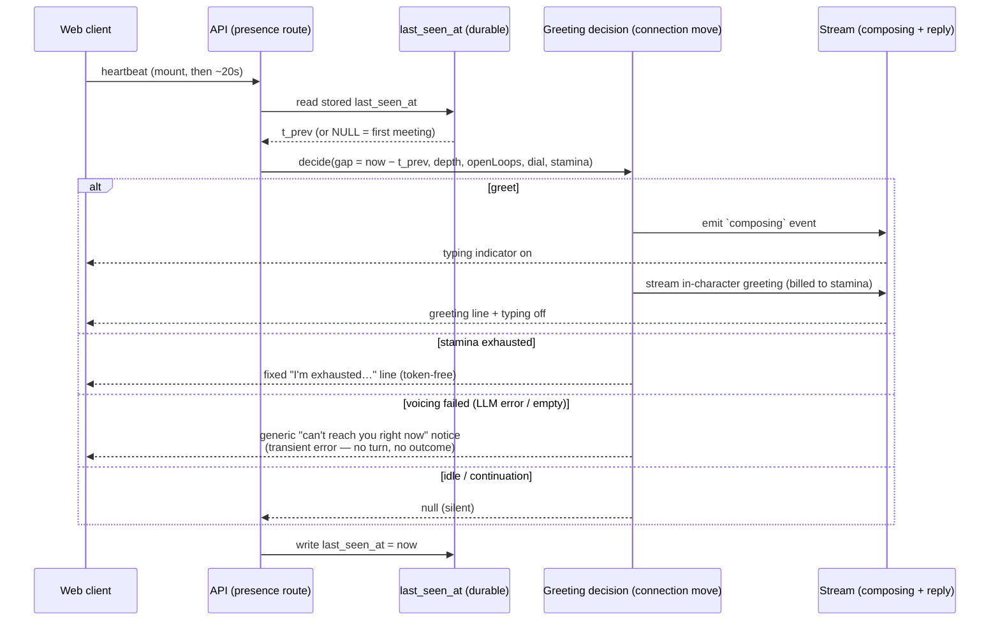
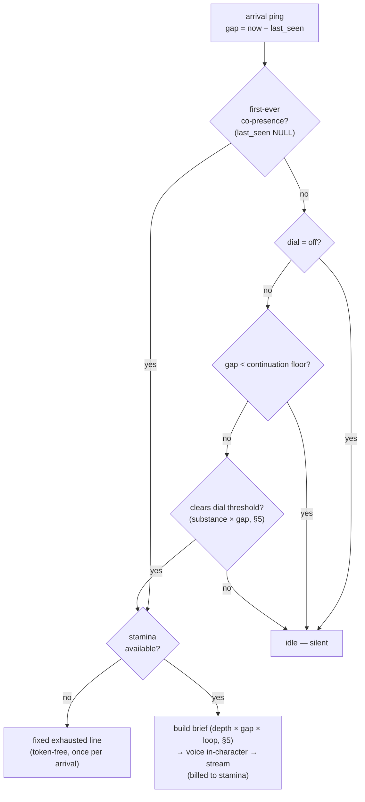
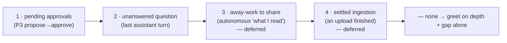

# CobbleCompanion — The Greeting Mechanism

> **Canonical source for how the companion *reacts to the user's arrival*** — detecting that the
> user has returned, deciding whether to greet (or stay quiet), and what to say given the gap, the
> relationship depth, and any unfinished business. The greeting is the **first `connection`-driven
> conversational move** — the social counterpart to the curiosity-driven *explore* burst — so it
> shares the motivation engine's machinery (drives, dial, reward loop) documented in
> `companion-motivation.md`; this doc owns only the *arrival* surface. For the proactivity mechanism
> it plugs into see `companion-motivation.md`; for the **stamina** wallet a greeting spends (and its
> sibling **energy** wallet) see `companion-economy.md`; for the agent-loop seam see
> `architecture.md` §4.5; for the *what & why* of proactivity see `product-overview.md` §5.4–§5.6;
> for canonical schema (the `last_seen_at` column, once built) see `implementation.md` §1; for
> scope/sequencing see `development-plan.md` §4d (Phase 14).
>
> **Status: built (Phase 14).** The mechanism below ships in `packages/core/src/greeting/`
> (`decide.ts` gate + `greeter.ts` service), the SSE route `packages/api/src/routes/greeting.routes.ts`,
> and the web client (`Chat.tsx` arrival triggers + composing indicator). Acceptance criteria and phase
> placement are owned by `development-plan.md` §4d.

## 1. Why this exists — what a greeting *is*

A greeting is not a feature bolted onto page-load; it is a **social ritual that re-opens a
relationship at the start of a co-presence episode**. Stripped to first principles it does three
things at once, and a fourth by omission:

1. **Acknowledges a transition** — "I notice you've arrived." A greeting is *edge-triggered* (the
   change from absent → present), never *level-triggered* (merely being present). Saying "hi" to
   someone already sitting next to you is broken.
2. **Re-establishes the relationship at its current depth** — strangers greet to reduce uncertainty;
   intimates greet with shorthand and continuity. The same words are warm between friends and creepy
   between strangers.
3. **Picks up the thread** — the difference between a vending machine ("Welcome back!") and a
   companion is whether it remembers what was left open.
4. **Knows when to stay quiet** — a needy greeting is worse than silence. A companion that pipes up
   every time you glance at the tab is damaged goods. **Silence is frequently the correct greeting**,
   and the mechanism must default to it.

These four give the design its four questions: **when** to fire (§3), **whether** to fire (§4),
**what** to say (§5–§6), and **how** to surface it (§7).

The greeting fills the social half of the `Initiator` seam (`architecture.md` §4.5): an outer-loop
turn can be generated by the *user arriving*, not only by the user typing. Like every proactive move,
its default outcome is **idle** — a first-class, free, silent result.

## 2. Vocabulary

| Term | What it is |
|---|---|
| **Arrival** | The rising edge from absence into co-presence — the user becomes present after being away long enough to count as having left. The *event* a greeting reacts to. |
| **Co-presence episode** | A continuous stretch of the user being "here." Opened by an arrival, kept alive by heartbeats, closed by absence. The conversation has **no sessions** (one lifelong transcript, `architecture.md`), but *presence* still has episodes — a greeting happens once at an episode's start. |
| **Gap** | `now − last_seen_at` — how long the user was away. Shapes whether and how to greet. |
| **Continuation** | A return below the gap floor (a brief tab-away). **Not** an arrival; no greeting. |
| **Open loop** | Unfinished business the greeting can pick up — a pending approval, an unanswered question, away-work to share, a settled upload (§5, Axis C). |
| **Greeting** | The `connection`-driven conversational move emitted at an arrival — voiced in-character, billed to **stamina**, or replaced by a token-free exhausted line when stamina is gone (§4, §7). |

## 3. The trigger — arrival is an edge, detected from a durable `last_seen_at`

**Why not the transcript.** A user who opens the chat, reads, and leaves without typing produces *no
transcript turn* — so last-message-time can't see them. The greeting must react to *presence*, which
the transcript doesn't record. So arrival is detected from a **durable per-companion `last_seen_at`
timestamp**, updated by the **presence heartbeat** (which fires on mount even when the user never
types — `usePresenceHeartbeat`). The trigger hangs off the heartbeat, **not** off `GET /messages`.

**Why durable, why per-companion.** The in-memory presence store (`motivation/presence-store.ts`)
resets on restart, so it cannot answer "it's been three days." `last_seen_at` must persist. It is
keyed **per companion** (the companion row, or a small presence table), not globally on the user:
greeting gap is about co-presence with *this* companion, so a user with two companions doesn't make
companion B think "you just visited" when they visited A. Canonical column lives in
`implementation.md` §1 once built.

**Sequencing — compute before you overwrite.** On each heartbeat: read the *stored* `last_seen_at` →
`gap = now − last_seen_at` → run the greeting decision (§4) against that gap → **then** write
`last_seen_at = now`. Overwriting first would erase the very gap the decision needs.

**Idempotency falls out for free — no separate `last_greeted_at`.** While the user sits in the tab,
heartbeats (~every 20s) keep `last_seen_at` fresh, so the gap stays tiny → *continuation* → no
greeting. When they leave, heartbeats stop and `last_seen_at` goes stale; on return the gap is large
→ *arrival* → greet **once** → write `now` → the next heartbeat sees a tiny gap → no re-greet. One
genuine return ⇒ at most one greeting, with a single column and no extra flag.

## 4. The decision — `decideGreeting`

A token-free heuristic gate, mirroring arbitration (`companion-motivation.md` §5): cheap checks
decide *whether* to greet before any tokens are spent. Order matters — the cheapest, most decisive
gates run first.

The gates, in order:

1. **First-ever co-presence → greet (introduce).** `last_seen_at IS NULL` (a brand-new companion the
   user just opened). This **overrides the dial** — a blank screen is a broken first impression, and
   the dial governs *ongoing* initiative, not the initial hello (§6). Still subject to the stamina
   gate, but a fresh companion has full stamina, so it always introduces itself.
2. **`dial = off` → idle (silent).** `off` means **reactive-only: the companion never speaks unless
   spoken to** — no autonomous notes, no nudges, and no greeting, because a self-firing greeting is
   exactly the proactivity the user switched off. The first-meeting introduction (gate 1) is the one
   exception. *(`gentle`/`active` defined in `companion-motivation.md` §5 — they set the threshold in
   gate 4.)*
3. **Continuation floor → idle.** If `gap` is below the floor (a brief tab-away), this is a
   *continuation*, not a reunion — stay quiet. The floor is tunable; it is what separates "stepped
   away for coffee" from "came back."
4. **Dial threshold → idle unless cleared.** Greet only when the move clears the dial's bar, computed
   from **substance × gap** (§5). Roughly: `gentle` needs an open loop *or* a long gap (≥ ~a day);
   `active` greets on a shorter gap (≥ ~an hour) *or* any substance, and may offer a light "welcome
   back" even empty. A short gap with nothing new → idle (the correct, quiet outcome).
5. **Stamina gate → greet, or the exhausted fallback.** A greeting is the companion *talking to you*
   — interaction, not solo work — so it is billed to **stamina** (the chat wallet), not energy
   (`companion-economy.md`). When stamina is exhausted, the companion can't muster a warm hello: it
   shows a **fixed template line** ("I'm exhausted — I need stamina to think straight…") instead. That
   line is **token-free** (a template, not an LLM call), which is what makes it safe to show on an
   empty wallet, and it doubles as a feeding nudge. The same once-per-arrival gating applies, so an
   exhausted companion groans **once** per genuine return, not on every heartbeat.

The exhausted line is reserved for *actual stamina exhaustion* — it must never stand in for a
transient failure. If the voicing itself fails (an LLM error, or an empty result) on a companion that
*has* stamina, the server surfaces a **generic, no-one's-voice "can't reach your companion right now"
notice** (a transient `error` event), and that path is honest about being a system hiccup: it
**persists no turn** and **records no `bond` outcome**, so a generation blip never lies about the
companion's state and never poisons the change-as-reward loop (§7). Stamina metered before the failure
is still spent — the tokens were consumed.

`last_seen_at = now` is written **after** the decision on every ping, greet or idle (§3).

## 5. The content — relationship depth × gap × open loops

When the gate says "greet," the *brief* handed to the voicer is assembled from three axes. The
greeting is generated in-character from this brief (never templated, except the exhausted fallback),
so it reads as the companion rather than a canned string.

**Axis A — Relationship depth** (from the user model, `companion-memory.md` §4 / Phases 11–13: belief
& fact count, episode history, whether a core profile exists):

| Depth | Goal | Greeting shape |
|---|---|---|
| **Stranger** (first meeting) | reduce uncertainty, bootstrap the relationship | introduce itself, set honest expectations, ask one low-pressure opening question — **never fake familiarity** (§6) |
| **Acquaintance** (a few facts) | prove memory works | reference exactly **one** known thing ("how did the move go?") — this is the trust-building moment for the whole memory system |
| **Familiar** (deep history) | continuity & warmth | shorthand, an inside reference, straight into the thread |

**Axis B — Temporal gap & clock** → tone and framing, not content:

| Gap | Framing |
|---|---|
| **< continuation floor** | (no greeting — handled in §4) |
| **minutes–hours** | light re-acknowledgement, only with substance |
| **~a day** | a genuine "welcome back" |
| **many days** | may carry mild relational weight ("it's been a couple weeks — I wondered how you were"), depth permitting; **never guilt-tripping** |

Absolute clock colours tone independently ("morning" / "you're up late").

**Axis C — Open loops** — what makes a greeting companion-grade rather than generic. **Lead with the
single most relevant loop; mention if more wait; never recite the list** (a greeting that reads as a
to-do dump is its own kind of needy). Priority order:

> **Built scope (Phase 14):** `findOpenLoop` implements only tiers **1–2** (pending approvals, then
> an unanswered last-assistant question). Tiers **3–4** are deferred — they depend on away-work
> reporting and ingestion-settled signals that land with the "richer arrival reactions" family (see
> *Out of scope / future* below); the ladder is the seam they slot into.

So the assembled greeting is: **acknowledge arrival (tone from gap + clock) → bridge at the right
depth → surface the one best open loop (or none) → invite continuation.**

## 6. The first meeting — the highest-value, lowest-risk greeting

Cold start is qualitatively different: no user model, no episodes, no open loops, fresh stamina. It
is also the greeting most worth getting right — a brand-new companion showing a blank screen is a
broken first impression, and this first turn is what **bootstraps the entire user-model pipeline**
(the first facts are extracted from the user's reply to it — `companion-memory.md` §4).

The first greeting should: introduce itself in-character (name, form, temperament — read from the
companion's persona), say plainly what it is and that it **grows with the user**, set honest
expectations ("I don't know you yet — the more we talk, the better I'll know you"), and ask an opening
question or two. It must **not** invent familiarity it doesn't have.

**It fires regardless of the dial** (gate 1, §4) — even at `off` — because the dial is about *ongoing*
proactivity, and a companion the user just deliberately created should say hello once. *(If a
deployment wants `off` to be absolutely literal — silent even on first meeting — that's a defensible
override, owned by `development-plan.md`; the default here is the one-time introduction.)*

## 7. Delivery & visual feedback — the `composing` contract

Greeting generation is **asynchronous** (the voicer needs an LLM call, which would slow the heartbeat
response if awaited) — but it cannot be *silently* async, or the user stares at a blank screen not
knowing anything is coming. The contract is: **arrival decides to greet → the user sees "composing…"
within a beat → the greeting streams in.** A greeting that appears a moment *after* load actually
feels more alive — the companion noticing you walked in — than an instant canned hello.

Two implementations, in increasing order of cleanliness:

- **Minimal — flag + poll.** The heartbeat response returns `{ greetingPending: true }`; the client
  flips on the existing typing affordance and polls `refreshTranscript` (`Chat.tsx`) until the line
  lands, then clears it.
- **Preferred — a server→client event stream.** A persistent stream the client subscribes to on
  mount, carrying a **`composing`** event (→ typing dots) followed by the streamed greeting. This
  reuses the SSE machinery chat replies already use, just **server-initiated**, and it **subsumes the
  `refreshTranscript` poll**: the same channel becomes the delivery path for *all* proactive companion
  messages (greetings now, autonomous report notes next — `companion-motivation.md` §5), with the
  typing indicator a first-class event rather than a bolt-on.

Billing: the greeting's tokens ride the arrival turn and are debited to **stamina**, like ordinary
chat (`companion-economy.md`). The exhausted fallback (§4, gate 5) is token-free and bypasses voicing
entirely.

## 8. How it fits the motivation engine

The greeting is **not** the `explore` move — it is the first **conversational** move under the
**`connection` / bond** drive (`companion-motivation.md` §3), and it is **edge-triggered** by an
arrival rather than selected from accumulated drive pressure on an idle tick. But it reuses the rest
of the engine's machinery unchanged:

- **Arbitration** — `decideGreeting` (§4) is a sibling gate to `decideMove`; the dial scales its
  threshold the same way (`off`/`gentle`/`active`).
- **The reward loop** — a greeting is a proactive initiation, so it creates a `proactive_outcomes`
  row and the per-turn **affect delta** (`companion-motivation.md` §7) reinforces or decays the
  `connection` drive weight. Greetings that consistently land cold → the companion greets less and
  lighter, *automatically*. This is what protects against neediness over time without a hand-tuned
  rule — the same change-as-reward mechanism that governs the explore burst.
- **The one-pending-outcome guard** — a greeting does not stack on an unresolved outcome already
  awaiting a reaction (`companion-motivation.md` §7), so affect attribution stays unambiguous.

## 9. Worked examples

**A — First meeting.** A user creates a companion and opens the chat. `last_seen_at` is NULL → gate 1
fires, overriding the `off` dial. Fresh stamina → it introduces itself in-character, says it grows
with the user, and asks one opening question. The user's reply seeds the first user-model facts.

**B — Return after a day, a question left open.** Gap = 26h, dial `gentle`. The gap clears the
threshold, and the last assistant turn ended in an unanswered question (open-loop priority 2). It
greets warmly, picks that thread back up — *"welcome back — you never said how the interview went, no
pressure"* — and writes `last_seen_at = now`. Subsequent heartbeats see a tiny gap → no re-greet.

**C — Brief tab-away.** Gap = 4 min, dial `gentle`, no open loops. Below the continuation floor →
idle, silent. The empty-load is correct; the companion doesn't pounce on a coffee break.

**D — Return while exhausted.** Gap = 3h, dial `active`, an open loop waits — the gate says greet —
but stamina is empty. Instead of a voiced greeting, the fixed token-free line appears once: *"I'm
exhausted — feed me and I'll be right with you."* A feeding nudge, not a warm hello. Next genuine
return while still empty → one more groan; never per-heartbeat spam.

## 10. Design decisions & scope

**Design decisions (this doc):**
1. **Arrival is an edge**, detected from a **durable per-companion `last_seen_at`** updated on the
   **presence heartbeat** — not from the transcript (a silent visit leaves no turn) and not from the
   volatile presence store (it resets on restart). Compute the gap *before* overwriting; idempotency
   falls out, no separate `last_greeted_at` (§3).
2. **Greeting is the first `connection`-driven *conversational* move**, edge-triggered by arrival, a
   sibling to the curiosity `explore` burst — reusing arbitration, the dial, and the reward loop
   (§8).
3. **Stamina-gated, with a token-free exhausted fallback.** A greeting is interaction → billed to
   **stamina**; an empty wallet yields a fixed "I'm exhausted" line (no LLM call), shown once per
   arrival (§4 gate 5, §7).
4. **`off` = reactive-only** — no greeting, **except** the one-time first-meeting introduction, which
   overrides the dial (§4 gates 1–2, §6).
5. **Content = depth × gap × open loops**, leading with the single most relevant loop; voiced
   in-character, never templated (except the exhausted line) (§5).
6. **Async delivery with a `composing` contract** — the user always sees a typing indicator within a
   beat; preferred implementation is a server→client event stream that also subsumes the proactive-
   note poll (§7).
7. **No neediness rule is hand-coded** — the reward loop decays the `connection` weight when greetings
   land cold, so restraint is *learned* (§8).

**Out of scope / future** (roadmap owned by `development-plan.md`):
- **Richer arrival reactions** beyond a greeting — surfacing a proposal or reporting away-work as the
  *primary* act, with the greeting wrapping it (the "arrival reaction" family). The §5 open-loop
  ladder is the seam where this grows.
- **Departure / farewell** reactions (the falling edge) — this doc covers arrival only.
- **Proactive mid-absence outreach** (push) — greeting reacts to the user *returning*, not to the
  companion reaching out while away; that needs an audience channel (`architecture.md` §4.5).
- **Cross-room arrival** — greeting when the user appears on a *different* surface (mobile vs web)
  than they left from; the per-companion `last_seen_at` generalises, the surface dimension does not
  yet exist.

## 11. See also
- `companion-motivation.md` — the drive model, arbitration, dial, and the change-as-reward loop the
  greeting reuses (§3, §5, §7).
- `companion-economy.md` — the **stamina** wallet a greeting spends and the feeding loop the
  exhausted fallback nudges.
- `companion-memory.md` §4 — the user model the depth axis reads and the first greeting bootstraps.
- `architecture.md` §4.5 — the `Initiator` seam and body-then-will split.
- `product-overview.md` §5.4–§5.6 — proactivity & vitality (the what & why).
- `implementation.md` §1 — canonical schema (`last_seen_at`, `proactive_outcomes`), once built.
- `development-plan.md` §4d (Phase 14) — scope, phase placement, and acceptance criteria.
