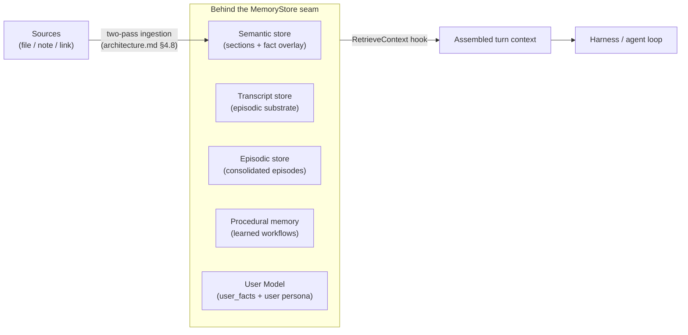
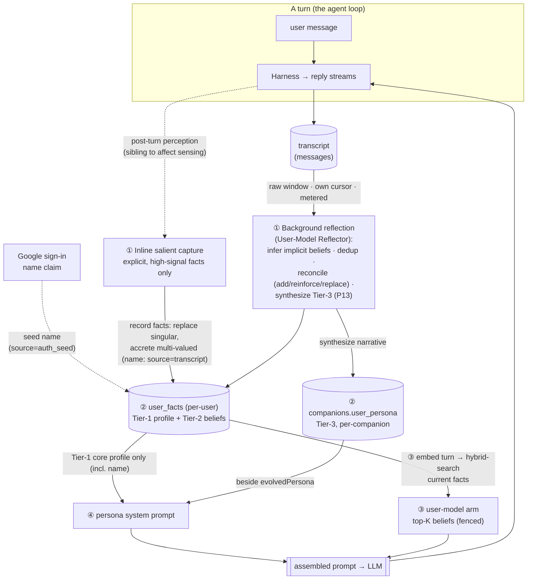

# Companion Memory — How It Works, How to Browse It, How to Evaluate It

This guide explains the companion's memory mechanism end-to-end and points to the
two tools for working with it: the **read-only memory browser** and the
**memory-vs-performance evaluation harness**.

It is a guide, not a source of record. Canonical facts live elsewhere and are
linked here, never copied:

- **Vision & the three memory types** → [`product-overview.md`](./product-overview.md) §2.1, §7
- **Architectural seams** (MemoryStore boundary, the agent loop) → [`architecture.md`](./architecture.md) §2, §4.3
- **Data model & hook signatures** → [`implementation.md`](./implementation.md) §1, §2.1
- **Rollout & acceptance criteria** → [`development-plan.md`](./development-plan.md) §3

---

## 1. The mental model

The companion's knowledge base is **three long-term memories** (see
[`product-overview.md`](./product-overview.md) §2.1):

| Memory         | Holds                                            | Example                                    |
| -------------- | ------------------------------------------------ | ------------------------------------------ |
| **Semantic**   | Facts, concepts, relationships from sources      | What it learned from your Peru books       |
| **Episodic**   | Timestamped experiences and shared history       | "Last July in Lima you loved that ceviche" |
| **Procedural** | Learned skills/workflows run without re-deciding | How it books a hotel                       |

The companion _grows_ by accumulating all three — that growth is the bond
deepening. Anything with cost or side-effects is **proposed** and held in an
approval queue for confirmation, not executed silently.

## 2. How memory is wired

All memory is reached through one seam — the **`MemoryStore` boundary**
([`architecture.md`](./architecture.md) §2, invariant #2). New memory kinds are
added as new implementations behind this interface, never as caller changes.
Memory enters a turn through one place — the `RetrieveContext` hook:



- Transcript store: `packages/core/src/memory/store.ts`; semantic store:
  `packages/core/src/memory/semantic-store.ts`
- The harness pulls prior context through the **`RetrieveContext` hook** — the
  single place memory enters a turn: `packages/core/src/harness/hooks.ts`,
  assembled in `packages/core/src/harness/context.ts`
  (signatures documented in [`implementation.md`](./implementation.md) §2.1).

This is the extension point: `RetrieveContext` is filled with **semantic recall**
(`packages/core/src/harness/semantic-retrieve.ts` — embed the question, hybrid-search
sections, ground the prompt in verbatim passages with citations), and with **episodic
recall** the same way, **without touching the loop**. How sources become semantic
memory (the two-pass ingestion flow): [`architecture.md`](./architecture.md) §4.8;
the fact overlay's contract: [`ontology.md`](./ontology.md).

**Retrieval substrate — which memory uses what.** Not every memory kind is recalled the same way.
Each enters a turn through one of three substrates: a **vector embedding** (semantic similarity,
hybrid-fused with full-text search by reciprocal rank), the **typed fact overlay** (the `ontology.md`
predicates), or **plain text** (carried whole into the prompt, or matched by recency/keyword — no
embedding step). Most kinds use one; **semantic memory and the User Model use both** an embedding
*and* the ontology. The one place you might expect an embedding and find none is **procedural
memory** — routines are short and few, so they are matched cheaply by title/keyword overlap.

| Memory kind | Vector embedding | Ontology (typed facts) | Plain text |
| --- | :---: | :---: | --- |
| **Transcript** (episodic substrate) | — | — | ✅ recency window |
| **Semantic** (sources → sections) | ✅ vector + FTS | ✅ fact overlay | ✅ verbatim sections stored |
| **Episodic** (consolidated episodes) | ✅ vector + FTS | — | — |
| **Procedural** (learned workflows) | — | — | ✅ title/keyword match |
| **User Model — Tier-1** (core profile) | — | ✅ typed predicates | ✅ rendered in persona prompt |
| **User Model — Tier-2** (learned beliefs) | ✅ vector + FTS | ✅ typed predicates | — |
| **User Model — Tier-3** (user persona) | — | — | ✅ synthesized prose |

> **"Plain text" means no embedding step** — the memory is either carried whole into the prompt
> (Tier-1/Tier-3, the recency window) or matched lexically (procedural). The two arms that carry
> **both** substrates: semantic recall grounds verbatim text whose entities are *also* indexed as
> ontology facts; the User Model stores typed predicates (`user_facts`) that Tier-2 recalls by
> embedding. The recall arms in motion: [`architecture.md`](./architecture.md) §4.3; the overlay
> contract: [`ontology.md`](./ontology.md).

## 3. What the memory system holds

The companion holds all three long-term memories plus the lead-inventory substrate:

| Memory / feature    | What it is                                                                                              |
| ------------------- | ------------------------------------------------------------------------------------------------------- |
| Episodic transcript | The companion's single continuous conversation (the episodic substrate, `messages` table)               |
| Semantic memory     | Sources read into verbatim sections + a typed fact overlay, retrievable with citations (`implementation.md` §1) |
| Episodic store      | Consolidated episodes + personality evolution                                                            |
| Procedural memory   | Workflows seeded from approved actions; a relevant learned routine also resurfaces in context as a retrieval-as-hint (`architecture.md` §4.3) |
| User Model          | The companion's structured + synthesized understanding of its **user** — `user_facts` (identity + learned beliefs) + the Tier-3 user persona; see §4 |
| Lead inventory      | The reading list (discovered URLs) — the body-then-will substrate, worked on command and by the motivation engine on idle |

> **Not held *as* memory.** Two things the companion holds are surfaced near memory but are not
> long-term memory, and are owned elsewhere — they are deliberately out of this table:
> - the **growth mirror** (knowledge · bond · initiative · character) is a *derived readout* of the
>   accumulation above, owned by the **Growth Service** (`architecture.md` §4.3, §3; data model
>   `implementation.md` §1) and shown in the separate Growth view, not the memory browser;
> - the **approval queue** is the propose→approve trust gate, owned by `architecture.md` §4.4
>   (vision `product-overview.md` §5.3) — the browser merely *surfaces* it as approval cards (§5).

The browser and eval harness below are designed so each memory kind slots in cleanly. A user-facing
manage/delete capability is out of scope (§7).

## 4. The User Model — what the companion knows about the user

The companion builds an explicit, structured **model of its user** — the symmetric mirror of the
`evolvedPersona` it grows for *itself*. It is **not** a store bolted on the side: it reuses the typed
fact overlay, the hybrid-retrieval pattern, and the persona-synthesis pattern the rest of memory
already uses, with the **user as a privileged entity** in the one ontology (`ontology.md`). Three
tiers:

| Tier | What it holds | Where it lives | How it enters a turn |
| --- | --- | --- | --- |
| **1 — Core profile** | Identity facts: name, pronouns/gender, `bornOn`/age, `livesIn`, `worksAs` (all **singular** — a new value replaces the old; no decay); plus `languages` and key `relationships` (**multi-valued** — distinct values accrete as separate rows, see `MULTI_VALUED_PREDICATES`) | `user_facts` — the **name is just one such fact**, not a `users` column (`implementation.md` §1) | Rendered into the **persona prompt every turn** — small, always carried (no retrieval) |
| **2 — Learned beliefs** | Preferences, interests, opinions, habits, goals (`prefers`/`dislikes`/`interestedIn`/`believes`) | `user_facts`, typed, with confidence · salience (decays) · provenance · current-state replace | A **retrieval arm**: hybrid-search the *current* beliefs, inject the top-K relevant ones, rendered by confidence × effective salience (`architecture.md` §4.3) |
| **3 — User persona** | A synthesized narrative — "who you are to me" | `companions.user_persona` | Blended into the persona prompt beside `evolvedPersona` |

**Shared truth vs. personal understanding (why the scoping differs).** The *facts* (Tiers 1–2) are
**per-user** — objective truths about the person ("vegetarian", born 1990, lives in Berlin), so
`user_facts` is keyed by `user_id` and shared across any companion the user owns: tell one companion,
all know. The *synthesized understanding* (Tier-3 `user_persona`) is **per-companion** — each
companion forms its **own** sense of you, drawn from the shared fact pool **plus its own per-companion
episodic history** with you. Truth is common; understanding is personal — the exact mirror of the
companion's own `evolvedPersona` (per-companion). The **name is just one Tier-1 fact**, not a special
`users` column: it is **seeded from your Google account at sign-in** (a modest-confidence `auth_seed`
fact, so first contact already has a name) and **refined in conversation** — a name you state or edit
supersedes the seed; if Google gave none, the companion asks. That seed/state/edit distinction is the
fact's **`source`** (`transcript` \| `auth_seed` \| `user_edit`), the general provenance every
user-fact carries (`implementation.md` §1, `ontology.md` §4). (In the PoC a user has one companion, so
per-user and per-companion coincide; the schema is scoped correctly for when they don't.)

**The knowledge cycle (extract → persist → retrieve → inject).** One loop: every turn feeds the
transcript; perception and reflection turn that into typed facts; persisted facts flow back into the
next turn's prompt — so the companion knows a little more each time.



Stages: **① extract** (inline `motivation/affect.ts` sibling + the reflector that extends
consolidation, `architecture.md` §4.5/§4.3) → **② persist** (per-user `user_facts` + per-companion
`user_persona`, `implementation.md` §1) → **③ retrieve** (Tier-2 arm in `composeRetrieveContext`) →
**④ inject** (Tier-1 + Tier-3 into the persona, Tier-2 as a fenced block — `architecture.md` §4.3).
The prose below elaborates each.

**How facts are learned — hybrid extraction (never blocks the reply):**

- **Inline salient capture.** After the reply streams, the same post-turn perception that senses the
  user's mood (`motivation/affect.ts`) also runs a conservative user-fact extractor — **explicit,
  high-signal** statements only. In Phase 11 it captured Tier-1 identity ("call me Sam"); **Phase 12
  widens it to explicit Tier-2 beliefs** ("I'm vegetarian", "I love jazz"), so a plainly stated
  preference is usable the very next turn rather than waiting for the next reflection. It writes them
  immediately (`source=transcript`): a stated name is just the singular `name` attribute replacing
  the `auth_seed` seed — no special path, no `users` column (`architecture.md` §4.5). Semantic dedup
  and reconciliation are **not** its job — the reflector owns them, so inline capture stays a cheap
  insert.
- **Background reflection.** The heavy lifting is off-request, in a **User-Model Reflector** that
  extends the consolidation pass (cursor-gated, metered). It reads the **raw transcript window** — the
  same span consolidation reads, deliberately *not* the filler-dropped episode summaries, because the
  signal for an implicit belief lives in the un-summarized repetition ("keeps asking about Rust →
  `interestedIn: Rust`"). Its own cursor (`user_facts_through_seq`) makes belief extraction
  independently idempotent — a failed reflection never advances past an unprocessed window — and lets
  it pin each belief's provenance to the exact turn (`learned_from_seq`, which inline capture can't,
  reading a seq-less `MessageDto`). A sibling synthesizer (`LlmUserPersonaSynthesizer`) re-synthesizes
  the **Tier-3 user persona** on its **own cursor** (`user_model_updated_through_seq`) right after the
  reflector — the exact mirror of how consolidation drives `evolvedPersona`, re-running only when the
  facts/episodes advanced — and the result is blended **additively** into the persona prompt: Tier-1
  identity facts keep rendering verbatim (exact ground truth), the Tier-3 narrative is an extra paragraph
  beside `evolvedPersona`, never paraphrasing the name/pronouns/location (Phase 13; `architecture.md`
  §4.3). The transcript is the
  canonical, **lossless** substrate (`ontology.md` invariant #1): anything inline capture misses, the
  reflector recovers on its next pass, and re-extraction rebuilds the whole overlay — so no knowledge
  is permanently lost as long as it was said.

**Write discipline (owned by the reflector, so hygiene lives in one place):** `user_facts` is a
**current-state overlay**, not a timeline — a revision **replaces** the prior value rather than stacking
history. Singular attributes (`name`, `livesIn`, …) upsert the value for the predicate; **multi-valued**
ones (`languages`, `relationships` — `MULTI_VALUED_PREDICATES`) **accrete**, replacing only an identical
`(predicate, object)` restatement so distinct values coexist. *(Phase 12 kept a superseded chain in this
table; **Phase 13 drops it** — the timeline lives in episodic memory, `ontology.md` §4.)*

**Beliefs are a *current-state* view — last-wins; the timeline lives in episodic memory.** The
`user_facts` current set holds **what's true now**; the *timeline* of the self lives in **episodic
memory** (the lossless transcript + episodes), not here. So "I loved coffee, then I quit" is **not** a
contradiction — both are true across time and both are recoverable from episodic memory; `user_facts`
simply moves to "doesn't drink coffee." The reflector's reconciliation is *current-state maintenance*,
not truth-arbitration. Its pipeline, per candidate belief: **dedup** (embed it, pull the top-K similar
*current* beliefs as bounded context) → one LLM reconciliation read returns **`add`** (new matter —
coexists), **`reinforce(id)`** (same matter, restated — bump salience, no new row), or **`replace(id)`**
(same matter, *newer state* — overwrite the current value). A polarity flip ("love" → "quit") is the
obvious `replace` case.

**Forgetting is the tail of decay (Phase 13), not a delete.** A Tier-2 belief's salience **decays
lazily**: rather than a sweeper rewriting rows, both read paths (the Tier-2 arm and the engine's
interest-sourcing) score it through one pure `effectiveSalience = stored × decay(now − updated_at)` with
a uniform half-life. As a belief fades it is **rendered more tentatively** — recall speaks a confident,
reinforced belief as known ("you're vegetarian") and a faint one as a hunch ("I have a vague sense you're
into jazz — or was it blues?") — and below a `STALE_SALIENCE_FLOOR` it stops surfacing entirely. *That* is
forgetting: graceful and partial, the way a person forgets, not a binary erase. The stored salience always
reflects the last genuine reinforcement (a `reinforce` revives a fading belief); decay is a *view*, never
a write (`ontology.md` §4). **No tombstone:** a belief the user lets fade but keeps mentioning is simply
**re-learned** by the reflector — self-correction, not a bug. And because faded beliefs are spoken as
hunches, the companion is **licensed to ask** to confirm ("Remind me — coffee or tea?"); the answer
reinforces or replaces, closing a conversational self-repair loop. **Tier-1 identity carries no salience
and so does not decay** — it changes only by the user's hand (below).

**Beliefs are also learned from behaviour, not only words.** Inline capture and reflection learn from
what the user *says*. The **belief-learning loop** (`architecture.md` §4.5,
`companion-motivation.md` §7) adds a second source: the motivation engine sources its
curiosity/interest topics from the current Tier-2 belief set and acts on them on its own (reads a
lead, posts a report note tagged with the originating belief), and the change in the user's mood
across their reaction **adjusts that belief's salience** — reinforced when appreciated, weakened when
ignored. A belief the companion *acted on and the user welcomed* is a belief grounded in behaviour,
not just a passing mention.

**Trust & control:** the companion is **fully trusted to write its own memory** — there is **no
approval queue** for user-facts (that gate is for external side-effects, `architecture.md` §4.4). The
safeguard is **legibility, not gating**: everything it believes about you is **visible** in the memory
browser (§5) — the one place the otherwise read-only browser gains a write affordance. Tier-1 identity
facts are **editable and forgettable** today (Phase 11); Tier-2 beliefs are **read-only until Phase
13** — and that read-only guarantee is **enforced server-side** (the `editFact`/`forgetFact` store
methods refuse belief predicates), not just by omitting UI controls. **Phase 13** opens read/edit/delete
across the **whole** model. Because Tier-2 beliefs **fade on their own**, the everyday "forgetting" is
decay (above); the explicit controls are **edit** (replace a value) and **`deleteFact`** (remove a single
current row — replacing the Phase-11 soft-supersede). Delete is **necessary for Tier-1** (identity does
not decay, so nothing else removes it) and offered on Tier-2 for immediacy. **Sensitive inferences** (a
closed set — gender, age, health, religion, sexuality, ethnicity, political leaning) are **gated at
write**: a low-confidence *inference* about a protected matter is not persisted at all, so the companion
never holds a shaky guess; an **explicit statement** ("I'm 34") always passes, is **flagged** in the
browser, and can be **truly purged** — the one place erasure must be complete (optionally forgetting the
originating transcript turn too). (A user-facing "don't infer X about me" toggle is deferred.)

**Iterating extraction quality:** because extraction is the part most likely to drift, it has its own
**eval dataset** — `user-extract` (`howto-run-evals.md`): explicit identity attributes scored
deterministically, fuzzier preferences by LLM judge. A prompt change that loses identity facts or
invents preferences fails the gate (`ontology.md` §5).

> **Status.** **Phases 11–13 are implemented.** Phase 11 (core profile): the `user_facts` store,
> inline capture of explicit identity facts, Tier-1 injection into the persona, the name seeded from
> sign-in, and the editable/forgettable browser panel. **Phase 12 (learned beliefs): built** — the
> `embedding`/`fts`/`salience` Tier-2 columns; inline capture widened to explicit beliefs (embedded at
> capture); the raw-transcript **reflector** (own cursor, `add`/`reinforce`/`replace` reconciliation)
> fired by consolidation; the hybrid **Tier-2 retrieval arm**; and the **belief-learning loop** (beliefs
> drive the motivation engine; the reaction reward refines belief salience). **Phase 13 (understanding &
> hygiene): built** — `user_facts` is now a **current-state overlay** (`replace`, the superseded chain
> dropped); **lazy decay** (`effectiveSalience`) + **uncertainty-aware recall** make forgetting graceful;
> the **sensitive write-gate** keeps shaky guesses about protected matters out; the **Tier-3
> `LlmUserPersonaSynthesizer`** writes `companions.user_persona` (additive blend); and the browser gained
> full **edit/delete** on both tiers, a `sensitive` badge, the read-only persona, and the `deleteFact`
> purge. Gated by the deterministic Phase-12 + Phase-13 DoD tests plus the live `user-extract`,
> `user-beliefs`, and `user-persona` evals. `development-plan.md` §4c.

## 5. Browsing memory (read-only)

A read-only view of everything a companion holds, grouped by memory kind.

**API** (owner-scoped; `/memory` + `/memory/search` in
`packages/api/src/routes/memory.routes.ts`, `/sources…` + `/ingestion` in
`source.routes.ts`):

- `GET /companions/:companionId/memory` — a sectioned snapshot
  (`MemorySnapshotDto` in `packages/shared/src/contracts.ts`): `identity`,
  `episodic` (the single transcript's `messageCount`), `semantic`
  (source/section/fact counts + ingestion jobs), and `procedural` (count of learned
  workflows). It also exposes `GET …/procedures` (learned workflows), `GET …/leads`
  (the reading list), `POST …/explore` (work the reading list → proposals), and the
  approval queue (`GET …/proposals`, `POST …/proposals/:id/confirm|reject`).
- `POST /companions/:companionId/memory/search` — search semantic memory
  directly; results carry the verbatim passage + a `Citation` (source, chapter,
  paragraph/page range).
- `GET /companions/:companionId/sources` and `GET …/sources/:sourceId` — the
  sources the companion has read and the per-source section drill-in (verbatim
  text + the companion's Pass-2 context line); `GET …/ingestion` — reading
  progress ("read N of M").
- Transcript drill-in reuses the chat read path
  `GET /companions/:companionId/messages` (the companion's one continuous
  conversation; there is no conversation/session entity — see
  [`implementation.md`](./implementation.md) §1). This read path returns the
  **most-recent N** messages (a recency window, like the harness `recentLimit`),
  not the full lifelong transcript — so both chat resume and the browser drill-in
  show the latest window. Full-history retrieval/paging is out of scope (§7).

**Web** (`packages/web/src/pages/MemoryBrowser.tsx` and `Sources.tsx`): reachable
via the **Memory** and **Sources** buttons in the chat header
(`packages/web/src/App.tsx`). The browser renders the identity card, the episodic
section (message count + "View transcript" toggle), the semantic section
(source/section/fact counts + a search box returning verbatim passages with
provenance), the procedural section (learned-workflow count + list), and the
reading-list (leads). Effectful actions surface as one-tap **approval cards** below
the chat transcript (`ProposalCard` + the `useProposals` hook). The Sources page handles
intake (file upload, note, link), shows reading progress, and lets the user delete a
source (incl. one parked for want of stamina); a vitality indicator in each page
header shows the companion's remaining stamina. Grounded chat answers render their citations
inline in `Chat.tsx`.

> The **User-Model panel** (§4) extends this browser with the companion's profile + learned beliefs
> about the user, and is the **one place the browser becomes writable** — read, edit, and forget —
> per the User-Model workstream (`development-plan.md` §4c, Phase 11 read + Phase 13 full management).

## 6. Evaluating memory vs performance

The question "how does the companion's _memory_ affect its _performance_" is
answered by the `memory-recall` dataset in **`packages/eval`** — a **live** run
of a fixed eval set under several memory configurations, scored for recall +
grounding. It is now one dataset in a generalized **dataset → scorer → runner**
framework that also covers stateless per-call-site datasets (e.g. `affect-sense`,
and `user-extract` — the User-Model extraction gate, §4) and a red-team `injection`
dataset. **How to run any of them — including the
deterministic CI tier vs the live nightly tier — lives in `howto-run-evals.md`.**

**Run it:**

```bash
OPENROUTER_API_KEY=… pnpm eval
# optional: choose recency windows; skip the semantic configs; pick models
OPENROUTER_API_KEY=… EVAL_WINDOWS=2,12,200 EVAL_SEMANTIC=false \
  LLM_MODEL=anthropic/claude-3.5-sonnet INGESTION_MODEL=google/gemini-2.5-flash pnpm eval
```

It is live (hits OpenRouter, costs tokens, non-deterministic), so it is **not**
on the per-PR gate. It does run nightly (and on demand) via
`.github/workflows/eval-nightly.yml` — the live tier, which runs memory-recall
(plus the stateless datasets) via `--dataset=all`. See `howto-run-evals.md`.

**What it does** (`src/run.ts`, fixtures in `src/fixtures/recall.json`): each case
seeds a transcript — and, for the source-grounded cases, **ingests `sources` through the
real `IngestionPipeline`** (live segmentation/enrichment/embeddings) — then asks a
question whose answer either _is_ reachable (**recall** cases) or _is not_
(**absence** cases). For every `MemoryConfig` it seeds a fresh companion (the
isolation boundary now that a companion holds one lifelong transcript), runs the
real `Harness` over the real `OpenRouterGateway`, and scores the answer in two
layers (`src/score.ts`): a deterministic expected-fact check, then an
LLM-as-judge for grounding (0–1) and hallucination. `src/report.ts` prints the
headline **comparison table** — one row per config — plus per-case detail:

```
memory config      window  recall pass  grounding  halluc. (absent Qs)
window-2            2       0%           0.20       50%
window-200          200     66%          0.80       0%
semantic-header     12      100%         0.95       0%
semantic-noheader   12      83%          0.90       0%
```

(Illustrative numbers.) Two signals: widening reachable memory raises recall and
grounding while lowering hallucination; and the **source-grounded cases** separate
the configs — facts that live only in an ingested book are unreachable for any
recency window and recalled only by the semantic configs. The
`semantic-header` / `semantic-noheader` pair is the **contextual-header A/B**
(`implementation.md` §3 `USE_CONTEXT_HEADER`): measure, don't assume, whether
prefixing the Pass-2 context line onto embedding inputs improves retrieval.

## 7. Beyond the PoC

Out of scope for this release (roadmap → [`development-plan.md`](./development-plan.md) §3):

- **Managing & deleting memory.** A user-facing inspect/manage/delete capability. The intended
  design: per-item "forget" actions (forget a stretch of the transcript, later a fact or skill)
  backed by deletes that cascade through the existing `onDelete: 'cascade'` foreign keys
  (`db/src/schema.ts`). The browser in §5 is deliberately **read-only** for now — **except the User
  Model** (§4), whose **Tier-1 identity facts are already editable/forgettable** (Phase 11) and whose
  **Tier-2 beliefs gain edit/delete in Phase 13**, where the everyday "forgetting" is **salience decay**
  and the explicit control is a single-row **`deleteFact`** (sensitive rows truly purged)
  (`development-plan.md` §4c) — the first write affordance and the template for broader forget controls
  later.
- **Full-history transcript paging.** The read path returns the most-recent N messages (§5); paging
  the full lifelong transcript is not built.
