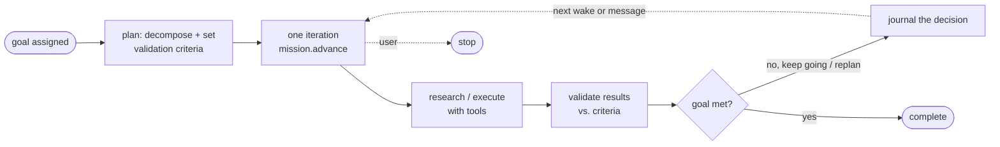
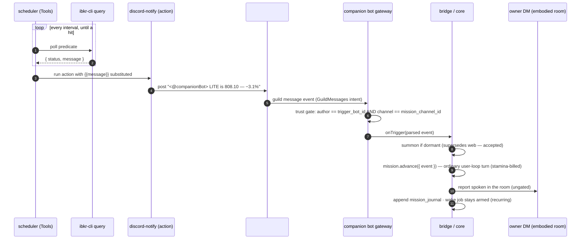
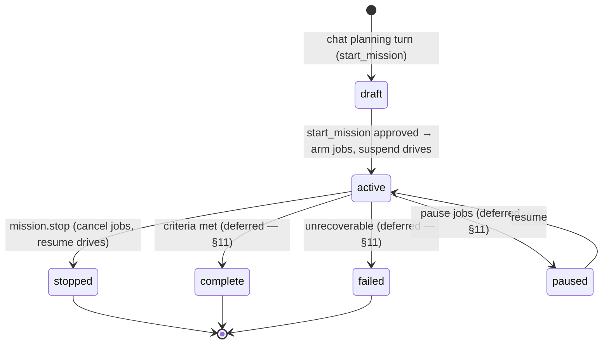

# CobbleCompanion — Missions (goal-driven, long-running tasks)

> **Canonical source for the missions feature's _design and decisions_** — what a mission is,
> why it is a distinct kind of motivation, how the companion is woken to pursue one, and the
> design choices that shape it. A **mission** is a **large, complex, long-running objective the
> companion pursues as an autonomous agent** — it **plans** the approach, **researches**,
> **executes** steps, **validates** the results against the goal, and **repeats** that loop across
> many turns (for days or weeks) until the goal is met or it is told to stop. It is the class of
> open-ended, self-directed task a general autonomous agent (e.g. [Manus](https://manus.im/)) takes
> on — run _inside_ the companion, on its memory, its tools, and its room. Worked example
> throughout: _"monitor LITE; wake me on Discord if it drops below $810; meanwhile track the news
> and report your findings and prediction"_ — a monitoring-flavoured mission; the general capability
> is any goal the companion can plan and iterate toward.
>
> **Status: built (Milestone 1), integration dry-run pending.** The Tools spine ships in the
> `Tools` repo (`scheduler`, `scheduler-cli`, `ibkr-cli query`, `discord-notify`); the companion
> half ships across `@cobble/db`, `@cobble/core`, `@cobble/api`, `@cobble/discord`, and
> `@cobble/web`. What ships is the **spine** of the loop (§1.1): the plan captured at creation, the
> per-turn journal that carries state across iterations, and the event-driven reasoning turn with
> tools. What **fully closes the loop autonomously** — validating each turn against the criteria to
> decide _continue / replan / complete_ without a human — is the deferred trajectory (§11); today a
> mission iterates per wake and the human closes it via `mission.stop`. Also remaining: a live
> end-to-end dry-run and a durability backstop (§11). Present tense below describes the live design;
> §11 marks what is not yet wired.
>
> **Each fact lives in one place.** This doc owns the **mission concept, the wake transport, the
> mission-mode semantics, and the seams each piece touches.** It references (does not redefine) the
> agent loop and propose→approve gate (`architecture.md` §4), the Discord surface
> (`companion-discord.md`), the drive-based motivation engine missions suspend
> (`companion-motivation.md`), the vitality wallets (`architecture.md` §4.8), the WS method
> contracts (`companion-endpoints.md` §4.13), tool acquisition (`companion-tools.md`), and the
> shipped scheduler (`Tools/scheduler/docs/`). Where this doc names a method, table, or payload it
> is a _reference_; follow the link for the _mechanism_.

---

## 1. What it is — a second kind of motivation

The companion is, by default, a **creature driven by drives** — curiosity, bond, helpfulness —
arbitrated homeostatically (`companion-motivation.md`). A drive is "what it _wants_": the tick is
single-shot, idle is a valid outcome, and self-initiated work only ever **reads into its own
memory**. `companion-motivation.md` §10 explicitly defers "a stronger sense of **purpose/agenda** —
goals the companion pursues." A **mission** is that deferred thing: an **externally assigned,
persistent, terminating objective with success criteria** — "what it was _told_ to finish."

| | Drive | Mission |
|---|---|---|
| Origin | Intrinsic (seeded + learned) | Assigned by the user |
| Lifetime | Always present | Created → runs → stopped/complete |
| Goal | None — a homeostatic need | Explicit objective + validation criteria |
| Idle | A valid outcome | A failure to make progress |
| Actions | Reads into own memory only | Plan → research → execute → validate → replan (an agentic loop) + report |
| Cadence | Lazy tick / arbitration | Event-driven (a fired predicate) or you messaging |

Two design consequences flow from this:

- **A mission is an _exclusive mode_, not a competing initiator.** While a mission is `active` the
  **drive engine is suspended** (§6), so a paid mission is never preempted by curiosity and never
  pollutes the learned drive weights. At most **one mission is active per companion**, enforced in
  the database (a partial unique index on `missions`).
- **A mission is _input-driven_, not proactively initiated.** Each mission turn is an ordinary
  agent-loop entry (`architecture.md` §4.1) — the _same kind_ a user message produces — triggered
  by an input, whether that input is **you typing** or a **scheduled trigger** (§3). There is
  therefore **no separate "mission initiator"** to build: `MissionService` owns the mission's state
  and reasoning, and the agent loop it already runs does the rest.

### 1.1 The mission loop — plan, research, execute, validate, repeat

The heart of a mission is not the wake — it is an **iterative, goal-directed loop**. At creation the
companion **plans**: it decomposes the goal into an approach and writes explicit
`validation_criteria` — the test that says when the goal is met. Thereafter, each iteration (one
`mission.advance` turn, §5.2) is a full agentic step: recall the plan and everything learned so far,
**research/execute** with tools, **validate** the new results against the criteria, then **decide** —
keep going, revise the plan, or declare the goal met — and record that decision so the next iteration
builds on it. The loop repeats across many turns until it validates as complete or the user stops it.



Two things make this loop cheap and durable rather than a runaway agent: the **cadence lives
outside** the companion (§2 — the LLM runs only when an iteration is warranted, not in a hot spin),
and the **state lives in a journal** (§4 — each turn recalls "what I concluded last time" instead of
rescanning the transcript, giving genuine cross-day continuity).

> **Build note.** Milestone 1 ships the loop's _spine_ — plan-at-creation, journal continuity, and
> the per-iteration reasoning turn. The **validate → decide (continue / replan / complete)** control
> currently leans on the human (`mission.stop`); making that decision _autonomously_ each turn is the
> deferred trajectory (§11) that closes the loop end-to-end.

## 2. Design principle — push the cheap, deterministic work _out_

The expensive resource is the LLM. Polling a price every second for weeks is **cheap and
deterministic**; reasoning about what a Fed announcement means for LITE is **expensive and fuzzy**.
Missions split the work on exactly that line:

- **Outside the companion (`Tools`):** the clock and the predicate. The **`scheduler`** service
  runs deterministic CLI checks at high frequency and emits a signal **only when something
  happens** (the predicate reports a non-empty message). No LLM, no companion tokens, no companion
  code.
- **Inside the companion:** the goal, the plan, the judgment, the report. The LLM runs a turn
  **only on an input** — you typing, or a scheduled trigger — so weeks of monitoring cost tokens
  only when there is something worth thinking about.

This is the same economics as the ingestion pipeline (read everything, emit almost nothing,
`architecture.md` §4.8), applied to time.

## 3. The actors and the wake path

The scheduler lives outside the companion and knows nothing about it. When a job's predicate fires,
the scheduler runs the job's **action CLI** — `discord-notify`, reused unchanged — which posts a
plain-text message into a **shared mission channel** that both the scheduler's bot and the user's
companion bot belong to. The companion's always-on bot gateway receives it, applies a trust gate,
summons the companion if it is dormant, and runs a mission turn.



An **alert-only milestone** (Milestone 0) exists as a stepping-stone: the same `scheduler` +
`ibkr-cli query` + `discord-notify --user <you>` DMs you directly with **no companion involved** —
a useful smart-alarm, but not the mission (no reasoning, no prediction).

### 3.1 Tools side — the scheduler + `discord-notify` as the action (shipped, no new binary)

Poll-until-condition, not a standing watch: a job **terminates on first hit**, so there is no
edge-trigger/cooldown problem. Canonical docs: `Tools/scheduler/docs/`. **The Tools side is
complete — the mission wake reuses the shipped `discord-notify` with no change.**

- **`scheduler`** — single-instance loopback REST service; API + poll loop + embedded SQLite in one
  process. A **job** = predicate CLI + interval + action CLI + recurrence bounds. Durable
  (persist-before-deliver, at-least-once, retry → `failed`). Trust = loopback + a binary allowlist;
  no shell; `{{message}}` is substituted as **one argv element** (no re-parse, no escaping hazard).
- **`scheduler-cli`** (binary `schedule`) — the companion equips it as a CLI tool:
  `run` / `list` / `get` / `cancel` / `pause` / `resume`.
- **`ibkr-cli query`** — the predicate; `query LITE le 810` prints `{status,message}`; the CLI
  authors the human-meaningful `message`.
- **`discord-notify`** — the mission's **action CLI, unchanged**. Core registers it as the job's
  action with the companion bot @-mentioned and `{{message}}` spliced in as **plain text**:

  ```
  schedule run --every 1s \
    --predicate "ibkr-cli query LITE le 810" \
    --action    "discord-notify --channel <missionCh> --text <@companionBotId> {{message}}"
  ```

### 3.2 The wire format — plain text, mention-prefixed

The message `content` posted to the mission channel is **exactly**:

```
<@COMPANIONBOTID> LITE is 808.10 — −3.1% on the session
```

- A single user-mention of the companion bot, a space, then the **event text** (the predicate's
  `message` verbatim). Core strips the leading mention token(s); the remainder **is** the event.
- **Plain text, not JSON.** v1 carries the event only — no `mission_id` in the payload. Routing is
  by the **single active mission** (§6). Plain text means no `{{message}}` escaping hazard.
- The mention is load-bearing twice: (a) Discord delivers the full `.content` for a message that
  mentions the bot **without** the privileged `MessageContent` intent; (b) it is a human-visible
  "for you" marker in the channel. Multi-mission later routes by **channel** (one mission channel
  per mission), so plain text scales without a structured payload.

### 3.3 Trust vs. routing vs. content

Three concerns are kept strictly separate — the crux of the security design (§8):

- **Trust** = the message `author.id` is the allowlisted `trigger_bot_id` **and** the message is in
  `mission_channel_id`. Both are stored on the per-user `discord_config` row. Trust is the
  **(author, channel) pair — never the message content** (anyone in the channel could type the same
  words).
- **Routing** = the accepted event is routed to the companion's **single `active` mission**. No
  `mission_id` is carried in v1.
- **Content-readability** = the @-mention delivers the full `.content` without the privileged
  `MessageContent` intent.

### 3.4 Summon-if-dormant

On a trigger, if the companion is **not currently embodied**, the bridge **summons
programmatically** (force-claims embodiment; newer ULID wins). This **supersedes** any other surface
(e.g. web) — **disruptive by design, accepted**. The companion then **stays embodied** for the
mission's duration, so subsequent triggers and reports are immediate with no re-summon churn. The
supersede/fencing machinery already handles a mid-turn takeover
(`plans/embodiment-handoff-fencing.md`), so there is no new race.

## 4. State — `MissionService`, `missions`, `mission_journal`

Mission state is **first-class**, not transcript-only, so `list`/`stop`/status and cross-day
continuity are real rather than reconstructed. Data model (Postgres, per-companion — full field
list in `implementation.md`):

- **`missions`** — `id`, `seq`, `companion_id`, `goal`, `plan`, `validation_criteria`, `status`,
  `job_ids` (the scheduler jobs, for cancel on stop), `outward_grant` (nullable,
  deferred — §7), timestamps. (There is no report-target column: the report is spoken in the
  embodied room — the owner DM — §7.) A **partial unique index** on `(companion_id) WHERE status='active'`
  enforces one active mission per companion at the database level, so a racing second activation
  conflicts instead of double-arming.
- **`mission_journal`** — append-only, one row per turn (`event`, `findings`, `prediction`,
  `decision`, ordered by `seq`). This gives **cross-day continuity**: on each trigger the companion
  recalls "what I concluded last time" without rescanning the whole transcript. Content fields are
  nullable — a turn may reason without concluding.

`MissionService` (`@cobble/core`) owns the lifecycle orchestration over these two stores:



The `complete` / `paused` / `failed` transitions are part of the designed lifecycle (and of
`missionStatusSchema`) but are **not implemented yet** — their `MissionService` methods are added
with the autonomous validate→decide milestone (§11). In v1 a mission is armed as a **recurring**
wake and ends via the user's `mission.stop`.

## 5. The two mission turns — create and advance

Both are ordinary agent-loop turns run over the connection's serial chain: creation *is* a
`messages.send` chat turn, and `mission.advance` is its own WS method seeded with the wake event.
The WS-method contracts are owned by `companion-endpoints.md` §4.13.

### 5.1 Creating a mission — plan, approve, activate (a chat turn)

The owner states the goal **in ordinary chat** (`messages.send`) — there is no separate create
method. That turn is the planning turn: the model decomposes the goal
into a `plan` + `validation_criteria` + the scheduler job(s) + the report target, then calls the
effectful **`start_mission`** tool. Because that tool is `effectful`, the shipped propose→approve
gate (`architecture.md` §4.4) holds it as a **proposal** and exits the loop — the plan surfaces to
the user as the standard approval card (in Discord: an embed with Confirm/Reject; no bespoke
approval surface). This one up-front approval is the **start-gate** for a long-running,
token-spending, standing-authorized task.

On confirm, the `start_mission` tool body:

1. reads the mission wake config (`trigger_bot_id`, `mission_channel_id`, the captured `bot_user_id`);
2. **arms the scheduler job** via the `scheduler-cli`-backed `MissionScheduler`, with the action set
   to `discord-notify --channel <missionCh> --text "<@botUserId> {{message}}"`;
3. **creates** the mission draft and **activates** it (records `job_ids`, `status=active`), which
   **suspends the drive engine**.

If activation fails after the job is armed, the tool **cancels the job** as compensation. There is a
narrow accepted crash window between arm and activate (a crash there could leave an armed job with no
active mission); it is documented in the tool and accepted for v1.

### 5.2 `mission.advance` — one iteration of the loop

`mission.advance` is a single turn of the §1.1 loop — recall → research/execute → validate → decide
→ journal. Fired by a trigger _or_ you messaging — handled identically. The bridge calls the
companion-scoped `mission.advance({ event })` WS method:

1. **resolve the active mission.** If there is **none** — a stale/duplicate trigger, or one racing a
   just-issued `mission.stop` — the method **skips cheaply** (`{done:true, skipped:'no active
   mission'}`) rather than burning a stamina turn that would inject no context and journal nothing.
2. **recall.** A dedicated **mission-retrieve arm** in the memory composition injects `goal` +
   `plan` + recent `mission_journal` + the incoming `event` as grounding — so the iteration continues
   from where the last one left off, at zero extra tokens beyond the turn itself.
3. **research / execute.** Pull data and act with tools (e.g. `ibkr-cli`, web fetch), analyze against
   the plan, recompute the prediction. In mission mode, effectful tools run **ungated** (§6).
4. **validate & decide.** Weigh the new results against `validation_criteria` and decide whether to
   keep going, revise the approach, or declare the goal met. _In Milestone 1 this judgment is
   expressed in the turn's reasoning and report; it does not yet drive an automatic status transition
   — the human closes the loop via `mission.stop` (§11)._
5. **report.** The turn's output is spoken in the embodied room (§7).
6. **journal.** `withMissionJournal` taps the turn's `done` message and appends it to
   `mission_journal` as findings (v1 report-as-findings), so the next iteration recalls this
   decision. A superseded turn journals nothing — the live turn on the new connection owns that
   write. The journal write is best-effort: a failure is logged, never surfaced into the turn.

`withMissionJournal` drives the harness generator manually (to tap `done`) but wraps it in
`try/finally` that forwards an early `.return()` into the inner generator, so the harness's own
`finally` — trace end, token debit, in-flight LLM-stream teardown — always runs, matching the
guarantee a plain `yield*` would give.

## 6. Mission mode — exclusivity, drive suspension, gate bypass

While a mission is `active`, the companion is in **mission mode**, which changes two things:

- **Drive-engine suspension.** One early-return gate in the motivation tick
  (`MotivationEngine.tick`): if the companion has an `active` mission → return idle. Drives resume
  on the next tick once the mission leaves `active` (`mission.stop` nudges the engine so this
  happens promptly). Ordinary chat is unaffected — it does not run through this engine.
- **Propose→approve bypass.** While a mission is active, effectful tools run **ungated**: the single
  `start_mission` approval is the **standing authorization** for the mission's work, so the gate
  does not re-prompt on each tool call inside a mission turn. This is intentional and off outside a
  mission. (v1 missions are read-only end-to-end, so no genuinely outward/effectful tool is exercised
  under the bypass yet — §7.)

## 7. Reporting & outward actions (no v1 grant)

**Reporting is the companion _speaking in its embodied room_ — not a gated tool call.** A mission
turn's report is just its output, which the bridge posts to its room exactly like a normal reply or
a proactive DM. No `beforeToolCall`, no gate, no grant. The **report target** is the **owner DM**
(the embodied room) by default — zero new code, ungated. Vitality rides along: the report can
include the stamina line so a weeks-long run stays topped up.

A v1 mission is **read-only** end to end (`ibkr-cli` read-only + web fetch + speak), so there is **no
effectful outward tool for a grant to authorize.** The **standing grant is defined but deferred**:
when a future mission uses a genuinely outward tool (place an order, send email, post where it is not
embodied), mission creation would mint a scoped grant `{ tool, target, rate-limit }`, and the gate
would allow _origin=mission ∧ within-grant_ without per-call approval, revoked on stop. The
`outward_grant` column exists for this; no v1 mission populates it.

## 8. Trust & security — a deliberately narrow non-owner input

The mission wake is the **one place** the Discord surface accepts input from someone other than the
owner. It is kept deliberately narrow, and layered on top of the existing owner lock without
weakening it:

- **Two separate authorities.** The **owner** (the human's Discord account, via DM) may chat, run
  owner commands, and summon/stop — unchanged. The **trigger sender** (the allowlisted scheduler bot
  id, in the mission channel) may **only** fire a mission trigger. It can never act as the owner,
  chat, `/summon`, or `/stop`.
- **Trust is the (author, channel) pair, never content** (§3.3). A message is accepted as a trigger
  only from `trigger_bot_id` **and** in `mission_channel_id`; both are stored on the per-user
  `discord_config` row and read on demand. Everything else in the channel is dropped. The DM
  owner-lock path is untouched.
- **Intent scope.** The gateway enables the `GuildMessages` intent (without it Discord delivers no
  channel messages) but **not** the privileged `MessageContent` intent — the @-mention (§3.2)
  already unlocks content for our one message shape.
- **The token stays out of the companion.** The scheduler's own bot token
  (`SCHEDULER_DISCORD_BOT_TOKEN`) lives in the **scheduler process's environment only**; it is never
  a CobbleCompanion config value and never exposed to the companion. The only mission config the
  companion holds is the two public ids plus its own captured `bot_user_id`.

## 9. What ships where (component map)

| Repo / package | Change | State |
|---|---|---|
| `Tools/scheduler` + `scheduler-cli` | poll-until-condition service + thin client | ✅ shipped |
| `Tools/ibkr-cli` | `query` predicate (`{status,message}`) | ✅ shipped |
| `Tools/discord-notify` | action CLI — **is the mission wake too**, unchanged | ✅ shipped |
| `@cobble/db` | `discord_config` += `trigger_bot_id` / `mission_channel_id` / `bot_user_id`; `missions` + `mission_journal` tables; the one-active partial unique index | ✅ |
| `@cobble/discord` | `GuildMessages` intent; guild trigger path (trust gate, mention-parse, trigger-only authority); programmatic summon; `bot_user_id` capture at ClientReady | ✅ |
| `@cobble/core` | `MissionService` + stores; the `start_mission` effectful tool; the `scheduler-cli`-backed `MissionScheduler`; the mission-retrieve arm; the drive-suspension gate; the propose→approve mission-mode bypass | ✅ |
| `@cobble/api` | `mission.advance` / `list` / `journal` / `stop` WS methods; `discord.config.setMissionWake`; `SCHEDULER_URL` config; full composition-root wiring | ✅ |
| `@cobble/shared` | mission + trigger + mission-wake contracts | ✅ |
| `@cobble/web` | a Missions section in the Discord settings panel (trigger-bot id + mission-channel id, readiness indicator) | ✅ |

## 10. Execution properties (the honest list)

1. **Exclusive mode** — the drive engine is suspended while `active` (§6); ordinary chat is
   unaffected.
2. **Stamina-billed** — the turn runs via the bridge as the real user, an ordinary user-loop turn,
   so it spends **stamina** (`architecture.md` §4.8). "Pre-top-up enough" applies for a weeks-long
   run.
3. **Surface-coupled & disruptive by design** — the mission lives on the Discord surface; a trigger
   supersedes whatever surface you are on (§3.4). Opening web mid-mission is superseded again on the
   next trigger.
4. **Not durable across a companion-worker outage** — if the worker is down when the channel message
   posts, Discord does not redeliver it and the trigger is lost. The fetch-recent-on-reconnect
   backstop that mitigates this is deferred (§11).
5. **State is first-class** — `missions` + `mission_journal` (§4), so `list`/`stop`/status and
   cross-day continuity are real, not reconstructed.

## 11. Deferred / beyond Milestone 1

- **Live end-to-end dry-run** against a running scheduler + Discord guild (a synthetic
  immediately-firing predicate → summon → reason → report → re-fire → `mission.stop`). The unit and
  integration coverage is green; only the live wiring smoke-test is outstanding.
- **fetch-recent-on-reconnect replay** — the durability backstop for the non-durable
  Discord→companion hop (§10.4): on gateway (re)connect, fetch recent mission-channel messages and
  replay unprocessed triggers, deduped against a persisted processed-message cursor. Needs a new
  gateway `fetchRecentMessages` method.
- **Closing the loop autonomously (the validate → decide control, §1.1, §5.2 step 4)** — the biggest
  gap from the north star. Today the companion _reasons about_ progress each turn but does not act on
  it: v1 arms a **recurring** wake and ends via the user's `mission.stop`. The deferred path lets the
  turn's own judgment drive the state machine — detecting `validation_criteria` met (→ `complete`,
  cancel jobs, resume drives), revising the plan/predicate when the approach isn't working, and
  re-arming a fire-once job per turn instead of a blanket recurring one. The `MissionService`
  transitions this needs (`pause` / `resume` / `complete` / `fail`, plus a job re-arm) are added
  with this milestone — deliberately not scaffolded ahead of it.
- **The standing outward-grant** — until a mission uses a genuinely effectful outward tool (§7).
- **Multiple concurrent missions** — would reintroduce explicit routing, solved then by **one
  channel per mission** (not a structured `mission_id`), so plain text still suffices.
- **Richer scheduler payload** (`{{status}}` / `{{job_id}}` tokens) and **richer cron schedules**.
- **Deeper reasoning half** — continuous news-ingest (CPI/PCE/Fed/earnings) and swing-prediction
  depth for the worked example.

> **Self-paced cadence needs no new mechanism.** A mission that should wake on its _own_ clock (e.g.
> "review the news every 6 h") just registers a **recurring scheduler job** whose predicate always
> emits a message — firing the same trigger on that cadence. The scheduler _is_ the companion's
> external clock.

## 12. References

- Discord surface (owner lock, embodiment, summon, intents) — `companion-discord.md`;
  mission-trigger intake is `companion-discord.md` §10
- Mission WS method contracts (`mission.*`, `discord.config.setMissionWake`) —
  `companion-endpoints.md` §4.13
- Agent loop, propose→approve gate, vitality wallets — `architecture.md` §4.1, §4.4, §4.8
- Embodiment fencing / supersede — `plans/embodiment-handoff-fencing.md`, `companion-discord.md` §4
- Drive-based motivation (what missions suspend) — `companion-motivation.md`
- Tool acquisition (how `scheduler-cli` / `ibkr-cli` / `discord-notify` plug in) — `companion-tools.md`
- Data models (`missions`, `mission_journal`, `discord_config` columns) — `implementation.md`
- Shipped scheduler (poll-until-condition, trust) — `Tools/scheduler/docs/`; predicate —
  `Tools/ibkr-cli/docs/api-reference.md` (`query` mode)
</content>
</invoke>
