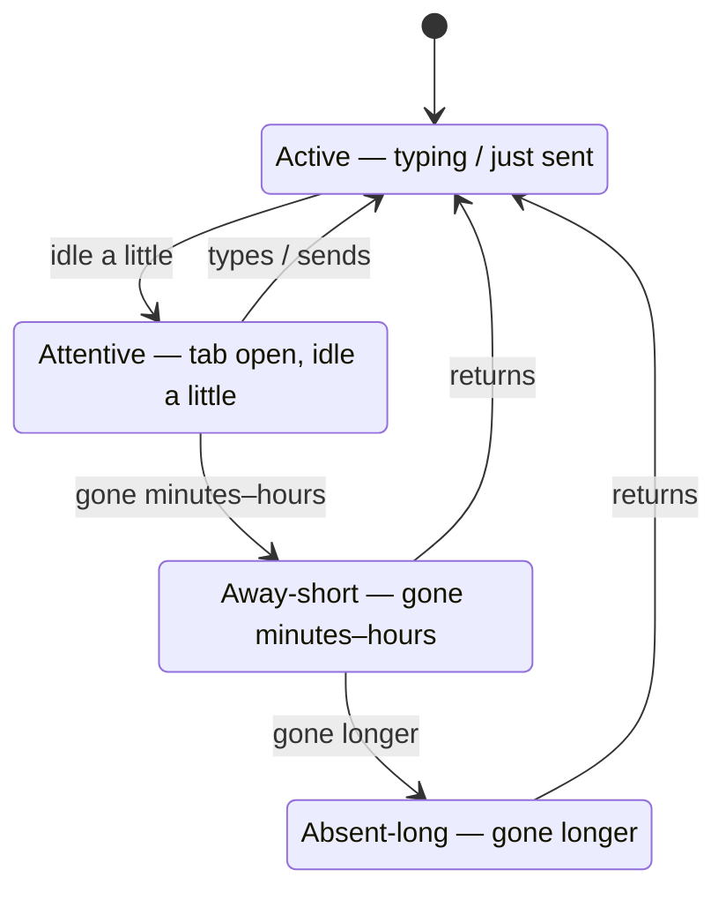
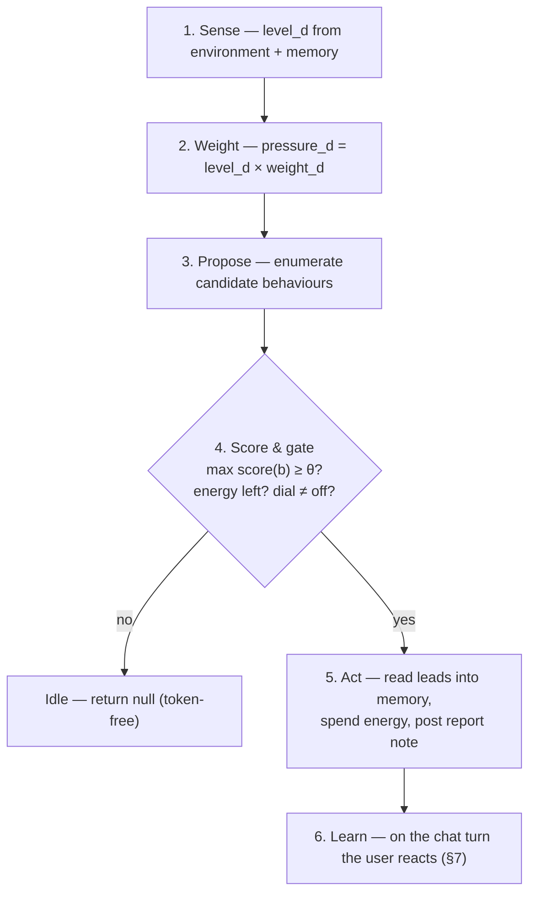
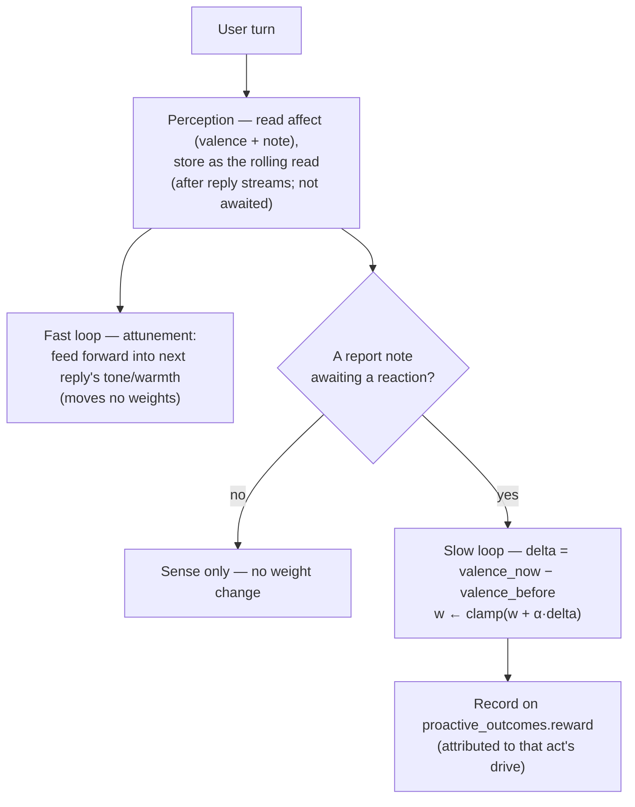

# CobbleCompanion — The Motivation Engine

> **Canonical source for the companion's motivation & proactivity *mechanism*** — how Cobble
> decides, on its own, whether and how to act. For the *what & why* of proactivity see
> `product-overview.md` §5.4–§5.6; for how the engine plugs into the agent loop (the `Initiator`
> seam, the body-then-will split) see `architecture.md` §4.5; for scope/sequencing see
> `development-plan.md` §3; for schema see `implementation.md` §1. Each fact lives in
> exactly one place — this doc owns the drive model, the arbitration mechanism, seeding, and
> learning. What lies beyond this release is collected in §10.
>
> The engine lives in `packages/core/src/motivation/`. Autonomous work runs **free** (no approval —
> it reads leads into memory itself, billed to **energy**, then posts a **report note**), and it
> **learns from the change in the user's mood** its acts produce — not from approve/reject. Learning
> runs as a **two-loop** model driven by one perception that runs **inside the agent loop on every
> turn** (`harness.ts` `perceiveAndLearn` + `motivation/affect.ts`): the companion senses the user's
> **mood and its change**, uses it to **attune** the next reply (fast loop, `context.ts`), and learns
> from the **change** in mood its acts produce (slow loop, `motivation/reinforce.ts` — an additive
> nudge). The slow loop fires only on a deliberate drive-serving act (the report note); ordinary chat
> senses but does not move weights.

## 1. Why this exists

Cobble is meant to be a *creature*, not a tool: it acts from its own motivations rather than only
answering. The **body** is the tools, the propose→approve gate, the tool-call audit log, and the
**lead inventory** (its reading list), all also workable on the user's command. The **will** is the
motivation engine that drives that body on its own. Autonomous work is **not gated by approval**
(autonomy is autonomy); what keeps it safe is its bounded nature — it only **reads into the
companion's own memory**, every act is logged, and **energy** caps how much it can do
(`architecture.md` §4.4–§4.5, §4.8). Approval stays for the user-initiated `/explore` command and
for any future *outward / irreversible* tools (send, pay, post), which don't exist yet. This doc
specifies that will.

The engine fills the reserved `Initiator` seam: an outer-loop ENTRY can be generated by the engine,
not only by a human (`architecture.md` §4.5). Each invocation it either emits a proactive turn or
**stays idle** — idleness is a first-class, free outcome.

> The engine works the **lead inventory**: on an idle tick it **reads** the next leads into the
> companion's own memory on its own — **no approval gate; autonomy is autonomy** (§4.4) — spending
> real tokens billed to **energy**, then posts one in-character **report note** ("here's what I
> read"). The user's reaction to that note in conversation is the reward (the **change in mood** it
> produces, §7) — the companion learns like a person, from how you respond, not from a button.
> Unprompted **conversation** beyond the report note (tips / questions / check-ins) and a stronger
> sense of **purpose/agenda** are out of scope (§10) — they're where the social drives (bond,
> understanding-the-user) begin to fire.

## 2. Vocabulary (four distinct things)

Keeping these separate is what makes the design tractable:

| Term | What it is | Lifetime |
|---|---|---|
| **Drive** | An intrinsic axis of "what it wants" (curiosity, bond, …) | **Fixed taxonomy** (hard-coded enum) |
| **Weight** | How much *this* Cobble cares about a drive — its disposition / personality | **Persisted per-companion; starts neutral; evolves** via learning |
| **Level (need)** | How *unsatisfied* a drive is right now | **Dynamic** — recomputed each tick from environment + memory (mostly derived, not stored) |
| **Behaviour** | A concrete move the engine can take (offer-tip, explore-lead, idle, …) | A fixed set of archetypes; each *targets* live content from memory |

So: a **drive** has a learned **weight** and a live **level**; together they create **pressure**;
pressure selects a **behaviour**.

## 3. The drive taxonomy (the fixed axes)

A small, fixed set keeps the system interpretable and gives the learning loop a stable space. The
*set* never changes at runtime; only the per-companion weights do. The **content** each drive points
at is always read live from memory — never seeded.

| Drive | Wants | Level rises with | Example behaviours |
|---|---|---|---|
| **Curiosity / learning** | discover & understand the world | unread **leads**, new interest signals, knowledge gaps | explore a lead, share a finding, propose an ingest |
| **Bond / connection** | closeness & continuity | time since last contact, emotional cues in recent turns | check in, recall a shared memory, ask about the day |
| **Understanding-the-user** | reduce uncertainty about the user | low-confidence / unknown preference areas, upcoming decisions | ask a preference question, confirm an inference |
| **Approval / competence** *(RL-coupled)* | be useful & appreciated | low recent approval, a high-confidence chance to help | offer a high-value tip, finish a pending task |
| **Helpfulness / goals** | advance the user's goals & pending work | active goals, deadlines, time-sensitive openings | progress a task, surface an opportunity, remind |
| **Upkeep / order** *(light)* | keep its own house in order | unconsolidated memory, a stale inventory | prune/organize leads *(consolidation is already automatic — this axis is minor)* |

> The **Approval / competence** drive is special: it's the one the reinforcement loop (§7) most
> directly shapes. It's how "helpful-vs-annoying" becomes a *felt drive* the companion learns,
> rather than a setting it's told.

## 4. The environment (what shapes *how* a drive is expressed)

The same drive produces different behaviour depending on context. The dominant input is **presence**
— *are you here?* — modelled as a spectrum from a client heartbeat (tab focus/visibility) + last
activity recency. Presence is **volatile** (in-memory, not persisted; a restart just resets it).

| Presence state | Signal | Posture |
|---|---|---|
| **Active** | typing / just sent | don't interrupt — respond, stay in flow |
| **Attentive** | tab open, idle a little | best moment to engage — a tip / question |
| **Away-short** | gone minutes–hours | light solo work; have something ready for return |
| **Absent-long** | gone longer | catch-up posture; bond pressure rising |



Other environment inputs: available tools, the lead frontier, time since last contact,
**remaining energy** (§8), and the **user's affect** — the companion's rolling read of the user's
mood and *its change* turn to turn, sensed in the agent loop (§7). Rule of thumb: **present
→ engage the user** (don't wander into solo projects unasked); **away → do solo work** that surfaces
on return; **idle whenever nothing clears the bar.**

## 5. The mechanism — one tick

Every invocation runs this loop. Steps 1–4 are **token-free** (cheap DB counts + in-memory
presence), so *staying idle costs nothing*. Only step 5 spends tokens (energy).



1. **Sense** — for each drive `d`, compute its level `level_d ∈ [0,1]` from environment + memory.
2. **Weight** — `pressure_d = level_d × weight_d`. Personality bends raw needs.
3. **Propose** — enumerate candidate behaviours `B`. Each behaviour `b` serves a subset of drives
   (`served_{b,d} ∈ [0,1]`), has a **presence-fit** `fit(b, presence) ∈ [0,1]`, and an
   `energyCost(b)`.
4. **Score & gate** —
   ```
   score(b) = ( Σ_d served_{b,d} · pressure_d ) · fit(b, presence) − λ · energyCost(b)
   ```
   If `max_b score(b) < θ`, or energy is exhausted, or the dial is `off` → **idle** (return null).
   Otherwise pick `argmax` with a small **exploration** floor `ε` (so it doesn't ossify).
5. **Act** — the engine runs the chosen behaviour against its live target, spending real tokens
   debited to **energy** (the only token spend; §8). That behaviour is **reading** the
   next leads into memory — **no approval, autonomous work isn't gated** (§4.4) — then posting one
   in-character **report note** summarising what it did. The burst is sized to what energy can
   afford (§8).
6. **Learn** — learning does not happen on this engine tick; it happens on the *chat* turn the user
   reacts on. The agent loop senses the user's mood every turn and, when a report note is awaiting a
   reaction, the **change** in mood it produced nudges the served drive's weight (§7).

`θ` (threshold), `λ` (energy aversion), and `ε` (exploration) are scaled by the **tunability dial**:
`off` → never act; `gentle` → high threshold, sparing; `active` → low threshold, eager. The dial is
the user's single intensity control.

## 6. Personality — the "creature" knobs

Per-companion constants **seeded at creation** (from temperament) shape the *dynamics* of the loop
above:

- **Focus length** — how many leads the chosen drive works in one burst before the engine
  re-arbitrates on the next tick. This is the explore-burst limit (`arbitration.ts`,
  `DEFAULT_KNOBS.focusLength = 3`).

Two further knobs — **boredom** (how fast the active drive satiates) and **distractibility** (how
much a higher-pressure drive can preempt mid-burst) — are persisted in the knob shape but inert;
they need a multi-step / multi-behaviour loop the tick doesn't yet run (§10). Together the three
numbers are what would produce the personality spectrum — a **tenacious deep-reader** (long focus,
low boredom, low distractibility) vs. a **magpie** (short focus, high boredom, high distractibility).

## 7. Seeding & evolution (what's fixed, what's learned)

- **Fixed forever:** the drive *taxonomy* (§3); the **temperament seed** (already immutable by
  product rule, `product-overview.md` §5.5).
- **Starts neutral, then learned:** the **drive weights**. A new companion starts at **neutral**
  (equal weights) and is *raised* into its disposition by the reinforcement loop below — personality
  **emerges from interaction** rather than being born fixed. Persisted in
  `companions.drive_weights` (null → neutral). (A richer initial seed from onboarding is out of
  scope, §10.)
- **Learned over time:** the weights **evolve** via the reinforcement loop below — this *is* the
  relationship-growth axis surfaced in the growth mirror (`product-overview.md` §5.5).
- **Dynamic, not "evolved":** drive **levels** are recomputed each tick (bond from message
  recency, curiosity from lead count, approval from recent reward history) — mostly derived, so
  almost nothing extra is stored.
- **Default constants:** the personality **knobs** (§6) run at shared defaults so the *mechanism*
  works; per-companion personalization (alongside the weight seed) is out of scope (§10).

### Reinforcement — learning from the user's mood, turn by turn

The companion learns the way a person does: across **every** turn it senses how the user feels and,
crucially, **how that feeling changes** in response to what the companion just said or did. There is
**no approve/reject button** — tying learning to a UI control was the wrong abstraction. Two loops
run off **one perception**.



**Perception — sense every turn, in the agent loop.** On each user turn the harness reads the user's
affect: a **valence ∈ [−1, 1]** plus a short natural-language **note** ("relieved", "frustrated,
terse"). It is stored as the companion's **rolling read of the user** (`companion_affect`, one row
per companion; see `implementation.md` §1). This is a **body** capability — it lives *in* the agent
loop (`architecture.md` §4.5), not as a bolt-on in a route handler — and it is **launched after the
reply streams (all tokens + `done` already sent) and not awaited**, so it adds zero latency to the
answer and never holds the SSE socket open. It is taken on every turn, not only after the companion acted.
Its tokens ride the chat turn, so they are billed to **stamina**, not energy.

**Fast loop — attunement (adjusts behaviour, learns nothing).** The stored read is fed *forward*
into the next reply's context, so the companion adjusts **tone, warmth, and level of detail** to
where the user is — the way you enter a conversation already holding a sense of how the other person
last seemed. This updates **no weights**; it is pure in-the-moment attunement, and it is the most
human-visible half of the mechanism.

**Slow loop — change-as-reward (learns).** The reward is the **change** in affect, not its level:

```
delta = valence_now − valence_before
```

Brightened after the companion's act → positive; cooled → negative; nothing moved → ~0. The delta
nudges the served drive's weight by an **additive step**, clamped:

```
w ← clamp( w + α · delta )
```

Positive delta raises the weight, negative lowers it, **zero leaves it untouched**. Because the
signal is a *change*, neutrality is **intrinsic** — a flat reaction simply yields `delta ≈ 0` and no
nudge, with no arbitrary "ignore faint praise" threshold — and **big emotional swings teach more**
than flat exchanges (the magnitude self-weights). The weights stay **interpretable** ("Cobble has
learned you value concise morning summaries"), which is both the growth signal *and* the
helpful-vs-annoying **measurement** — one mechanism, not two.

> **Why change, not level.** Absolute valence would reward "the user is happy" even when the
> companion's act had nothing to do with it (or mildly annoyed them on an otherwise good day). The
> derivative isolates *the companion's effect*. An additive nudge on the change is also why no
> neutral-band floor is needed: a zero delta is simply a no-op, where an EMA-toward-target update
> would instead pull the weight toward zero and slowly kill the drive.

**What the delta is attributed to.** The slow loop fires **only when a
deliberate drive-serving act is awaiting a reaction** — the autonomous burst's report note (the most
recent unresolved `proactive_outcomes` row; `note_message_id`). The delta is attributed to that act's
drive, and `proactive_outcomes.reward` records it. **At most one note waits at a time:** the engine
tick will not start a new burst while an outcome is still unresolved, so "the most recent unresolved
row" is unambiguous. A scalar mood delta can attribute to a single act
only; allowing two pending notes would mis-credit the reaction to the wrong one and orphan the other.
Reactions only *resolve* outcomes and ticks drain serially, so the gate makes a second pending row
impossible rather than papering over it after the fact. Ordinary chat still **senses** every turn (so
attunement and the rolling read always work) but does **not move weights**: diffuse credit
assignment across **bond / understanding-the-user / persona** is out of scope (§10). This keeps learning
well-attributed and, as a side effect, naturally **bounds reward-hacking** — weights only move on acts
the companion *chose*, not on every pleasant exchange.

**Seam — body senses, will learns.** Perception lives in the agent loop (the body); the weight update
lives in the motivation layer (the will). The two stay separated; one affect signal connects them.
The harness produces "the user's mood changed by `delta`"; the will decides what, if anything, that
teaches.

**Guards:** additive nudge at a small rate (slow drift, not whiplash); an exploration floor so a
drive never dies to zero; change-as-reward so it can't fish for raw "thanks"; the energy budget + dial
cap how often the companion initiates at all. **Not guarded — by decision:** *sycophancy.* A companion
that learns to please vs. one that stays honest-and-stubborn is a **personality divergence**, not a
bug; the per-companion **learning policy** that would own it is out of scope (§10), so the reward
stays policy-neutral and the drive-serving gate above bounds it meanwhile.

## 8. Budget interplay — energy gates the will

Self-initiated work draws the **energy** pool; user-initiated work draws **stamina** (the two-pool
model, `architecture.md` §4.8). Consequences:

- Every autonomous read spends **real provider tokens** (the ingestion passes), debited to energy
  through a per-run meter override on the shared pipeline (`architecture.md` §4.8) — energy is the
  actual token cap on self-initiated work, not a placeholder.
- When **energy is exhausted**, step 4 idles — the companion **stops initiating** but still answers
  on stamina. Out of energy ≠ out of conversation.
- Autonomous work can **never starve interaction** — separate counters (energy vs stamina).
- **Energy-aware planning:** the burst is sized to what energy can afford — `limit = min(focus
  length, ⌊energyRemaining / estimated-read-cost⌋)`, and below one read's worth the engine idles. So
  the companion *scopes its plan to its means* rather than only stopping at zero. (The `architecture.md`
  §4.7 agent-loop ceiling still governs the chat/LLM loop; the autonomous read is bounded by energy +
  focus length, as above.)

## 9. Worked examples

**A — Away, leads pending, energy available.** You've been gone an hour (Away-short). No one to
engage, so engagement behaviours get low presence-fit; `explore-lead` wins. It **reads** the next
few leads into memory on its own (bounded by focus length and what energy affords), spending real
tokens against energy — no approval, that's what autonomy means. When you return, one in-character
note is waiting: *"While you were out I read those two pieces on X — ask me anything."* How you reply
becomes the reward.

**B — Nothing worth doing.** Dial is `gentle`, leads are stale, you were here 5 minutes ago, energy
is nearly gone. Every behaviour scores below `θ` (or energy can't afford a read) → **idle**, zero
tokens. The companion is content to rest.

## 10. Design decisions & scope

**Design decisions (this doc):**
1. **Fixed drive taxonomy** of six axes (§3); no runtime drive-kind invention.
2. **Two-level granularity** — coarse weighted axes × live fine-grained targets from memory.
3. **Weights** start **neutral** per-companion and **evolve** via reinforcement — a Cobble is
   *raised* into its personality.
4. **Homeostatic-need × learned-weight** arbitration with a **token-free heuristic gate**; the LLM
   only *executes* the chosen behaviour.
5. **Knobs run at default constants**; **taxonomy + temperament immutable**; **levels dynamic**. Of
   the three knobs, only **focus length** drives the burst (§6).
6. **Autonomous work runs free** — no approval gate, no proposal cards. On an idle tick the engine
   **reads** the lead inventory into memory itself, spends real tokens against **energy**, and posts
   one **report note**. (Approval is kept for the user-initiated `/explore` command and for any future
   outward/irreversible tools — revisited when such tools exist. Autonomy is autonomy.)
7. **Reinforcement = the user's mood, sensed every turn in the agent loop** — one perception
   per turn drives two loops: a **fast** loop that attunes the next reply to the user's mood (no
   learning), and a **slow** loop that learns from the **change** in mood (`delta = valence_now −
   valence_before`) via an additive nudge `w ← clamp(w + α·delta)`. Change-as-reward, not absolute
   valence; no approve/reject button.
8. **Slow-loop learning is gated on a deliberate drive-serving act** — the delta moves weights only
   when a report note is awaiting a reaction (attributed to that act's drive). Ordinary chat senses
   every turn (attunement + rolling read) but does not move weights. **Sycophancy is not guarded** by
   decision — it's a personality divergence the per-companion learning policy would own (§10 below),
   and the drive-serving gate bounds it meanwhile.

### Beyond the PoC

Out of scope for this release; the roadmap is owned by `development-plan.md`. (The stamina/energy
**game economy** that the budget feeds is part of the product — see `companion-economy.md`.)

**Built, not yet wired (gaps).**
- The **boredom** and **distractibility** knobs (§6) are persisted but inert — they need a
  *multi-step inner loop within a tick* (per-step satiation decay) and *competing behaviour families*
  (mid-burst preemption), and the tick is single-shot over the one `explore` behaviour today.

**Out of scope / future.**
- **Unprompted conversation** beyond the report note (tips, questions, check-ins) + a stronger sense
  of **purpose/agenda** (goals the companion pursues and raises on its own). This is where the
  **bond** and **understanding-the-user** drives begin to fire and learn. *Illustrative:* a present &
  attentive Cobble that spots a juicy lead and offers an unprompted "want the gist?"; or one that, over
  weeks, learns from which offers you engage to become a tenacious research partner — *raised, not
  configured.*
- **Ordinary-chat learning** — using the every-turn mood **delta** to move the **bond /
  understanding-the-user / persona** dispositions on plain conversation (not only on a drive-serving
  act). Needs diffuse credit assignment across those targets.
- **Single-pass perception** — folding the affect read into the same model pass that generates the
  reply (one call instead of two), via a structured side-channel; today it runs a separate cheap read.
- **Per-companion learning policy** — the disposition that makes one Cobble learn to please and
  another stay honest/stubborn (the sycophancy axis, §7); reward stays policy-neutral until then.
- **Continuous work-while-away** — eager between-visit activity (needs push for an audience;
  `architecture.md` §4.5).
- **Onboarding personality seed** — a richer initial seed from the onboarding selection (weights +
  knobs); weights stay neutral so the character card is *earned*.
- **Deeper RL** — a contextual-bandit / richer policy, and evolving knobs.

## 11. See also
- `architecture.md` §4.5 — the `Initiator` seam, body-then-will, loop integration.
- `architecture.md` §4.4 — propose→approve gate + the `origin` resolution.
- `architecture.md` §4.8 — stamina/energy two-pool budget.
- `product-overview.md` §5.4–§5.6 — proactivity & vitality (the what & why).
- `implementation.md` §1 — schema (`drive_weights`, `personality_knobs`, `companion_energy`,
  `proactive_outcomes`, `proposals.origin`, `companion_affect`).
- `development-plan.md` §3 — scope, DoD, and deferrals.
