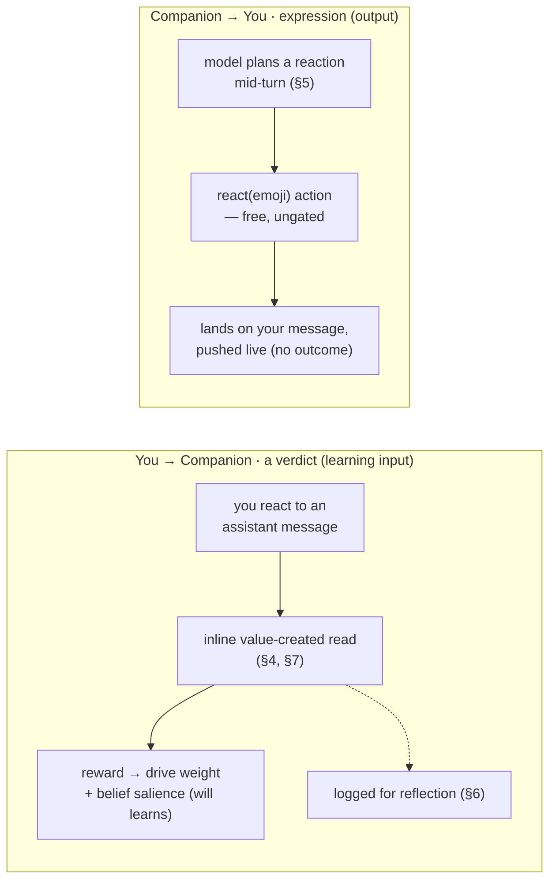
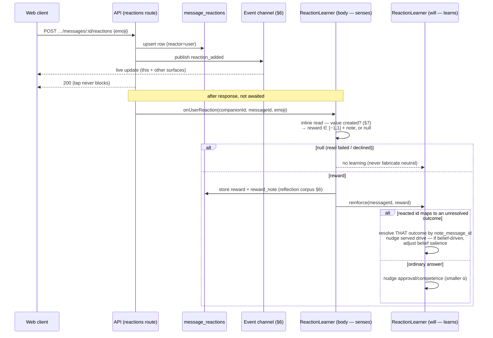
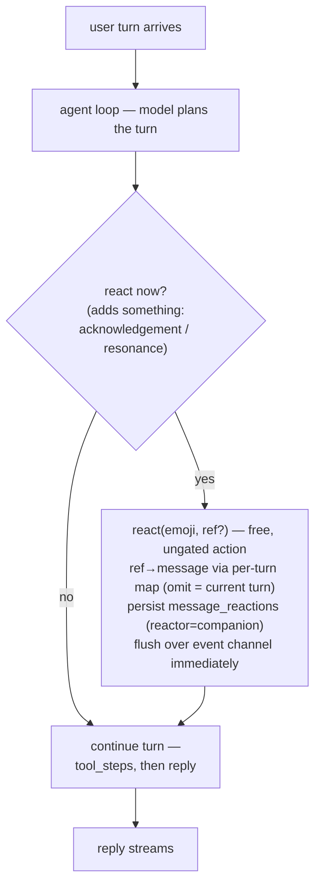
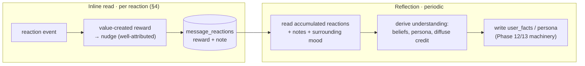
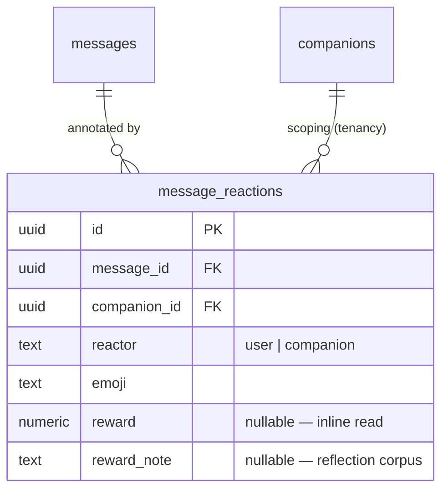

# CobbleCompanion — Emoji Reactions

> **Canonical source for emoji reactions in chat** — the user reacting to the companion's messages,
> and the companion reacting to the user's. Reactions are a **second reward-learning channel** beside
> the every-turn affect loop: an _addressed, explicit_ signal the companion learns from, and an
> _expressive_ act the companion emits to feel present. This doc owns the reaction surface, its data
> model, and how its signal plugs into learning; the **drive model, arbitration, and change-as-reward
> loop it extends** are owned by `companion-motivation.md` §7. For the agent-loop seam the companion's
> own reaction is emitted from see `architecture.md` §4.5; for the standing event channel reactions
> ride see `architecture.md` §6; for the **stamina** wallet the read it triggers spends see
> `companion-economy.md`; for the user model / beliefs the reflection layer feeds see
> `companion-memory.md` §4; for canonical schema (`message_reactions`) see `implementation.md` §1; for
> scope/sequencing see `development-plan.md` §4f.
>
> **Status: designed, not built.** Nothing in this doc ships yet. It specifies the design; phase
> placement and acceptance criteria are owned by `development-plan.md` §4f.

## 1. Why this exists — what a reaction _is_

A reaction is a distinct speech act from a reply, and stripping it to first principles is what makes
it valuable to a _learning_ companion. A reaction has four properties a typed turn does not:

1. **It is _addressed_.** A reaction is bound to exactly one message. A reply is ambient — it answers
   "the conversation," and you must infer what it responds to. A ❤️ on message _M_ is unambiguously
   _about M_. This is the property that matters most below.
2. **It is backchannel / low-friction.** It costs the sender almost nothing and takes no turn — so it
   carries the small signals people wouldn't bother typing ("that landed", "I saw this", "aww").
3. **It is a compressed verdict.** An emoji is a quantized emotional judgement, carrying valence and
   often a flavour (delight vs. agreement vs. gratitude).
4. **It is asynchronous & retractable** — a revisable annotation on the transcript, addable later and
   removable, rather than an immutable turn.

The companion's change-as-reward loop (`companion-motivation.md` §7) already does real work —
differencing valence (`delta = valence_now − valence_before`), the one-pending-outcome rule, the
`findLatestUnresolved` claim — to **isolate the companion's effect** and **attribute it to the right
act**. A reaction gives that away for free: an explicit, signed, **addressed** verdict on a specific
act. The motivation doc literally calls the thing it waits for "a reaction"; this feature makes that a
real, structured signal.

So the strategic framing: **reactions are the high-confidence, explicitly-attributed reward channel;
the every-turn affect delta is the implicit, ambient fallback.** They are complementary, not
redundant.

## 2. Vocabulary

| Term                     | What it is                                                                                                                                                                                          |
| ------------------------ | --------------------------------------------------------------------------------------------------------------------------------------------------------------------------------------------------- |
| **Reaction**             | An emoji attached to a single transcript message, by the user or the companion. A `message_reactions` row, not a transcript turn (`implementation.md` §1).                                          |
| **Reactor**              | Who placed the reaction — `user` or `companion`.                                                                                                                                                    |
| **Value-created reward** | The reward a _user_ reaction yields: **did the companion's act create value for the user?** Judged in context, in [−1, 1] — not the emoji's face-value valence (§7).                                |
| **Inline reaction-read** | The cheap, per-reaction structured read that turns one user reaction (in the context of the act it lands on) into a value-created reward + note. The fast path that feeds the nudge (§4, §7).       |
| **Reflection**           | The slower, periodic pass that turns _many_ reactions + their notes into understanding — beliefs, persona, diffuse credit — feeding the user model (§6). A separate timescale from the inline read. |
| **Expressive reaction**  | A reaction the **companion** emits as part of a turn (👀 "on it", 🎉, 🙏). Pure expression — it creates no outcome and awaits no reward (§5).                                                       |
| **Quick-react bar**      | A curated shortcut set (❤️ 👍 😂 🎉 😮 😢 🙏 👎) shown for one-tap reacting, with a "+" to the full picker. A **convenience, not a constraint** — neither side is limited to it (§7).               |

## 3. The two directions

Reactions flow both ways, and the two directions have **different natures** — one is a learning
_input_, the other an expressive _output_:

Only `message`-kind rows are reactable; `tool_step` / `proposal` chrome is not.

## 4. Flow 1 — you react (the reward channel)

The user taps an emoji on an assistant message. Persisting and acknowledging the tap is instant; all
learning runs **after** the response and is best-effort, so a reaction never blocks the UI and a
learning hiccup never surfaces as an error (`logging.md`).

Three things this flow makes precise:

- **Addressing replaces differencing.** Because the reaction is pinned to one act, the reward needs no
  `valence_now − valence_before`; the act is already isolated. The inline read outputs the reward
  directly.
- **Resolve _by message id_, not "latest unresolved."** A reaction on a report note resolves the
  `proactive_outcomes` row whose `note_message_id` equals the reacted id — strictly better attribution
  than the ambient `findLatestUnresolved` path, and it sidesteps the one-pending ambiguity.
- **First resolver wins, for free.** The existing atomic claim (`reward IS NULL`,
  `companion-motivation.md` §7) means if a reaction resolves an outcome, the later ambient affect delta
  finds nothing unresolved — no double-nudge — and vice-versa. No new guard.

**Reactions on _ordinary_ answers — which drive, and how hard.** Today ordinary chat moves no weights
(diffuse credit is deferred). But a reaction on a plain answer is _not_ diffuse — it is addressed — so
it does teach. The question is _which_ drive, given a plain answer has no _motivating_ drive to credit
(unlike a proactive act, where the served drive is known).

- **Target: the `approval` drive.** A reaction on a plain answer signals one thing — _"were you useful /
  did that land?"_ — which is exactly the **`approval`** drive: the companion's "be useful and
  appreciated" axis (`companion-motivation.md` §3, the RL-coupled one). A 👍 on a crisp answer raises
  it; a 👎 on a bloated one lowers it. _("approval/competence" in §3 is one drive with a two-word label
  — approval = appreciated, competence = good-at-it — not two drives; the code calls it `approval`.)_
  All plain-answer reactions route here, **not** split across bond/understanding/etc.: guessing that
  split from one emoji is the diffuse-credit problem we defer (§6); approval is the honest, well-aimed
  default because every reaction on a direct answer is, at bottom, about usefulness.
- **A gentler nudge than a proactive act.** A proactive-act reaction judges a **deliberate bet the
  companion chose to make** (high signal about its _initiative and judgment_) and is **precisely aimed**
  (the served drive is known); a plain-answer reaction is **lighter** (feedback on one response, not its
  character), **fuzzier** (routed to a default), and **far more frequent**. If every casual 👍 moved
  personality as much as a reaction to a self-initiated act, the character would whipsaw on everyday
  taps. So everyday feedback **drifts** the dial gently and accumulates. _Analogy:_ a colleague who
  **stays late on their own initiative** to prep a briefing and hears "this is excellent" learns a lot
  about whether to take initiative again; the same colleague answering a routine question and hearing
  "thanks, perfect" learns little from any one — but a hundred such moments add up to "reliably
  helpful." → **proactive-act reaction ≈ `0.1`** (parity with the existing affect-delta rate — an
  addressed reaction is at least as trustworthy); **plain-answer reaction ≈ `0.04`** (gentle drift).
  Both are deliberately conservative starting values, tunable up later (`companion-motivation.md`'s
  "slow drift, not whiplash" guard). The reaction's _emotional intensity_ already scales within each
  channel (a 🎉 carries more than a lukewarm 👍); these rates set each channel's **baseline weight**.
- Its note still feeds reflection (§6).

## 5. Flow 2 — the companion reacts (expression, planned in the turn)

The companion's own reactions are **a first-class expressive action the model plans within a turn** —
not a side-channel perception. The killer property is **react-early-then-work**: you ask it to
validate something, a 👀 lands on your message in a beat, _then_ the tool steps stream, _then_ the
verdict. That depends on the reaction being _in_ the plan, decided by the model that understands the
request.

- **Plumbed like a free `tool_step`.** The `react` action reuses the loop's expressive-emit machinery:
  **ungated** (no approval — it's not effectful), **leaves no `tool_step` chrome row** (the reaction
  itself is the artifact — see _Reading back_ below), and **streamed the instant it's decided** so it
  can precede the rest of the turn. It persists a `reactor='companion'` row on the _user's_ message.

### Addressing — _which_ message the companion reacts to

A reaction is **addressed** (§1), so the companion must point at a specific message. But the model
never sees message ids — the context projection (`architecture.md` §4.5) is `{role, content}` only, and
the real ids are UUIDs the model would mis-copy. The mechanism keeps identity **server-side**:

- **Request-scoped handles.** When context is assembled, each **addressable message** (the recent
  _user_ turns — the only rows the companion reacts to) is tagged with a tiny ordinal `[1] [2] [3]`,
  and a turn-local map `ref → messageId` is held for that request only (never persisted; discarded when
  the turn ends). The model points with `react(emoji, ref)`; the harness resolves `ref` against the map
  to the real message id. The model handles a small integer, never a UUID, and `ref` is validated to be
  **in range** — so it cannot point outside what it can see.
- **Omit `ref` = the current turn.** The common case (👀 the thing you just asked) needs no handle: an
  omitted `ref` binds to the message that triggered this turn, which the harness already knows. Handles
  matter only when the companion singles out a _non-latest_ message.
- **The grain is the message row, exactly as sent.** Reactions attach to whole messages, never
  sub-spans. If you send three separate messages, that is three addressable rows (🎉 on one, 👀 on
  another); if you send the same three lines as _one_ message, it is one row and both reactions stack on
  it. A single message can carry several reactions (different emoji → different rows; the
  `unique(message_id, reactor, emoji)` rule allows it). The companion can't pin a reaction to one phrase
  inside a combined message — separate sends give finer-grained reactions.
- **Bounded to what's in view.** Addressing reaches only messages **in the current context window** —
  covering a rapid-fire burst and a recently-earlier message, but not something scrolled far into the
  past (that would need _retrieval_ first — out of scope, §11). Reacting to what's presently visible is
  both simpler and correct: it mirrors a person reacting to what's on screen.

### Reading back — reactions are conversational content, always visible to the companion

A reaction was genuinely _expressed_, so the companion **always reads it back** — its own _and_ the
user's — woven in as an **inline annotation on the message it belongs to**, not a separate transcript
line. So later context reads like `[1] You: I got the job! (companion reacted 🎉)` /
`Companion: …answer… (you reacted ❤️)`. This is what stops the companion from re-celebrating news it
already cheered, and lets it carry the sense that a past answer _landed well_.

> **Reading back ≠ learning again.** Learning fires **once**, the moment a reaction lands (§4); reading
> the reaction back later is **pure memory** and moves no weights — so continuity never re-triggers a
> reward, no matter how many times the reaction re-enters context. _(This corrects an earlier draft that
> said the companion's reaction is "excluded from the context projection like a `tool_step`": the
> chrome **row** is suppressed, but the reaction's **content** is surfaced inline.)_

Reactions ride **with their messages**: when a message ages out of the window, its reactions go with it;
a reaction moment worth keeping long-term is captured by the episodic layer (`companion-memory.md`), not
by pinning it in live context forever.

- **It subsumes the affective case too.** If the companion is taking a turn anyway, the main model
  understands emotional content at least as well as a cheap side-read — so a ❤️ on good news is also
  just a planned action. **One mechanism**, not two; the affect read goes back to pure perception
  (sense → learn), never expression.
- **No extra cost.** The reaction is a few tokens in a turn the model already runs — no separate call.
  It rides the turn's **stamina**, like the reply.
- **It creates no outcome.** Expression awaits no reward — otherwise the companion could react to _bait_
  a reaction. It is a free emit, like a tool step.
- **The dial concern dissolves.** A reaction _inside a turn responding to you_ **is** being reactive —
  so `off` (reactive-only, `companion-motivation.md` §5) has nothing to suppress; expressive reactions
  only happen while already answering you.
- **It lets the companion be terser.** Instead of typing "Sure, let me check that," it 👀 and goes — a
  glance reads as _more_ present than a sentence, and trims reflexive filler. Prompt-govern it the way
  tool use is governed: react only when it _adds_ something, never on every turn.
- **Not whitelisted — governed by taste.** The companion is **not** restricted to a fixed set; it may
  pick any emoji, the same way it chooses its wording. The only soft guidance is **legibility** — lean
  on common, unambiguous emoji, since a reaction the user can't read is a wasted signal. The
  quick-react bar (§2) is a user convenience, not the companion's allowed set.

## 6. Flow 3 — reflection (the deeper, separate learning pass)

The inline read (§4) produces the immediate, well-attributed **reward**. A second, slower pass turns
accumulated reactions into **understanding** — and the two are deliberately separate timescales (the
inline read _must_ be immediate, to attribute while the outcome is still fresh; reflection benefits
from hindsight the inline read can't have).

Reflection rides the existing consolidation/reflector cadence (`companion-memory.md`). It converts
"the user reacted 😢 to a moving story, 👍 to terse facts" into beliefs ("moved by personal stories;
prefers concise") and persona refinement — and it is the natural home for the **diffuse-credit**
ordinary-chat learning the motivation loop defers. **Reflection is the next layer, not a v1 blocker:**
the reward channel works without it; reflection makes the companion _understand what kind of value this
user wants_, not just nudge a weight.

## 7. The reward is "value created", not emoji valence

The single most important design decision: a **fixed emoji→score lexicon is wrong** on the reward
path, because the same glyph means opposite things depending on what the companion did.

> The companion shares a piece of sad news and you react 😢. That is **not** a negative reward — you
> were _reached_; the act created value. The same 😢 on a botched attempt to help _is_ negative. The
> reward is not "is the user happy" and not "what does the emoji mean" — it is **did the companion's
> act create value for the user?**, and only the _context_ (what it did, what it said) separates the
> two. A static table can't see that — and by `companion-motivation.md` §7 ("big emotional swings teach
> more"), it would be wrong on exactly the reactions that should teach the most.

So the reward is **interpreted, not looked up**, which lands it back in the architecture already there:
the change-as-reward loop never read keywords — it read mood _in context_. The **inline reaction-read**
(§4) is the same machinery as the affect read (`implementation.md` §1, the `report_affect` channel),
generalized: its inputs are _(the reacted message + recent context + the act's intent / served drive)_;
its output is a **value-created reward ∈ [−1, 1] + a short note**, or **`null`** on failure/decline.
The same body-senses / will-learns seam holds — the read is a body-side perception, `reinforce.ts`
decides what it teaches.

- **Null is never a fabricated neutral.** A failed or declined read yields no learning — identical to
  the affect read's rule, so a hiccup can't masquerade as a neutral reward and move weights.
- **Any emoji is fair game, both ways.** Because the reward is interpreted in context, **no emoji set
  is enforced** — the user reacts with anything (the quick-react bar is just a shortcut, §2), and the
  companion picks freely, guided by taste/legibility rather than a whitelist (§5). The read interprets
  whatever appears.
- **Reward-hacking shrinks.** A "value-created" judgement is far harder to farm than spamming ❤️, and
  the existing guards still hold: claim-once-per-outcome, small additive α, the drive-serving gate.

## 8. Data model, delivery & API

**Table — outside the append-only transcript.** Reactions are _mutable_ (add/remove, after the fact);
the transcript row is immutable. So reactions live in their own table, and the transcript stays
canonical. Canonical schema → `implementation.md` §1.

`unique (message_id, reactor, emoji)` makes toggling idempotent; un-reacting deletes the row.
`reward` / `reward_note` are filled by the inline read (user reactions only) and are the corpus
reflection (§6) consumes.

**Contracts** (`@cobble/shared`) — a validated `emoji`, a `ReactionDto`, and a derived
`MessageDto.reactions[]` (joined for render, never stored on the immutable row). Boundary validation
(`security.md`) checks the value is a **single well-formed emoji** with a sane length cap — **not**
membership in an allowed set; no emoji is whitelisted on either side (§7).

**Delivery** — reactions ride the **standing companion event channel** (`architecture.md` §6): two new
`CompanionStreamEvent` variants, `reaction_added` / `reaction_removed`, carrying
`{ messageId, reactor, emoji }`. This is how the companion's own reaction appears live, and how a
reaction placed on one surface syncs to another.

**API** — `POST /companions/:id/messages/:messageId/reactions {emoji}` and
`DELETE …/reactions/:emoji`: validate, persist, publish, **return immediately**; the inline read +
reinforcement run after the response, best-effort.

**Seam — event-triggered, beside the harness.** A user reaction is _not_ a turn, so its read is
triggered from a small **`ReactionLearner`** (body-side perception → reward), not from the harness's
in-loop `perceiveAndLearn` — analogous to how the greeting is edge-triggered (`companion-greeting.md`).
The companion's _own_ reaction, by contrast, _is_ emitted inside the agent loop (§5).

## 9. How it fits the motivation engine

Reactions **extend** the change-as-reward loop (`companion-motivation.md` §7) rather than replacing
it — they reuse its machinery unchanged:

- **The reward target** — a user reaction on a report note resolves the same `proactive_outcomes` row
  the ambient affect delta would, attributed by `note_message_id`. If the burst was belief-driven
  (`driven_by_user_fact_id`), the same reward also adjusts that belief's `salience` — the Phase-12
  belief-learning loop, _with no new code on that branch_.
- **The claim guard** — the atomic `reward IS NULL` claim already makes "reaction vs. ambient delta"
  safe: whichever resolves first wins, no lost update.
- **The dial** — unaffected for the user direction; for the companion direction it dissolves (§5).
- **The wallets** — the inline read and any expressive reaction ride **stamina** (user-initiated /
  in-turn), never energy. Self-initiated work's energy budget is untouched (`companion-economy.md`).

The one genuinely new reward path is the **ordinary-answer reaction → `approval` drive** nudge
(§4, ≈0.04): addressed credit on everyday chat the ambient loop deliberately forgoes.

## 10. Worked examples

**A — 👀 then work.** You: "validate this config against the schema." The model plans the turn, emits
👀 on your message (lands immediately), runs read-only tool steps, then replies with the verdict. No
outcome, no reward — pure expression that also spared you a "Sure, let me check…" line.

**B — 😢 on sad news (the lexicon-killer).** The companion shared a moving piece of news; you react 😢.
The inline read sees _what it did_ and judges **value created** — reward ≈ +0.8, note "moved, engaged."
If that message was a report note, its outcome resolves positively and the served drive (and any
driving belief) strengthens. A fixed table would have scored this negative.

**C — 👍 on a concise answer.** You 👍 an ordinary, terse answer. No outcome is pending, so the inline
read nudges **approval/competence** at a small α, and the note ("valued concision") feeds reflection —
which over time forms the belief "prefers concise" in the user model.

**D — react then un-react.** You ❤️ a message, then remove it before anything else resolves the
outcome. The row is deleted and the event republished; because resolution is claim-once and
idempotent, the companion's weights don't oscillate.

**E — addressing a rapid-fire burst.** You send three _separate_ messages: "I got the job!", "starts in
two weeks", "anyway, what should I cook tonight?". Context tags them `[1] [2] [3]` with a turn-local
`ref→messageId` map. The companion 🎉 **`ref=1`** (the job — _not_ the latest message) and 👀 **`ref=3`**
(the dinner question it's about to help with), then answers. Each lands on the right bubble even though
the salient one wasn't last. Had you sent all three lines as **one** message, it's a single row `[1]`,
and both 🎉 and 👀 stack on it (the companion can't pin to one line within a combined message).

**F — reading back, no double-celebration.** Two turns after example E, you keep chatting. The companion
reads the conversation back with its own reaction inline — `[1] You: I got the job! (companion reacted
🎉)` — so it _knows it already celebrated_ and doesn't gush "congratulations!" again. The re-read moves
no weights; learning already happened when the 🎉 was placed.

**G — gentle vs. firm learning.** You 👍 a tidy answer (plain answer → `approval` drive, rate ≈ 0.04 —
a gentle drift). Separately, the companion's curiosity drove it to read two articles and report back,
and you 🎉 that note (proactive act → the served _curiosity_ drive, rate ≈ 0.1 — a firmer nudge,
because it was a deliberate bet you're rewarding). Same up/down mechanism, different step size.

## 11. Design decisions & scope

**Design decisions (this doc):**

1. **Two directions, two natures** — user→companion is a learning _input_ (a verdict); companion→user
   is an expressive _output_. They share a table, not a mechanism (§3).
2. **The companion's reaction is a planned agent action**, emitted mid-turn as a free, ungated emit
   that **leaves no `tool_step` chrome row** — enabling **react-early-then-work**. It subsumes the
   affective case; there is **one** reaction mechanism, and the affect read stays pure perception (§5).
3. **The reward is "value created", interpreted in context — not a fixed emoji lexicon** (§7). The
   inline reaction-read reuses the `report_affect` machinery; `null` on failure never fabricates a
   neutral.
4. **Two separate learning passes** — an **inline** read for the immediate, well-attributed reward
   (must be fresh, to attribute to the pending act), and a **reflection** pass for understanding
   (beliefs/persona/diffuse credit). Separate timescales (§4, §6).
5. **Reactions resolve outcomes _by message id_**, strictly better-attributed than the ambient
   `findLatestUnresolved`; the existing atomic claim makes reaction-vs-delta safe with no new guard
   (§4, §9).
6. **Ordinary-answer reactions nudge the `approval` drive** — addressed credit the ambient loop forgoes.
   All plain-answer reactions route to `approval` (not split across drives — that's deferred diffuse
   credit, §6); the note also feeds reflection (§4).
7. **A reaction lives outside the append-only transcript** (it is mutable) in `message_reactions`,
   delivered live over the standing event channel as `reaction_added` / `reaction_removed` (§8).
8. **No emoji is whitelisted, either direction.** Because the reward is interpreted in context (not a
   lexicon), there is no constraint to enforce: the user reacts with anything (the quick-react bar is a
   shortcut), and the companion picks freely, guided by taste/legibility rather than an allowed set
   (§5, §7). Boundary validation checks _well-formedness_, not membership (§8).
9. **The companion addresses messages via request-scoped handles, resolved server-side.** The model
   never sees ids — addressable (recent _user_) turns get a tiny `[n]` tag and a turn-local `ref→id` map;
   `react(emoji, ref?)` resolves against it, omit ⇒ current turn, `ref` validated in-range. Grain is the
   message row as sent (multiple emoji per row allowed); addressing is bounded to the context window (§5).
10. **The companion always reads reactions back** — its own and the user's — as **inline annotations on
    their messages**, not chrome rows. Reading back is **memory, not learning**: it moves no weights, so
    continuity never re-triggers a reward (§5).
11. **Two learning rates, conservative.** A proactive-act reaction nudges the served drive at **≈0.1**
    (parity with the affect-delta rate); a plain-answer reaction nudges `approval` at **≈0.04** (gentle
    drift — lighter, fuzzier, far more frequent). Emotional intensity scales within each channel (§4).

**Out of scope / future** (roadmap owned by `development-plan.md`):

- **The reflection pass itself** — §6 is designed but is the layer _after_ the reward channel; v1 ships
  the inline read + reward, logs the corpus, and leaves reflection's belief/persona synthesis for the
  next phase.
- **Context-sensitive companion _affective_ reactions** beyond pragmatic acknowledgement (richer
  emotional resonance) — the §5 action is the seam they grow in.
- **Fast-loop attune from a reaction** — using a reaction to update the rolling
  `companion_affect` mood read so the _next_ reply is warmer. Deferred deliberately: the reaction read
  yields a **value-created** reward, which is _not_ a mood valence (the 😢-on-sad-news case has high
  value but a sad mood, §7), so writing it into `companion_affect` would corrupt attunement. A faithful
  fast loop needs a separate mood read; v1 learns from the reward (slow loop) and leaves attunement to
  the per-turn affect read.
- **Reactions as a first-class growth signal** surfaced in the mirror ("Cobble learned you love its
  concise summaries") — the reward log makes them legible; the mirror wiring is later.

## 12. See also

- `companion-motivation.md` §7 — the change-as-reward loop, drives, the dial, and the
  `proactive_outcomes` claim this extends.
- `companion-memory.md` §4 — the user model / beliefs the reflection layer feeds and refines.
- `companion-greeting.md` — the other edge-/event-triggered reaction (arrival), a sibling pattern.
- `architecture.md` §4.5 — the agent-loop seam the companion's expressive reaction is emitted from.
- `architecture.md` §6 — the standing companion event channel reactions are delivered over.
- `companion-economy.md` — the **stamina** wallet the inline read and expressive reactions spend.
- `implementation.md` §1 — canonical schema (`message_reactions`, `companion_affect`,
  `proactive_outcomes`).
- `development-plan.md` §4f — scope, phase placement, and acceptance criteria.
