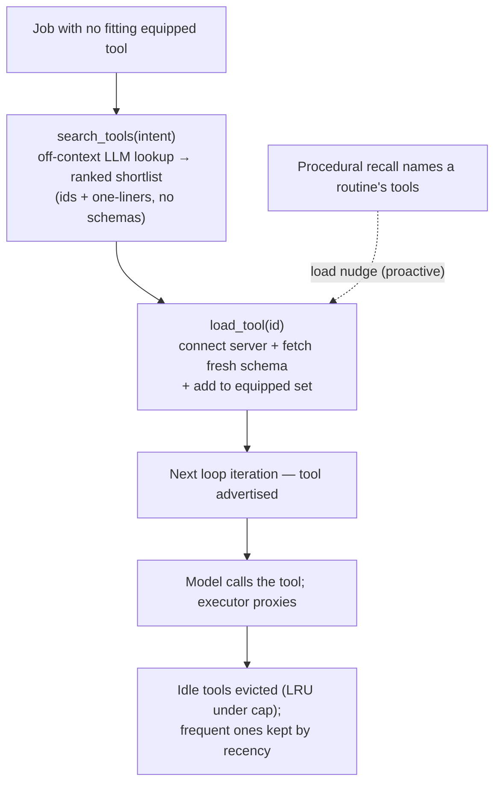

# CobbleCompanion — Tool Acquisition & Use

> **Canonical source for the tool-acquisition *mechanism*** — how the companion gains **new
> primitive abilities at runtime, without developer code changes or a redeploy**, how it
> **discovers and loads only the tools a job needs**, and how that know-how is preserved so the
> right tool resurfaces when needed.
>
> For the *product capability* (the acquire-vs-combine framing, why it matters) see
> `product-overview.md` §5.1/§5.3; for *scope, sequencing & acceptance* see `development-plan.md`
> (the **tool-acquisition workstream**); for how the generic primitives plug into the agent loop
> and the **trust model's** place beside propose→approve see `architecture.md` §4 / §8; for the
> **data model**, the MCP adapter, the CLI policy engine, and config keys see `implementation.md`.
> Each fact lives in exactly one place: this doc owns the **discover → load → call → remember**
> mechanism and the **whitelist trust model**; it does not redefine the schema, the loop, or the
> product vision.
>
> **Status — both tracks built (MCP: Phase 9, PR #10; CLI: Phase 10).** The shared
> **discover → load → call → remember** spine (the catalog, `search_tools`/`load_tool`, the
> per-companion equipped set, the per-step dynamic registry, and proactive loading) and **both
> executors** — the MCP connector (HTTP/SSE) and the CLI `run_command` sandbox — are implemented and
> wired, each **off by default** until a source is configured (`MCP_SERVERS` and/or `CLI_TOOLS_PATH`).
> CLI tools are **developer-described folders** under `CLI_TOOLS_PATH` (a `TOOL.json` exec contract +
> `TOOL.md` usage prompt, §6) that flow through the same spine as MCP tools; the model fills each
> tool's argument schema and an argv template renders it, so there is no free-form command or
> per-argument regex policy. Present tense throughout describes **live** behaviour. **Deferred**
> (Beyond the PoC, §9): ingesting tool docs into semantic memory, a dedicated experimentation/probe
> harness, and OS-level sandbox + network isolation (the portable subprocess tier ships now, §7).
> Beyond the three hand-written PoC tools (`web_fetch`, `memory_search`, `ingest_source`), the
> companion's toolset now grows at runtime via whitelisted MCP servers **and** host CLIs — no code
> change or redeploy.

## 1. What it is

Today a new *primitive* ability means a developer hand-writes a `Tool` in TypeScript and wires it
into the registry at boot (`architecture.md` §3, the three tools). Procedural memory
(`companion-memory.md`, `architecture.md` §4.3) already lets the companion **combine** the
primitives it has — sequencing existing tools into a learned routine — but it cannot **acquire**
new ones.

Tool acquisition adds the missing **"acquire"** half. The companion gains new primitives the way a
person uses tools in real life: it knows a large *inventory* of tools exists, it **looks up the
right one when a job calls for it**, **picks it up** (loads it), uses it, and **remembers** the
ones it reaches for often — so next time the right tool is already at hand. No code change, no
redeploy. Together, *acquire* (this doc) and *combine* (procedural memory) are the complete
self-extension story the product promises as the companion's "growing repertoire of abilities"
(`product-overview.md` §2.1, §5.5).

**Scope.** The **companion server host** only. Mobile/desktop OS-as-tools is a separate, later
product surface (§9, `development-plan.md` Phases 6–7).

## 2. The model — carry what you need, look up the rest

A person may have access to hundreds of tools but does not carry them all. They keep a few
frequently-used tools on hand; the rest sit in inventory or in a shop, and when a job needs one
they don't have, they **find out which tool does the job, then go get it** — they don't memorize
every tool up front. The mechanism mirrors this exactly, because preloading every available tool
into the model's context does not scale: a full tool schema (name + description + JSON-Schema
arguments) runs hundreds of tokens, so only a few hundred fit a turn, whereas a *catalog entry* —
just enough to recognize a tool — is ~an order of magnitude smaller, so thousands fit a single
lookup. The design keeps the heavy schemas **out** of context until a tool is actually chosen.

Tools therefore live in three tiers by how present they are in the model's context:

| Tier | Real-life analogue | In the model's context? |
|---|---|---|
| **Core** | tools you always carry | **Always** — full schema. The generic primitives + the discovery meta-tools (§3) + the base hand-written tools. **Fixed by the developer**, in code — never evicted, never counted against the equipped cap. |
| **Equipped** | tools you picked up for the job at hand | **While held** — full schema; loaded on demand this conversation, evicted when idle under the equipped-tool cap (§4). |
| **Catalog** | every tool in the shop you *could* get | **No** — only a tiny, searchable index entry (name + one-line description). The whitelisted universe (§6), searched off-context (§5). |

The companion's *effective* repertoire is the whole catalog — unbounded — while any single turn
advertises only the core tools plus whatever is currently equipped, a small bounded set.
**Discovery is an explicit, model-driven act**, not an automatic context injection: the companion
searches the catalog and loads what it needs, the same way it would call any other tool — whether
reactively (a job hits a wall) or proactively (it anticipates the need from procedural memory, §5).

## 3. The hands — execute, discover, load

A small fixed set of **generic primitives**, built once in code, is the entire executable surface
this feature adds. They split into *executors* (drive an external tool) and *discovery meta-tools*
(find and pick up a tool):

| Primitive | Kind | What it does | Track |
|---|---|---|---|
| **`run_command`** | executor | drive any **whitelisted** host CLI, with validated arguments | CLI (Phase 10) |
| **MCP connector** | executor | speak to any **whitelisted** HTTP/SSE **MCP server**; its tools become callable | MCP (Phase 9) |
| **`search_tools`** | discovery | given the job at hand, return a ranked shortlist of catalog tools that could do it — **ids + one-liners, no schemas** | shared spine |
| **`load_tool`** | discovery | pick a tool from the shortlist: connect its server if needed, fetch its **fresh** schema, and add it to the **equipped** set so it's callable next loop iteration | shared spine |

`search_tools` and `load_tool` are core tools — always present — because they are how the companion
reaches the rest of its repertoire. The executors are *transport*: once a tool is equipped, the model calls it like
any native tool, and the executor proxies the call. For MCP, "connecting" is folded into
`load_tool` — the companion reasons about *acquiring a capability*, not about managing a transport
session. The know-how worth remembering is *which* tool does a job and *when* to reach for it
(§5), not the call mechanics.

## 4. The dynamic registry & the equipped set (the wiring)

The PoC registry is a static array composed once at boot (`architecture.md` §3). Tool acquisition
refactors it into a **composition of capability sources** — fixed core tools plus the companion's
**equipped** tools — behind the **unchanged** `list()` / `get()` interface the harness already
calls. Adding a source is additive.

The one loop refinement: the effective registry is **resolved per model step**, not once per turn,
against a mutable per-conversation **equipped set**. This is what makes `load_tool` work — a tool
loaded mid-turn is advertised on the *next* iteration of the same loop and is then callable. The
loop *shape* is unchanged (same stages, same termination — `architecture.md` §4.7); only *when* the
tool set is computed moves from per-turn to per-step. This stays within the tool-invocation
extension point (invariant #3): re-resolving the registry from companion state is a refinement of
that hook, not a new loop stage. Re-resolution is cheap — schema assembly from cached snapshots, no
network — so it adds no per-step round-trip.

The equipped set is **a single bounded tier**, capped at **`maxEquippedTools`**. When loading a
tool would exceed the cap, the **least-recently-used** equipped tool is evicted — "you can't carry
everything." There is no separate always-on tier among the acquired tools: a tool the companion
loads proactively (§5) is an ordinary equipped tool, subject to the same cap and LRU. The fixed
*core* tools (§2) are the only always-present set, and they live in code — never in the equipped
set, never counted against this cap, never evicted.

To keep the changing tool set legible to the model, the loop surfaces a stable *currently-equipped*
summary so a tool appearing or falling away is never silent.

The wiring is **persisted per-companion** (the equipped set + the connection/`learned_tools` store
— data model in `implementation.md`) and **rebuilt at startup**, so acquired tools survive a
restart. A connected MCP server records its endpoint, an auth-secret *reference* (never the secret
itself, §7), its last fetched schema, and status; a learned CLI records which whitelisted usage it
has gotten working.

## 5. Discovery, the catalog & remembering

The catalog index, the equipped set, and procedural memory together back discovery — and
crucially, **discovery is separated from the model's context**:

- **The catalog (discovery index).** Every whitelisted server's tools are indexed ahead of time as
  **lightweight entries** — id, name, one-line description, source — in a per-deployment store. The
  index is for *finding* a tool, never for *calling* it, so it holds no argument schemas. It is
  refreshed when the whitelist changes and re-fetched periodically, so it tracks what the servers
  actually advertise. Hundreds of servers' worth of tools live here without touching a turn.
- **`search_tools` is an LLM lookup, run off the main loop.** It executes as its own model call —
  in its **own context window**, so the catalog never enters the conversation — feeding the
  candidate catalog entries plus the companion's intent to a **cheap model** (the same cheap-model
  seam ingestion uses, `architecture.md` §4.8) and returning the best-matching ids with a one-line
  *why*. Reasoning over descriptions beats vector similarity at intent→capability leaps ("schedule
  a reminder" → the calendar tool), and the catalog prefix is cache-stable, so repeat lookups are
  cheap. No embeddings are on the critical path; an embedding **prefilter** is a later
  scale optimization for very large catalogs (§9).
- **Promotion = proactive loading from procedural memory.** Rather than waiting to hit a wall and
  then `search→load`, the companion **picks up the tools a job needs before it starts** — and it
  knows which tools from procedural memory, the *combining* half of the story
  (`companion-memory.md`). When a recalled routine resurfaces (`procedural-retrieve.ts`), its tool
  steps are checked against the catalog and the equipped set: any tool the routine uses that exists
  in the catalog but isn't equipped is surfaced as a **load nudge**, and the companion `load_tool`s
  it up front. This keeps loading an **explicit, model-driven act** (§2) — procedural recall only
  *names* the candidates; the model decides. A proactively-loaded tool is then an ordinary equipped
  tool (no special tier): if the job keeps using it, recency keeps it in the equipped set; if not,
  the LRU reclaims it like any other (§4). This is why there is no frequency-pinned tier — promotion
  is anticipation, not a privileged shelf.

When a tool is loaded, its docs (a README, a `--help` dump, the user's description) can be ingested
through the existing pipeline (`architecture.md` §4.8) into **semantic memory**, so "how this tool
works" is recalled like any other knowledge — but the **authoritative argument schema is fetched
fresh at `load_tool` time**, never trusted from the (possibly stale) catalog entry, so a tool is
always called against what the server advertises right now.

The flow end to end: hit a job with no fitting equipped tool → `search_tools(intent)` returns a
shortlist → `load_tool(id)` connects + fetches the fresh schema + equips it → next loop iteration
the tool is advertised and the model calls it → idle tools are evicted, frequent ones promoted.

## 6. Trust model — the developer's whitelist

The entire trust decision is the **developer's whitelist**, made once, ahead of time: it defines
**the catalog** — the universe of tools the companion may ever discover or load. The developer
curates which CLIs and which MCP servers are admissible. The two tracks differ in granularity:
CLI admission is **per-tool** — each whitelisted tool is a folder under `CLI_TOOLS_PATH` whose
`TOOL.json` fixes its binary, its model-facing argument schema, and the argv template that renders
those validated arguments (so the model never composes a free-form command); MCP admission is
**per-server** — whitelisting a server admits **every tool it advertises**, with no per-operation
filtering. At runtime the outcome is **binary**:

| Usage | Outcome |
|---|---|
| In the catalog (whitelisted) **and** arguments validate | **Runs free** — any origin (autonomous or user-driven) |
| Off-whitelist, or arguments fail validation | **Denied** |

Discovery and loading do not widen this gate: `search_tools` only ever surfaces catalog (=
whitelisted) entries, and `load_tool` can only equip what the whitelist admits. There is **no
per-call approval, no read-only/effectful split, and no origin distinction** for these generic
tools — the whitelist *is* the approval. This is a **separate trust system** from the product's
propose→approve gate (`architecture.md` §4.4), which continues to govern consequential outward
actions (`book` · `send` · `pay`). The two coexist: the whitelist admits *which generic
capabilities exist at all*; propose→approve governs *named effectful tools*.

Two consequences are load-bearing:

- **Whitelist entries must be narrow** — a specific binary, constrained arguments, sandboxed output;
  for MCP, a specific server endpoint. Granularity stops at the server: there is **no per-operation
  filtering**, so admitting a server admits *every* tool it exposes — including any
  outward/destructive operations (`send` · `pay` · `delete`) it advertises, which run free with no
  per-call approval once loaded. Curation must therefore weigh the server's **entire** surface, not
  just the operations the companion is expected to use. Because there is no runtime approval
  backstop, curation carries the full trust weight. A narrow whitelist also **bounds the
  experimentation space**: the companion may try different *validated* invocations to learn a tool,
  but no manipulation — including prompt injection through ingested content or a crafted tool
  result — can escape the whitelist into arbitrary execution.
- **Both tracks are developer-whitelisted, identically.** A user cannot point the companion at a
  brand-new CLI or MCP server on their own on the server host; admitting a tool is an operator
  action (data/policy, no code change, no redeploy). Discovering and learning to *use* a whitelisted
  tool is then fully autonomous, no developer in the loop. User-addable servers are deferred (§9).

## 7. Security

The whitelist is the admissibility floor; these boundaries harden what runs within it
(implementation → `implementation.md` §5, trust model → `architecture.md` §8):

- **CLI execution is sandboxed.** `run_command` spawns the binary with **no shell** (argv elements
  pass verbatim, so a crafted argument is never a command), a **scrubbed environment** (no secrets),
  and a **per-tenant ephemeral working directory** under a scratch root (never `CLI_TOOLS_PATH`),
  under wall-clock + output-byte ceilings (mirroring the `web_fetch` byte-cap posture). This is the
  **portable subprocess tier**: it runs identically on every host but does **not** enforce network
  isolation — OS-level isolation (namespaces/containers, network egress control) is deferred to
  hardening (§9), behind the same sandbox seam. The narrow per-tool whitelist + fixed binary are the
  mitigation meanwhile. `CLI_TOOLS_PATH` must be **read-only + deployment-controlled** and must not
  overlap any path the app writes to (it is the CLI trust boundary, §6).
- **MCP is HTTP/SSE-only** on the server host, behind the same **SSRF** guard as link ingestion
  (`architecture.md` §8): scheme + blocked-host checks with connection-layer DNS re-validation. No
  **stdio** transport — the host never spawns a user-specified process (that rides with the future
  desktop surface, §9).
- **Discovery touches no secrets and no live calls.** The catalog stores only public tool metadata
  (names, descriptions); `search_tools` reasons over that metadata in an isolated sub-context and
  can take no action — it only *names* candidates. Effect happens only when an equipped tool is
  actually called.
- **Tool outputs are untrusted external data.** A CLI's stdout and an MCP server's results re-enter
  context as untrusted content and inherit the existing injection-hardening posture
  (`implementation.md` §2.1) — same class as `web_fetch` output and provider responses. A crafted
  result cannot cause a tool outside the whitelist to be loaded or run.
- **Credentials are references, never values.** MCP server auth uses the secret-management posture
  (`architecture.md` §8, `implementation.md` §5); a secret is never stored in the catalog or the
  equipped set, in source, or sent to the model — it is resolved at call time.

## 8. The two tracks & sequencing

The mechanism ships as two phases over one shared spine — the generic primitives, the catalog +
`search_tools`/`load_tool` discovery meta-tools, the per-step dynamic registry with its equipped
set, and proactive loading. The spine is **capability-source-agnostic**: catalog entries can describe
MCP tools, CLI usages, or skills uniformly, so discovery and loading work the same regardless of
where a tool comes from. Scope and acceptance are owned by `development-plan.md`:

- **MCP track (first).** Lower risk and largely a *catalog + load* problem: self-describing schemas
  mean little trial-and-error. It exercises the full discover → load → call → remember spine
  end-to-end.
- **CLI track (second).** Higher power, more new machinery: the `run_command` host sandbox and the
  per-tool definition format (`TOOL.json` exec contract + `TOOL.md` usage prompt) under
  `CLI_TOOLS_PATH`. CLI tools are *developer-described* (the folder is the analogue of an MCP
  server's `tools/list`), so the model fills a fixed argument schema rather than composing free-form
  commands — and the "remember" half reuses the shared procedural-memory + proactive-loading spine,
  no CLI-specific learning machinery.

## 9. Beyond the PoC

Deferred from this workstream, recorded here so the boundary is explicit:

- **Embedding-prefiltered search** — for catalogs too large to pass to a single `search_tools` call,
  an embedding **prefilter** (reusing the embedding gateway + `pgvector` the semantic store already
  uses) narrows the catalog to top candidates, then the LLM ranks among them. A scale optimization,
  not on the PoC critical path (§5).
- **Search-and-auto-load** — when `search_tools` is confident, fold the load into the search so a
  single step equips the obvious tool, trading the two-step's predictability for one less round-trip.
- **OS-level CLI isolation** — the shipped `run_command` sandbox is the portable subprocess tier
  (no-shell, scrubbed env, ephemeral per-tenant cwd, time/output ceilings) but does **not** enforce
  network isolation. Kernel-level isolation (namespaces/containers, egress control) lands behind the
  same sandbox seam when the production host is fixed (§7).
- **CLI tool-doc ingestion** — ingesting a tool's `TOOL.md` / `--help` into **semantic memory** so
  "how this tool works" is recalled like any other knowledge. The PoC keeps the usage prompt on the
  equipped tool only; ingestion is symmetric machinery MCP doesn't use, so it is deferred.
- **CLI experimentation/probe harness** — actively probing a CLI (`--help`, dry-runs, self-tested
  invocations) to *learn* it. The PoC relies on the developer-authored `TOOL.json`/`TOOL.md` instead,
  so no probe loop is built; "remember" reuses the shared procedural + proactive-loading spine.
- **Mobile/desktop OS-as-tools** — exposing a device's OS access as tools is a separate product
  surface (`product-overview.md` §5.2, `development-plan.md` Phases 6–7), not part of the
  server-host mechanism.
- **stdio MCP transport** — spawning local MCP server processes belongs to the desktop surface,
  where the blast radius is the user's own machine.
- **User-addable tools** — letting a user (not the developer) point the companion at a new CLI or
  MCP server, with its own admission/trust flow.
- **Trust graduation** — a usage repeatedly exercised could *earn* wider latitude over time, rather
  than the whitelist being the only gate.
- **External-API cost metering** — the energy/stamina budget meters LLM/embedding tokens
  (`architecture.md` §4.8); the monetary cost of an external tool/MCP call is a new cost axis not
  yet metered.
- **Boot-resilient CLI admissibility** — the CLI source's admissibility check is backed by an
  in-memory ref snapshot rebuilt by the single startup catalog refresh, with no periodic rebuild or
  retry; the MCP source consults its whitelist live and statelessly, so it has no equivalent boot
  dependency. If that one startup enumeration transiently fails (e.g. a `readdir` hiccup), the
  snapshot stays empty and every persisted equipped CLI tool is silently dropped from the registry
  and the equipped summary until the next restart — even though the tool folders still exist on disk
  and the call-time re-read that actually guards execution would succeed. (The pre-gate on the
  snapshot is belt-and-suspenders only; the authoritative revocation is the fresh per-call store
  read.) New-folder discovery being startup-bound is the accepted Phase-9 staleness trait; the
  fragility of *already-equipped* tools is the part to harden — by dropping the redundant pre-gate
  and trusting the call-time read, backing the admissibility check with the store, or adding a
  retried/periodic refresh.
