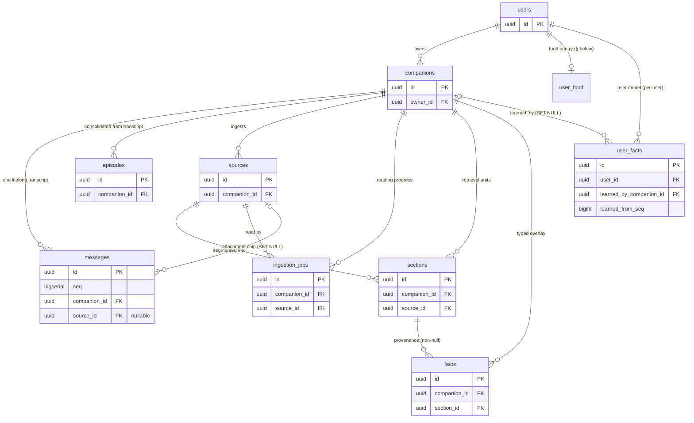
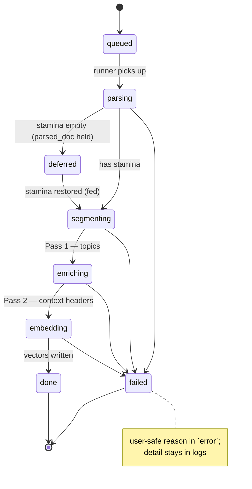
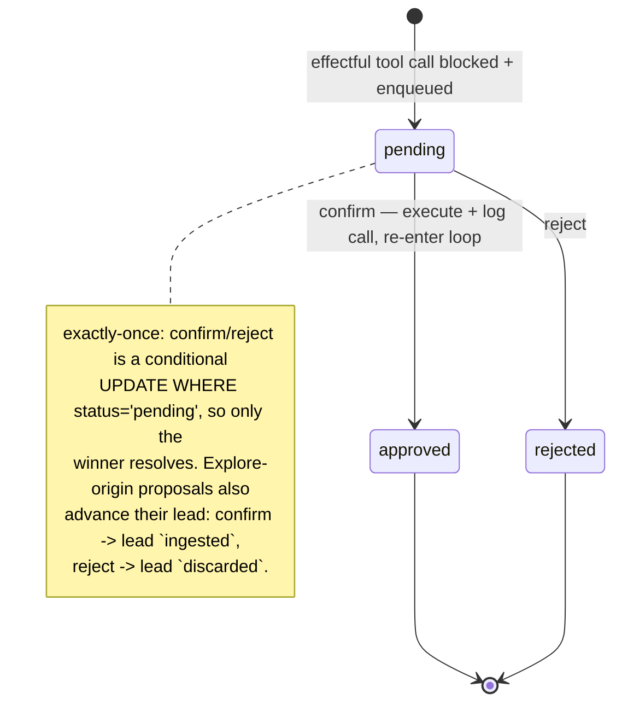
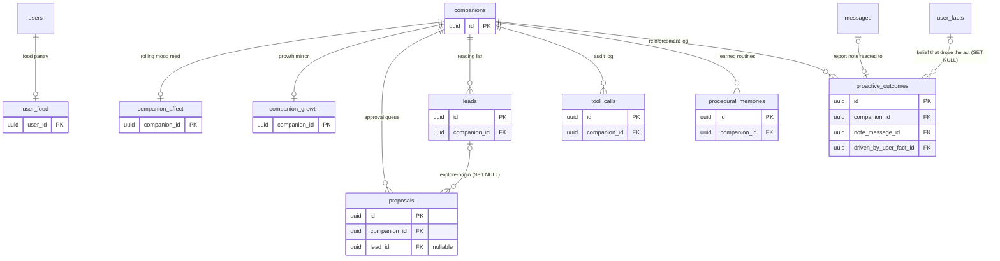

# CobbleCompanion — Implementation

> **How it works internally:** data models, schemas, configuration, error handling, and security
> implementation — enough for a developer to modify the system using only this doc. For *what the
> system is* (components, flows, decisions) see `architecture.md`; for *what we're building and in
> what order* see `development-plan.md`.

## 1. Data Model

Postgres (with `pgvector`). Multi-tenant: every row is scoped by owner
(`architecture.md` §2, invariant #5). Field types are indicative; authoritative DDL lives in
migrations under `db/`.

The data model splits into two clusters. The first is the **knowledge & memory spine** — the one
transcript, its consolidated episodes, and the three-layer ingested-knowledge stack
(`sources` → `sections` → `facts`) with its reading-progress jobs. Every row hangs off a single
`companions` "home". The diagram shows keys and relationships only; the per-table field detail is in
the sections that follow.



### `users`
| Field | Type | Notes |
|---|---|---|
| `id` | uuid (PK) | |
| `email` | text, unique | login identity |
| `created_at` | timestamptz | |

> **No `display_name` column.** What the companion calls the user is **not** a `users` field — the
> name is a Tier-1 `user_fact` (`user · name · …`) like every other identity attribute (`user_facts`
> below; `companion-memory.md` §4). At provision it is **seeded from the Google `name` claim** as an
> `auth_seed`-source fact at modest confidence, so first contact already has a name; a name the user
> then states (`transcript` source) or edits (`user_edit`) supersedes the seed. When Google supplies
> no name the seed is absent and the persona asks. This retires the old `display_name` column and the
> `setUserDisplayName` primitive — the name is now just one `user_fact` (`development-plan.md` §4c
> Phase 11).

> **Auth note:** there is no local credential/token table. Sign-in is **Google Sign-In**; the
> SPA obtains a Google ID token and the API validates it against Google's JWKS, then
> JIT-provisions the `users` row from the verified `email` claim (Google requires
> `email_verified === true`). The token's `name` claim (profile name, **unverified** — used only to
> seed what the companion calls the user, never for identity/authorization) seeds a Tier-1 `name`
> `user_fact` with `source = auth_seed` on first provision; a name stated or edited later supersedes
> it. See §5.

### `companions` — the canonical "home"
| Field | Type | Notes |
|---|---|---|
| `id` | uuid (PK) | |
| `owner_id` | uuid (FK → `users.id`) | tenancy scope |
| `name` | text | user-chosen |
| `form` | text | species/appearance archetype (seed) |
| `temperament` | text | **immutable** starting personality seed (`product-overview.md` §5.5) |
| `evolved_persona` | text, nullable | "who I've become with you" — re-synthesized from episodes, blended into the persona prompt beside the seed; null until the first evolution |
| `persona_updated_through_seq` | bigint, default 0 | transcript `seq` the evolved persona was last synthesized from (evolution cursor) |
| `consolidated_through_seq` | bigint, default 0 | highest transcript `seq` already rolled into episodes (consolidation cursor) |
| `user_persona` | text, nullable | "who **you** are to me" — the User Model's **Tier-3** synthesized understanding of the user, re-synthesized from `user_facts` + episodes by the background reflection pass and blended into the persona prompt beside `evolved_persona` (the symmetric self-model); null until the first synthesis (`companion-memory.md` §4, `development-plan.md` §4c) |
| `user_facts_through_seq` | bigint, default 0 | _(Phase 12)_ highest transcript `seq` the **User-Model Reflector** has extracted Tier-2 beliefs through — the **belief-extraction cursor**, independent of `consolidated_through_seq` so a failed reflection never advances past an unprocessed window (mirrors the evolution cursor's independence) |
| `user_model_updated_through_seq` | bigint, default 0 | transcript `seq` the `user_persona` was last synthesized from (Tier-3 user-model cursor, mirrors the evolution cursor; Phase 13) |
| `created_at` | timestamptz | |

### `messages` — transcript (episodic-memory substrate)
| Field | Type | Notes |
|---|---|---|
| `id` | uuid (PK) | |
| `seq` | bigserial | monotonic per-row ordinal — authoritative chronological order |
| `companion_id` | uuid (FK → `companions.id`) | indexed with `seq` (`messages_companion_idx`) for recency recall |
| `role` | text | `user` \| `assistant` \| `system` |
| `content` | text | |
| `kind` | text | `message` \| `tool_step` \| `proposal` — `$type<MessageKind>()`, default `message`.<br>What the row *is*, so the rich conversation (grounded answers, read-only look-ups, held actions) reconstructs identically on reload.<br>**Only `message` rows enter the LLM-context projection** (`getMessagesSince` and the recency window filter to `kind='message'`); `tool_step`/`proposal` are UI chrome — never re-fed to the model nor consolidated into episodes |
| `metadata` | jsonb | nullable `MessageMetadata`: `citations` on a grounded `message`; `toolName` on a `tool_step`; `toolName`+`proposalId` on a `proposal` (the id wires the row to the live approval queue).<br>Lets the surface re-render the row faithfully |
| `source_id` | uuid (FK → `sources.id`, **`ON DELETE SET NULL`**) | nullable; set on a file upload's attachment chip (a `user` turn) and its acknowledgement (an `assistant` turn) so the chat reconstructs the 📎 chip + "View status →" link on reload.<br>`SET NULL` (not cascade): deleting a source must never delete an append-only transcript turn — it just drops the link |
| `created_at` | timestamptz | episodic memory builds on these timestamped turns |

> **Proactive ingestion notes.** A successful or failed read appends a single `assistant` turn
> here via the **Ingestion Announcer** (`packages/core/src/ingestion/announcer.ts`): an
> in-character note generated through the metered LLM gateway (spent from the companion's stamina),
> with a single-sourced **canned fallback** (`@cobble/shared`) when stamina is empty, when
> generation throws, or when no persona is available. It is appended *before* the job's terminal
> status flip, and an announcement failure is logged but never alters the job outcome
> (`architecture.md` §4.8). These notes carry no `source_id` (no chip/link — just a message).

> **One conversation per companion.** There is deliberately **no `conversations`/session
> table** (`architecture.md` invariant): a companion has exactly one continuous, lifelong
> conversation with its user, so messages attach directly to the companion. The whole
> conversation is `SELECT * FROM messages WHERE companion_id = ? ORDER BY seq`. This makes a
> second conversation structurally impossible.

> **Ordering note:** recency recall orders by `seq`, not `created_at` — many turns can share a
> `created_at` at sub-millisecond resolution, so a monotonic ordinal is the source of truth for
> transcript order. `seq` is a single global sequence, so it orders the whole transcript.

### `episodes` — consolidated episodic memory
| Field | Type | Notes |
|---|---|---|
| `id` | uuid (PK) | |
| `companion_id` | uuid (FK → `companions.id`, cascade) | tenancy scope; indexed `(companion_id, occurred_end)` for the time-window filter + "latest episodes" scans, and `(companion_id, seq_end)` for the cursor |
| `summary` | text | the consolidated narrative ("you loved the ceviche in Lima…") |
| `seq_start` / `seq_end` | bigint | transcript `seq` range this episode consolidated — idempotent, incremental rebuilds |
| `occurred_start` / `occurred_end` | timestamptz | wall-clock span the episode covers; rendered as the date on each recalled block |
| `salience` | real, nullable | self-reported 0–1 weight, stored and displayed only. Filler is dropped at consolidation (the reflection pass omits it); recall ranking (RRF) does **not** use this value (§6) |
| `embedding` | `vector(1024)`, nullable | HNSW `vector_cosine_ops`; nullable → recalled lexically until embedded |
| `fts` | tsvector (generated from `summary`) | GIN-indexed |
| `created_at` | timestamptz | |

> **Derived, not canonical.** Episodes are a rebuildable overlay over the one transcript (no
> session entity — invariant #6). A background **consolidation** pass reflects the
> un-consolidated tail (`seq > companions.consolidated_through_seq`) into episodes and advances
> the cursor atomically; recall is the same vector + FTS hybrid (RRF) as `sections` —
> **topic-only** in production (`architecture.md` §4.3, §4.8). Personality evolution reads recent
> episodes to re-synthesize `companions.evolved_persona`. (Two stored signals — the wall-clock time
> window and salience — do not steer recall; see §6.)

### `sources` — Layer 0: verbatim originals
| Field | Type | Notes |
|---|---|---|
| `id` | uuid (PK) | |
| `companion_id` | uuid (FK → `companions.id`, cascade) | tenancy scope |
| `kind` | text | `pdf` \| `note` \| `link` \| `txt` \| `md` \| `docx` \| `pptx` — free text typed via `$type<SourceKind>()`, so new formats need no migration; accepted-format/MIME contract → `architecture.md` §4.8 |
| `title` | text | display title ("your Peru book") |
| `origin` | text, nullable | filename / URL; null for notes |
| `raw_text` | text | **canonical** extracted text — everything derived is rebuildable from it |
| `byte_size` | integer, nullable | |
| `created_at` | timestamptz | |

### `ingestion_jobs` — reading-progress surface
| Field | Type | Notes |
|---|---|---|
| `id` / `companion_id` / `source_id` | uuid | cascade FKs |
| `status` | text | `queued → parsing → segmenting → enriching → embedding → done` \| `failed`; `deferred` is off-line (parsed, awaiting stamina — resumes once the companion is fed — `architecture.md` §4.8) |
| `sections_total` / `sections_done` | integer | drives "read N of M" |
| `error` | text, nullable | user-safe failure reason; detail stays in logs |
| `parsed_doc` | jsonb, nullable | parsed paragraphs held while `deferred`, so the AI passes resume without a re-upload; null otherwise |
| `created_at` / `updated_at` | timestamptz | |

> The durable status surface is what makes the in-process runner replaceable by a real worker
> with no schema/API change (`architecture.md` §4.8, §8), and lets deferred jobs survive a restart.

The `status` column is a state machine. Parsing extracts text without the LLM; the three AI passes
(segment → enrich → embed) are metered, so a job the companion can't afford from stamina is parked in
`deferred` with its `parsed_doc` held, then resumes once it has stamina again (after feeding):



### `companions` — vitality columns (stamina + energy wallets)
The two halves of a companion's vitality are **inline columns on the `companions` row** (1:1 with
the companion — no separate wallet table):

| Field | Type | Notes |
|---|---|---|
| `stamina_balance_tokens` | bigint, not null, default 1_000_000 | tokens left for **user-initiated** work (chat, assigned tasks). |
| `energy_balance_tokens` | bigint, not null, default 1_000_000 | tokens left for **self-initiated** work (the motivation engine). A separate wallet so autonomy can't starve interaction. |

> Each balance is seeded at companion creation from `STARTING_VITALITY_TOKENS` (the column default is
> the safety net for a bare insert). Spend decrements it (atomic SQL `GREATEST(0, balance - n)` — a
> turn can't drive it negative, so there is no debt); feeding increments it. No cap, no window, no
> auto-refill — a balance only goes down (spending) or up (feeding). Postgres-backed so it is correct
> across replicas. Routes enforce stamina inline: chat/search 429 when empty, ingestion defers until
> it has tokens again (`architecture.md` §4.8). `GET /companions/:id/usage` exposes the stamina
> balance for the web client's live indicator. One store meters both columns, picked by a
> `'stamina' | 'energy'` discriminator (`packages/core/src/quota/vitality-store.ts`).

### `user_food` — the per-user food pantry
| Field | Type | Notes |
|---|---|---|
| `user_id` | uuid (PK, FK → `users.id`, cascade) | one row per user; the foods the user holds, spendable on any of their companions |
| `ration` / `spark` / `treat` | integer, not null | counts of each food type. Seeded with `initialFood` (default 10 each) on the row's first creation; a feed decrements one (atomic SQL `count - 1`, guarded ≥ 0). Not replenished in the PoC. |
| `updated_at` | timestamptz | |

> The feeding economy's supply (`companion-economy.md`). `POST /companions/:id/feed` consumes one
> food from this row and adds its grants to the fed companion's wallet(s). When a count hits 0 the
> feed returns 409; a developer raises it directly in the DB (no buying in the PoC).

### `sections` — Layer 1: retrieval units
| Field | Type | Notes |
|---|---|---|
| `id` / `companion_id` / `source_id` | uuid | cascade FKs; companion denormalized for filtered retrieval |
| `chapter_title` | text, nullable | structural parent label |
| `topic_title` | text | Pass-1 segmentation output |
| `original_text` | text | **pure verbatim** paragraph slice — never model-rewritten |
| `context_header` | text, nullable | Pass-2 one-liner; prefixed onto the **embedding input only** |
| `para_start` / `para_end` | integer | 1-based inclusive paragraph range (provenance) |
| `page_start` / `page_end` | integer, nullable | PDF page range |
| `ord` | integer | section order within its source |
| `embedding` | `vector(1024)` | nullable until the embed pass; dimension pinned by `EMBEDDING_DIMENSIONS` (db schema) — changing it requires a migration |
| `fts` | tsvector, generated | `to_tsvector('english', original_text)` |

Indexes: HNSW (`vector_cosine_ops`) on `embedding` — chosen over IVFFlat because it needs no
training set and fits incremental ingestion; GIN on `fts`; btree on `(companion_id)` and
`(source_id, ord)`.

### `facts` — Layer 2: typed knowledge overlay
| Field | Type | Notes |
|---|---|---|
| `id` / `companion_id` | uuid | cascade FK |
| `section_id` | uuid (FK → `sections.id`, cascade) | **provenance — non-nullable by contract** (`ontology.md` §4) |
| `fact_type` | text | closed core set, validated at ingestion (`ontology.md` §2) |
| `subject` / `predicate` / `object` | text (predicate nullable) | entities are denormalized strings; normalization is owned by `ontology.md` §5 |
| `confidence` | real, nullable | extraction self-reported (0–1), advisory |

### `user_facts` — the User Model (typed knowledge about the user)

The companion's structured understanding of its user — the same typed-fact contract as `facts`
(`ontology.md`), but the **subject is the privileged user entity**. A separate table because the
lifecycle differs: identity attributes supersede on revision (most singular; `languages`/`relationships` are multi-valued and accrete) and are editable/forgettable today (Phase 11); beliefs accrete and are read-only until Phase 13, when they gain user editing and decay (the `editFact`/`forgetFact` path refuses belief predicates until then).
**Keyed by `user_id`, not `companion_id`** — facts are objective truths about the *person* (name, age,
"vegetarian"), so they are shared across any companion the user owns; only the *synthesized
understanding* of the user (Tier-3 `companions.user_persona`) is per-companion (`development-plan.md`
§4c; the truth/understanding split, `companion-memory.md` §4). Mechanism, tiers, and the
extraction/retrieval flow → `companion-memory.md` §4.

| Field | Type | Notes |
|---|---|---|
| `id` / `user_id` | uuid | cascade FK → `users.id` (tenancy — the user owns the fact) |
| `source` | text `$type<UserFactSource>` | **origin** — `transcript` (learned in conversation, the usual case) \| `auth_seed` (the name from Google sign-in) \| `user_edit` (the user set/corrected it in the browser). Determines which provenance columns are set and informs default confidence |
| `learned_by_companion_id` | uuid (FK → `companions.id`, **`ON DELETE SET NULL`**), **nullable** | which companion's conversation taught this — set only when `source='transcript'` (null for `auth_seed`/`user_edit`). The fact outlives the companion (it's the user's), so the link nulls rather than cascades |
| `learned_from_seq` | bigint, **nullable** | **reserved provenance** — the transcript `seq` a fact was learned from. The Phase-11 inline-capture path does **not** populate it (the harness reads `MessageDto`, which omits `seq`) — it records the `learned_by_companion_id` link instead; pinning the exact turn is a Phase-12 reflector concern, so this is null on every fact today (no FK to the churning `episodes`; re-extraction rebuilds from the transcript) |
| `fact_type` | text | the closed core set, validated at extraction (`ontology.md` §2) — identity is an `attribute`, a taste a `relation`/`attribute`, a life event an `event` |
| `subject` / `predicate` / `object` | text (predicate nullable) | `subject` is the user entity; **polarity is carried by the predicate** (`prefers` vs `dislikes`), so likes/dislikes need no extra column. Denormalized strings, per `ontology.md` §5 |
| `confidence` | real, nullable | (0–1), advisory; default tracks `source` — explicit `transcript` statement → high, inferred → low, `auth_seed` → modest (a guess from the account), `user_edit` → authoritative. Steers retrieval ranking, decay, and supersession precedence, never storage |
| `salience` | real, nullable | event-driven strength weight (Tier-2); multiplies a belief's fused hybrid-recall score (`1 + 0.5·salience`), so a reinforced belief rises and a cut one sinks among comparably-relevant hits — a gentle prior over relevance, never an injector. Bumped/cut on reinforce + proactive reaction; **passive time-decay is Phase 13** (see the Tier-2 note below) |
| `superseded_at` | timestamptz, nullable | null = current; set when a singular attribute is revised, a multi-valued one (`languages`/`relationships`) is restated identically, or a belief's **same matter takes a newer state** (current-state last-wins — `ontology.md` §4). Superseded rows are kept (history — the timeline of the self), excluded from retrieval |
| `superseded_by` | uuid, nullable (FK → `user_facts.id`) | the fact that replaced this one, when applicable |
| `created_at` / `updated_at` | timestamptz | |

> **Tier-2 belief columns (Phase 12, in the table).** The same `user_facts` table carries the Tier-2
> overlay: `embedding` (`vector(1024)`, HNSW `vector_cosine_ops`), `fts` (tsvector generated from
> `subject`+`predicate`+`object`, GIN-indexed) — the hybrid-recall machinery (`architecture.md` §4.3) —
> and `salience` (real, nullable). `salience` is an **event-driven strength weight**: the reflector
> bumps it on a `reinforce` (restatement), and the belief-learning loop bumps/cuts it on the user's
> reaction to a belief-driven proactive act (`companion-motivation.md` §7). **Passive time-decay** of
> salience and the **stale-drop retrieval cutoff** are Phase 13. Both writers (inline capture, reflector)
> compute the embedding at write; a null-embedding row degrades gracefully to FTS-only retrieval (the
> `fts` column is generated, so always present) (`development-plan.md` §4c). Both writers embed the
> belief under its **natural-language rendering** (`beliefPhrase`, e.g. `interestedIn jazz` →
> "the user is interested in jazz") — the *same* phrasing the recall block surfaces — so the stored
> vector lives in the same register as the natural-language turn it is recalled against. This symmetry
> is what makes the floor meaningful: a terse `predicate object` tag sits in a different register from a
> full query sentence, inflating cosine distance and risking the floor dropping a genuinely relevant
> belief. The vector arm carries a **relevance floor** (`BeliefSearchParams.maxVectorDistance`, default
> `0.8` cosine distance in the retrieval arm): a belief farther than this is dropped rather than pulled
> in to fill the top-K, so the "what I know about you" block is what's *relevant now*, not every belief
> while the user has ≤ topK of them. The FTS arm self-gates (a term match is a relevance gate); the
> floor is a starting value, tuned against the `user-extract`/`user-beliefs` evals as belief volume grows.

> **The three tiers are a rule, not a column** (mirrors leaf types, `ontology.md` §3). **Tier 1 —
> core profile**: the subset whose predicate is an identity attribute (`name`, `bornOn`, `livesIn`,
> `worksAs`, pronouns, `languages`, `relationships`, …) — mostly singular, with `languages`/`relationships`
> multi-valued (`MULTI_VALUED_PREDICATES`); including the user's **name**, which is just one such fact
> (seeded from Google at sign-in, then refined in conversation), no longer a `users` column. Assembled
> into the persona block and carried every turn (§2.2) — the persona renders **Tier-1 only**, filtering
> out any non-Tier-1 predicate so a Phase-12 belief sharing the table cannot leak in. **Tier 2 —
> learned beliefs**: a **closed** predicate set `TIER2_PREDICATES` = `prefers`/`dislikes`/`interestedIn`/`believes`
> (validated at extraction, mirroring `TIER1_PREDICATES`; polarity rides the predicate); too many for
> context, so surfaced by the retrieval arm over *current* Tier-2 rows only (`architecture.md` §4.3) —
> added in Phase 12. **Tier 3 — user persona**:
> the synthesized narrative in `companions.user_persona` (Phase 13). Indexes (Phase 11): btree on
> `(user_id, superseded_at)` for the current-facts scan; plus a **partial unique index**
> `user_facts_one_current_name_uniq` on `(user_id, predicate)` `WHERE predicate = 'name' AND
> superseded_at IS NULL` — DB-enforced "one current `name` per user", since `seedName` runs on every
> authed request outside the harness per-user serialization and parallel first-load seeds would
> otherwise double-insert (`seedName` absorbs the conflict via `ON CONFLICT DO NOTHING`). Scoped to
> `name`; multi-valued predicates (`languages`/`relationships`) keep many current rows by design.

### Hybrid retrieval

`SemanticMemoryStore.search` runs two arms over `sections` scoped by `companion_id` —
**vector** (`embedding <=> query` cosine, top-K) and **lexical** (`fts @@ plainto_tsquery`,
`ts_rank`-ordered, top-K) — and fuses them with **reciprocal-rank fusion**
(score = Σ 1/(K + r), with K=60 and r the 1-based rank within each arm), which is scale-free so the two scores never need calibrating.
Optional metadata filters: `source_id`, and `entity` (an EXISTS over the fact overlay's
subject/object — how a section whose text only says "he" is still found by "Pizarro"). Every
hit carries provenance (source title, chapter, topic, para/page range) + the verbatim text.

### `proposals` — approval queue
| Field | Type | Notes |
|---|---|---|
| `id` / `companion_id` | uuid | cascade FK |
| `lead_id` | uuid, nullable | FK → `leads.id` (`on delete set null`). The reading-list lead this proposal came from (explore-origin); null for a chat-origin proposal. Resolving the proposal advances this lead's lifecycle |
| `tool_name` | text | the effectful tool the companion wants to run |
| `tool_args` | jsonb | the serialized call, run verbatim once approved |
| `tool_call_id` | text, nullable | the provider's tool-call id (audit/correlation) |
| `summary` | text | human-readable description shown in the approval card |
| `status` | text `$type<ProposalStatus>` | `pending` → `approved`/`rejected` |
| `created_at` / `resolved_at` | timestamptz (resolved nullable) | |

> **Exactly-once:** confirm/reject is a conditional update `WHERE status='pending'` that returns the
> row only to the winner (mirrors the deferred-job claim, `architecture.md` §4.8), so a double-confirm
> cannot double-execute. Index `(companion_id, status)`.
>
> **Lead closure:** resolving an explore-origin proposal advances its `lead_id` — a successful confirm
> marks the lead `ingested`, a reject marks it `discarded` (best-effort, never fails the user's action).
> Without the link a lead would be stranded at `read` forever — clogging `/leads` and never re-proposed.

The approval-queue lifecycle, and how resolving a proposal closes its originating lead:



### `tool_calls` — audit log
| Field | Type | Notes |
|---|---|---|
| `id` / `companion_id` | uuid | cascade FK |
| `seq` | bigserial | monotonic order (`created_at` ties within a ms) |
| `name` / `args` / `result` | text / jsonb / text | one row per executed call — the DoD's "every tool call is logged" |
| `created_at` | timestamptz | |

### `leads` — reading-list inventory
| Field | Type | Notes |
|---|---|---|
| `id` / `companion_id` | uuid | cascade FK |
| `seq` | bigserial | stable reading-list order |
| `url` | text | unique per `(companion_id, url)` → re-discovery is idempotent |
| `why` | text, nullable | where it was captured (the page it came from) |
| `status` | text `$type<LeadStatus>` | `new` → `read` → `ingested`/`discarded` |
| `created_at` | timestamptz | |

> The body-then-will substrate: filled by `web_fetch` link harvest, worked on command
> (`/explore`), and by the motivation engine on idle (`architecture.md` §4.5).
>
> **Lifecycle:** `/explore` advances `new`→`read` and enqueues a proposal carrying the lead's id; the
> terminal states are written when that proposal resolves — confirm→`ingested`, reject→`discarded` (see
> `proposals.lead_id`). `/leads` lists only `new`+`read`, so a resolved lead leaves the reading list.

### `procedural_memories` — learned workflows
| Field | Type | Notes |
|---|---|---|
| `id` / `companion_id` | uuid | cascade FK |
| `seq` | bigserial | newest-first listing |
| `title` | text | the approved action's summary |
| `steps` | jsonb | ordered tool names the workflow ran |
| `created_at` | timestamptz | |

> Seeded on a successful approved action; browseable, and a relevant routine also resurfaces as a
> retrieval-as-hint in context (`architecture.md` §4.3).

### Proactivity & growth

The schema the motivation engine and growth service use (full mechanisms →
`companion-motivation.md`, `companion-economy.md`; authoritative DDL → `db/`).

The second cluster is the **will & economy** — the approval queue and its reading-list leads, the
tool/procedure logs the loop writes, the per-companion singletons that carry mood, and the growth
mirror, plus the per-user food pantry the feeding economy spends. The two vitality wallets are
inline columns on `companions` (above), not their own tables. As above, only keys and relationships
are shown; fields are in the prose below.



- **`proposals.origin`** — `text` enum `chat | explore | autonomous`, default `chat`. Lets the
  confirm route re-enter the loop only for `chat`-origin proposals (the §4.4 resolution) and spend
  effectful work from the right wallet (chat→stamina, explore/autonomous→energy).
- **`companions`** also carries: `proactivity_dial` (`off | gentle | active`, default `gentle` — the
  tunability dial); `personality_knobs` (jsonb `{focusLength, boredom, distractibility}` — the
  "creature" constants, at shared defaults, null → defaults); `drive_weights` (jsonb — per-drive
  weights the reinforcement loop updates; **starts neutral**, null → neutral defaults); and the two
  **vitality** columns `stamina_balance_tokens` / `energy_balance_tokens` (see the columns table
  above) — the two halves of a companion's vitality, held inline (1:1, no wallet table). Each
  spending-decrements (floored at 0) and feeding-increments — no cap, no window, no auto-refill.
  **Energy** meters self-initiated work, **stamina** user-initiated work; they are **separate
  wallets** so autonomy can't starve interaction (§4.8). Seeded at creation from
  `STARTING_VITALITY_TOKENS`.
- **`user_food`** — the per-**user** food pantry the feeding economy spends: integer counts of
  `ration` / `spark` / `treat`, seeded with `initialFood` (10 each) on first use, a feed consuming one
  (atomic, guarded ≥ 0). Per user, not per companion, so one pantry feeds all of a user's companions
  (`companion-economy.md`).
- **`companion_affect`** — the companion's **rolling read of the
  user's mood**, one row per companion: `valence` ∈ [−1, 1] + a short natural-language `note`. The
  agent loop upserts it on every *successful* read (last-write-wins); the prior read is fed forward to
  attune the next reply, and the turn-over-turn change is the reinforcement signal
  (`companion-motivation.md` §7). The read is taken via a structured **`report_affect` tool call**
  (named `valence` + `note` fields, provider-parsed) — no free-text parsing. A malformed *field*
  degrades to neutral (still a genuine read), but a **missing call or provider failure is a non-read**
  (`null`): the prior baseline is kept and nothing is learned, so a transient hiccup can't masquerade as
  a neutral mood and fabricate a reward delta. The user's message is **fenced in `<user_message>` tags**
  in the read prompt so it cannot dictate its own valence.
- **`proactive_outcomes`** — one row per initiation for the reinforcement loop: the served
  drive, a drive snapshot at initiation, the linked **`note_message_id`** (the report note the user
  reacts to), and the **reward** once resolved. The reward is the **change** in the user's mood
  across their reaction to the note (`delta = valence_now − valence_before`, sensed in the agent
  loop), applied as an additive nudge — not approve/reject. Doubles as the helpful-vs-annoying
  measurement. Resolution is an **atomic claim** — the reward write is conditioned on
  `reward IS NULL`, so two racing reactions can't both score one outcome; only the winning claim goes
  on to nudge the drive weights (no lost update). _(Phase 12)_ also carries
  **`driven_by_user_fact_id`** (uuid, nullable, FK → `user_facts.id` `ON DELETE SET NULL`): the Tier-2
  belief that drove a belief-driven burst (null for non-belief acts). On resolution the same `delta`
  that nudges the drive weight also adjusts **that belief's `salience`** — the belief-learning loop
  (`companion-motivation.md` §7).

Presence is **not** a table — it is a volatile, heartbeat-fed in-memory signal (§4.5).

- **`companion_growth`** —
  the bond/growth standing as a **MIRROR**, fully **decoupled** from feeding (growing earns nothing
  spendable). Growth itself is **DERIVED** every read from substrate that already exists
  (sources/sections/episode counts, the tool/procedure/affect logs, the proactive-outcome log, learned
  `drive_weights`) and **may move in either direction**; this row is **not** a parallel score and
  **never floors** what the surface shows. It stores only the **acknowledged high-water mark** —
  `knowledge_band`, `bond_band`, `initiative_band` (the highest band index already reflected on) and
  `observed_capabilities` (jsonb `CapabilityKey[]`). The mark exists ONLY to make reflections
  **idempotent**: `advance` is a compare-and-set on the monotonic band indices + observed-capability
  set (the same trick as the consolidation cursor), so two concurrent post-turn recomputes (e.g. rapid
  back-to-back turns, or two app instances) can never double-post a growth reflection. (`GET /growth`
  itself is read-only — it never recomputes — so a read can never post.) The row is created lazily on
  first recompute. Growth curves and the capabilities catalogue are centralized in
  `core/src/growth/config.ts` (`DEFAULT_GROWTH_CONFIG`) — no scattered literals — alongside the
  feeding economy's constants (food grants, the food seed), which drive the separate **feeding**
  flow; see `companion-economy.md`.

### Migrations & versioning

The schema is **code-first** in `db/src/schema.ts`; `pnpm db:generate` (Drizzle Kit) diffs it
against the recorded snapshot and emits a timestamped SQL migration under `db/migrations/`, tracked
by the `meta/` journal. `pnpm db:migrate` applies pending migrations in order. During the PoC the
history is kept as a **single squashed baseline** (`0000_*.sql`) rather than an accreting chain;
once schema changes ship against a live database, new migrations append forward-only. Two tests
guard the contract — a **journal** test (the recorded migrations match the schema) and a **replay**
test (applying the migrations from empty reproduces the expected schema), so a schema change that
forgot its migration fails CI rather than drifting.

## 2. Harness & Agent-Loop Internals

The design and diagrams of the loop live in `architecture.md` §4; this is the concrete mechanism.

### 2.1 Extension-point signatures

The loop defines these typed hooks (invariant #3); filling them is additive and does not change the
loop.

```ts
// memory-retrieval hook — assembles prior context for a turn. Takes the
// current user content because query-dependent recall (semantic memory
// embeds the question) needs it; the recency window ignores it. The object
// param keeps future fields additive. The return is a RetrieveResult carrying
// the blocks plus the `usage` spent recalling them (the query embedding), so
// the harness can meter the whole turn against the companion's stamina wallet
// (`companions.stamina_balance_tokens`, §1).
interface RetrieveParams { companionId: string; userContent: string }
interface RetrieveResult { blocks: readonly ContextBlock[]; usage: TokenUsage }
type RetrieveContext = (params: RetrieveParams) => Promise<RetrieveResult>;

// a context block may carry provenance (semantic recall); the harness
// surfaces a turn's provenance as a `citations` stream event before `done`
interface ContextBlock { role: MessageRole; content: string; provenance?: Citation[] }

// tool hooks — gate around every tool call. The gate writes a pending
// proposal + returns Block for an effectful call (→ exit-to-approve); afterToolCall
// receives the executed call so it can log name+args+result.
type BeforeToolCall = (call: ToolCall, ctx: TurnCtx) => Promise<ToolCall | Block>;
type AfterToolCall  = (result: ToolResult, call: ToolCall, ctx: TurnCtx) => Promise<ToolResult>;
// TurnCtx carries { companionId, ownerId } so tools scope tenant state + bill tokens.

// initiation hook — produces a non-human ENTRY
type Initiator = (companionId: string) => Promise<Entry | null>;                   // null → stay idle
```

**Semantic retrieval** (`packages/core/src/harness/semantic-retrieve.ts`): embeds
`userContent` via the Embedding Gateway, hybrid-searches the semantic store (§1), renders each
hit as a system-role grounding block with structured `provenance`, then appends the recency
window. Embedding-provider failure logs and degrades to recency-only — recall never breaks the
conversation.

Each grounding block is prompt-injection hardened: a trusted preamble (declaring everything
below it untrusted, titles included) is followed by a sentinel-fenced region holding **all**
document-derived strings — source/chapter/topic titles and the verbatim passage. Titles are
attacker-influenced (source/chapter titles come from ingested documents; topic titles are
LLM-derived from them), so they are sanitized before rendering: fence sentinels stripped
(repeated until stable, defeating splice recombination), control characters/newlines flattened,
length capped. Only numeric locators (paragraph/page ranges) render as trusted text. Citation
`provenance` carries titles verbatim — sanitization is prompt-only; UI rendering escapes
separately.

### 2.2 Context assembly

A turn's prompt is composed, in order, from: **(1)** the companion identity row (`name`, `form`,
`temperament` → persona system prompt — `evolved_persona` and the **`user_persona`** (Tier-3) are
blended in beside the seed when present, and the **Tier-1 core profile** — the current identity
attributes from `user_facts`, **name included** (multi-valued `languages`/`relationships` grouped
onto one line each) — is rendered as a compact "what I know about you" block so the reply addresses a
specific someone; the render is **Tier-1 only**, dropping any non-Tier-1 predicate so a Phase-12
belief sharing the table cannot leak into the every-turn prompt; when no name fact exists yet the
persona says it is unknown, cueing the companion to ask rather than invent one), **(2)** the base system prompt,
**(3)** `RetrieveContext` output. The hook is one slot; `composeRetrieveContext` runs the arms in
order — **episodic** memory blocks (time-anchored, fenced), the **user-model** belief arm (Tier-2:
top-K relevant current `user_facts`, hybrid-ranked, fenced), then top-K **semantic** grounding
blocks (verbatim sections with source/para preambles), then the most-recent N transcript messages
(the recency window, appended once by the semantic arm). Each arm degrades independently.

**Post-turn perception (inline salient capture).** After the reply streams, the same perception
step that senses affect (`senseAffect`, §2.3 / `companion-motivation.md`) also runs a conservative
**user-fact extractor** — a sibling call site that reads the just-finished exchange and emits
*candidate* `user_facts` for **explicit, high-signal** statements only ("call me Sam", "I'm
vegetarian"). It writes them (a revision **supersedes**, never overwrites — a stated name is just the `name`
attribute, no special path; multi-valued `languages`/`relationships` accrete); deeper inference,
dedup, supersession, and Tier-3 synthesis are deferred to the
**background reflection** pass that extends consolidation (`architecture.md` §4.3, §4.5). Both the
extractor and the reflector are metered LLM calls; extraction quality is gated by the `user-extract`
eval dataset (`howto-run-evals.md`). A chat turn therefore now has **two** post-turn perception reads
— affect sensing and user-fact capture — each an independent, best-effort `stamina` debit (atomic, so
neither can drive the wallet negative or void the turn). The registry's tool list is advertised to
the gateway via `LlmStreamParams.tools` (not the prompt text); prior tool-call/result turns are
replayed into the message array in the OpenAI wire shape.

**Prompt registry (code-as-truth).** The persona, attunement, and every other prompt that defines a
turn's *instruction* (the system/user message that tells the model what to do) are not inline
strings — each is a typed `PromptTemplate<I>` in `core/src/prompts/catalog/`,
rendered at its call site via `render(template, input)`. A template carries an `id`, an
author-declared `semver`, and a pure `build(input)`; `render` stamps the call with a
`PromptRef = { id, version }` where `version = { semver, contentHash }`. The `contentHash` is a
sha256 (16 hex) over the rendered output of the template's fixed `sample` — stable across source
reformatting, sensitive to wording/tool-schema changes, so a reworded prompt that forgot its semver
bump is caught by the registry drift snapshot. `LlmStreamParams.promptRef` (optional, metadata only —
never sent to the provider) carries it through `meteredLlmGateway` for metering and tracing; the
main chat turn is stamped `persona` and also passes `LlmStreamParams.coPromptRefs` — co-occurring
prompt refs (today the affect-attunement line) recorded as `coPrompts` triples on the `llm_call` span
so the stamp describes the whole call, not just the primary prompt (`coPromptRefs(affect)`,
`harness/context.ts`). **Deliberate exclusion:** the episodic and semantic *retrieval context blocks*
(`harness/episodic-retrieve.ts`, `harness/semantic-retrieve.ts`) are not registry templates — they
are fenced, untrusted *data* assembled per turn, not instructions, so each keeps its inline sentinel
fencing. The how-to (changing/adding a prompt) lives in `guide-prompts.md`.

### 2.3 Turn & loop mechanics

- A **turn** = one streamed LLM call; the gateway returns a `StreamResult { usage, toolCalls }`. With
  no tools registered, `toolCalls` is empty → the inner loop exits after one turn.
- **Inner loop:** when a turn returns tool calls, each is run through `beforeToolCall` — a read-only
  call dispatches via `dispatchTool` and its result re-enters as a `tool`-role message for the next
  turn; an **effectful** call is BLOCKED. **All** effectful calls in a turn are collected (not just the
  first) and each enqueues a `proposals` row; the loop then EXITs. `afterToolCall` logs every executed
  call. The model response **streams** throughout; usage accrues across all turns, debited once at exit.
- **Transcript fidelity:** the loop persists what the user sees so it survives reload — a grounded
  answer carries its `citations` in `metadata`; each read-only call writes a friendly `tool_step` row
  (`Tool.stepSummary`) and emits a `tool_step` stream event; each held action writes a `proposal` row
  and emits a `proposal` event. `ChatStreamEvent` therefore spans `token` / `citations` / `tool_step` /
  `proposal` / `done` / `error`. The web reconciles against the transcript after any turn that produced
  tool-step/proposal rows (live == reload).
- **Approval re-entry:** the confirm route resolves the proposal exactly once, executes + logs the held
  call, writes its outcome as a `tool_step` row, then calls `Harness.continueAfterApproval` — which
  retrieves recent context, injects the outcome as an **ephemeral** observation (the persisted row is
  UI-only and filtered from context), and runs the loop so the companion narrates and continues. No new
  user message is persisted; the response **streams** back over SSE like a normal turn.
- **Streamed tool calls:** the OpenRouter gateway accumulates `choices[].delta.tool_calls` fragments
  by `index` (the first carries id+name+partial args, later frames append arg-string pieces) and
  `JSON.parse`s the assembled arguments at `[DONE]`; malformed args degrade to `{}` (failures are
  data) rather than throwing.
- **Dead-loop guard (§4.7):** the loop is bounded by `DEFAULT_MAX_TOOL_ITERATIONS` and an optional
  per-run token budget (both `HarnessOptions`, defaults in `harness.ts`); hitting either
  exits-with-partial.
- On exit, the turn is appended to `messages` (the transcript / episodic substrate, §1).

The proactive `Initiator` seam is filled by the motivation engine in `motivation/` (see §1
and `companion-motivation.md`).

## 3. Configuration

Loaded from environment / a secret manager; required values validated at startup (fail fast).

| Variable | Purpose |
|---|---|
| `DATABASE_URL` | Postgres connection (secure connection required) |
| `LLM_PROVIDER` | Selects the gateway backend: `openrouter` (default) \| `fake` |
| `OPENROUTER_API_KEY` | LLM provider credential (secret — required when provider=`openrouter`) |
| `LLM_MODEL` | Model id passed to the provider |
| `AUTH_MODE` | `google` (default) \| `dev_bypass` (local/test — skips Google) |
| `GOOGLE_CLIENT_ID` | OAuth Web client ID — public, served to the SPA and used as the API's ID-token audience (required when `AUTH_MODE=google`) |
| `DEV_BYPASS_EMAIL` | Identity resolved in `dev_bypass` mode |
| `APP_URL` | Web client origin (allowed CORS origin for local cross-origin dev) |
| `PORT` | Server port (Cloud Run injects this) |
| `EMBEDDING_PROVIDER` | `openrouter` (default) \| `fake` (tests/offline dev) |
| `EMBEDDING_MODEL` | Embedding model id (default `perplexity/pplx-embed-v1-0.6b`) |
| `EMBEDDING_DIM` | Requested embedding dimensionality (default 1024) — **must equal** the `sections.embedding` `vector()` column dimension; the API fails fast at startup on mismatch, and changing it requires a migration |
| `INGESTION_MODEL` | Cheap model for the two ingestion reading passes (default `google/gemini-2.5-flash`) — input-heavy, output-bounded (`architecture.md` §4.8) |
| `INGESTION_MAX_BYTES` | Source upload size cap, also the link-fetch body ceiling (default 25 MiB) |
| `USE_CONTEXT_HEADER` | `true` (default) \| `false` — prefix the Pass-2 context header onto embedding inputs (the eval A/B knob, `companion-memory.md` §5) |
| `STARTING_VITALITY_TOKENS` | The token balance a new companion is seeded with in **each** vitality column (`stamina_balance_tokens` + `energy_balance_tokens`) at creation (default 1 000 000). Not a cap — wallets only refill by feeding (§4.8). |
| `INGESTION_QUEUE_MAX` | Backstop cap on queued+in-flight ingestion runs across all owners; submissions past it get 429 (default 100) |
| `MCP_SERVERS` | Developer whitelist of MCP servers as a JSON array of `{ ref, endpoint, label?, authTokenEnv? }` — the trust boundary for tool acquisition.<br>Empty (default `[]`) disables MCP. HTTP/SSE endpoints only (`companion-tools.md` §7) |
| `MAX_EQUIPPED_TOOLS` | Per-companion cap on the equipped-tool set (default 8); the single tier evicts LRU past it (`development-plan.md` Phase 9) |
| `CLI_TOOLS_PATH` | Directory of CLI tool-definition folders (each a `TOOL.json` + `TOOL.md`) — the CLI track's trust boundary, must be **read-only + deployment-controlled** and not overlap the CLI scratch dir (rejected at startup).<br>Empty (default) disables the CLI track (`companion-tools.md` §6) |
| `CLI_SCRATCH_DIR` | Root for the per-tenant ephemeral working dirs CLI runs execute in (separate from `CLI_TOOLS_PATH`; cleaned up after each run). Empty (default) → the OS temp dir (`companion-tools.md` §7) |
| `TRACING_PROVIDER` | Online tracing backend: `none` (default) \| `langfuse` (`runbook-tracing.md`) |
| `LANGFUSE_PUBLIC_KEY` / `LANGFUSE_SECRET_KEY` | Langfuse credentials (secret; required when `TRACING_PROVIDER=langfuse`) |
| `LANGFUSE_HOST` | Langfuse base URL (default `https://cloud.langfuse.com`) — **HTTPS only** (it carries the keys + payload); `http://` permitted solely for `localhost` |
| `TRACING_SAMPLE_RATE` | Fraction of turns traced, deterministic per trace id, `0`–`1` (default `0` — nothing sent until raised) |
| `TRACING_REDACT` | `strict` (default, metadata only — no content) \| `metadata_only` (same as `strict` today) \| `off` (sends content with a defensive PII/secret scrub) |

**Tracing seam.** The harness opens one `TraceSink` trace per turn and nests
`assemble_context` / `llm_call` (one per call, via `meteredLlmGateway`, stamped with the
`promptRef` + token usage) / `tool_call` spans. `TraceSink` (`core/src/tracing`) mirrors the
`Logger`/`UsageSink` seam — no-op by default, wrapped in `guardedTraceSink` so a sink fault never
breaks a turn. The Langfuse Cloud adapter (`api/src/tracing/langfuse-sink.ts`) applies deterministic
sampling + content redaction (`scrubContent`) before any third-party export. Operational + privacy
detail: `runbook-tracing.md`.

**Loop & tool tuning constants** are in-code defaults (not secrets, so not env-wired): the loop
ceilings `DEFAULT_MAX_TOOL_ITERATIONS` (default 6) + the optional per-run token budget (`harness.ts`,
overridable via `HarnessOptions`), `web_fetch`'s returned-text cap (`web-fetch.ts`, default 8000
chars) and link-harvest cap (`MAX_HARVESTED_LINKS`, default 20), and the `/explore` burst size
(`inventory.routes.ts`, default 3).

**Motivation tuning constants** are likewise in-code: the motivation **sweep cadence**
(`MOTIVATION_SWEEP_INTERVAL_MS`, `api/src/index.ts`) and the autonomous-burst focus length
(`motivation/`). Both per-companion vitality wallets (**stamina** and **energy**) are seeded from
`STARTING_VITALITY_TOKENS` (`api/src/index.ts`), and the post-turn **affect read** runs on
`INGESTION_MODEL` (spent from the companion's stamina) — see §1 and `companion-motivation.md` §7–§8.

## 4. Error Handling

- Every caught error is logged at `error` severity with context (operation, relevant
  `user`/`companion` ids — never secrets) before being handled or surfaced (`common/logging.md`).
- API boundary returns user-safe messages; internal detail stays in logs.
- LLM Gateway handles provider failures explicitly (timeout, rate limit, unavailable) and surfaces
  a typed error to the harness rather than throwing raw provider errors.

## 5. Security Implementation

Implements the trust-model boundaries in `architecture.md` §8.

- **Secrets** — never hardcoded; loaded from env / secret manager; presence validated at startup.
- **Authentication** — **Google Sign-In** (Google as the OIDC provider). The SPA uses Google
  Identity Services (`@react-oauth/google`) to obtain a Google **ID token** and sends it as a
  `Bearer` header; the Fastify API validates the RS256 token against Google's JWKS
  (issuer `accounts.google.com`, audience = `GOOGLE_CLIENT_ID`, expiry, `jose`), requires
  `email_verified === true`, and JIT-provisions the user from the verified `email` claim.
  `AUTH_MODE=dev_bypass` skips all of this for local dev/tests. (ID tokens last ~1h, with no refresh
  token, so a session lasts within that window.) An **expired** token is an expected client condition,
  not a server fault: the API guard classifies `jose`'s `ERR_JWT_EXPIRED` and logs it at `info`
  (no stack), reserving `error`-level logs for genuine verification anomalies (bad signature, wrong
  audience, missing claims).
- **Client session persistence** — the SPA persists the ID token to **`sessionStorage`**
  (`packages/web/src/auth/session.ts`) so a page refresh restores the session instead of bouncing to
  the sign-in gate. On load the token is restored synchronously before the first authenticated
  request; its `exp` is decoded client-side (no verification — the API remains the authority) and an
  already-expired token is dropped rather than sent. `sessionStorage` (not `localStorage`) is a
  deliberate posture: the credential survives refresh and in-tab navigation but clears on tab/browser
  close. Because the ID token lives ~1h with no refresh token, this only restores a session within
  that window (§6).
- **Transport** — HTTPS/TLS for client traffic; secure (TLS) Postgres connections.
- **Tenancy** — every query filtered by `owner_id`/`companion_id`; authorization checked at the
  API boundary before reaching the core.
- **Input validation** — schema-validate all request bodies and all external (LLM) responses at
  the boundary before use.
- **LLM provider data handling** — user content sent to the provider is an explicit external
  trust boundary; record the chosen provider's data-retention terms here once finalized.

## 6. Beyond the PoC

Out of scope for this release; the roadmap is owned by `development-plan.md`.

**Built, not yet wired (gaps).**
- **Episodic recall steering.** `EpisodicStore.searchEpisodes` accepts an `after`/`before`
  time-window filter (unit-tested), but no recall path passes one — neither the harness episodic arm
  nor `/episodes/search` (`episodeSearchSchema` has no time fields, and nothing parses time from a
  turn). Production recall is topic-only and the `occurred_*` span is only a date annotation.
  Separately, **salience** is ignored by RRF — it ranks by fused vector/FTS rank alone; filler never
  reaches recall because consolidation omits it, not because salience down-weights it.

**Out of scope / future.**
- **Onboarding personality seed** — drive weights stay neutral so the character card is *earned*.
- **Deeper reinforcement** — a contextual-bandit policy beyond the additive change-as-reward nudge.
- **Runtime tool acquisition** — the implementation behind `companion-tools.md`, **both tracks built**
  (`development-plan.md` Phases 9–10) over one **source-polymorphic `CapabilitySource`** seam
  (`core/acquisition/`) the catalog builder, `load_tool`, and the equipped-registry resolver dispatch
  on. **MCP** (Phase 9, PR #10): a per-deployment **tool catalog** (`tool_catalog`
  table — lightweight index of id, name, one-line description, source over every whitelisted tool;
  no argument schemas); a per-companion **equipped set** (`equipped_tools` table) rebuilt at startup,
  a single tier bounded by **`maxEquippedTools`** (env `MAX_EQUIPPED_TOOLS`, LRU eviction; the fixed
  *core* tools live in code, never in this set); **`search_tools`** (a cheap off-loop LLM lookup over
  the catalog in its own context → ranked ids) and **`load_tool`** (connect if needed → fetch
  **fresh** schema → equip); an **HTTP-MCP adapter** (MCP tool def → the existing `Tool` interface
  §2.1, namespaced `mcp__<ref>__<tool>` with sha256-anchored collision-safe truncation, `tools/call`
  proxied, results sanitized as untrusted like §2.1 grounding) over the official MCP SDK
  (Streamable-HTTP, routed through the SSRF-guarded `ssrfSafeFetch`); a **registry resolved per model
  step** from the equipped set (loop shape unchanged, invariant #3); **promotion = proactive
  loading** — a recalled procedural routine (§2.2) names the tools it needs that aren't equipped, and
  the companion `load_tool`s them before the job starts (a tool-load advisor bridges procedural
  recall → the equipped set; anticipation, not a frequency-pinned tier); and config (`MCP_SERVERS`
  JSON whitelist with per-server auth-secret env refs → `AppConfig.mcpServers`; `MAX_EQUIPPED_TOOLS`).
  **CLI** (Phase 10, PR #11): tools are **developer-described folders** under `CLI_TOOLS_PATH` (the
  CLI trust boundary), each a `TOOL.json` (binary + model-facing `parameters` JSON Schema + argv
  template + mandatory limits) + `TOOL.md` (usage prompt); `parseCliToolDef` validates them and
  `cliToolToTool` validates the model's args against the schema, renders each `{param}` into a
  **discrete argv element** (no shell), and fences output as untrusted. No-shell kills *command*
  injection but not *option* injection (a value like `-rf`/`--config=/x` that the binary parses as a
  flag); `unsafeArgvPlaceholders` flags any bare leading-placeholder argv element and
  `FileSystemCliToolStore` logs an operator warning at load (not a skip — the curator anchors it as
  `--in={path}` or behind a `--`, `companion-tools.md` §7). The **`CliToolStore`** seam
  (production `FileSystemCliToolStore` scans the dir, skips+logs invalid folders, rejects
  path-traversal refs) is re-read at load **and at call time**, so a removed folder is revoked
  immediately; the **`CommandSandbox`** seam (production `SubprocessSandbox`: `child_process.spawn`,
  no-shell, scrubbed env, per-tenant ephemeral cwd, wall-clock + output-byte kill) is the executor —
  the portable tier, with OS-level/network isolation deferred. No new tables (CLI reuses
  `tool_catalog`/`equipped_tools` via the shared spine). Config: `CLI_TOOLS_PATH` + `CLI_SCRATCH_DIR`
  (per-run wall-clock + output-byte ceilings are declared per tool in each TOOL.json's mandatory
  `limits` block — no deployment default); `buildToolAcquisitionWiring` composes MCP + CLI sources
  (null only when neither is configured). Mechanism → `companion-tools.md`; scope →
  `development-plan.md`.
- **Auth** — an app-issued session JWT and silent refresh / 401-driven re-auth beyond the ~1h
  Google ID token.
- **Background workers & push** — worker tuning and push-notification credentials.
- **Transcript compaction** — summarizing the compactible remainder when the context window fills.
- **Security hardening** — encryption-at-rest, data inspection/management/delete controls,
  on-device data locality for native surfaces, and a propose→approve audit trail.
