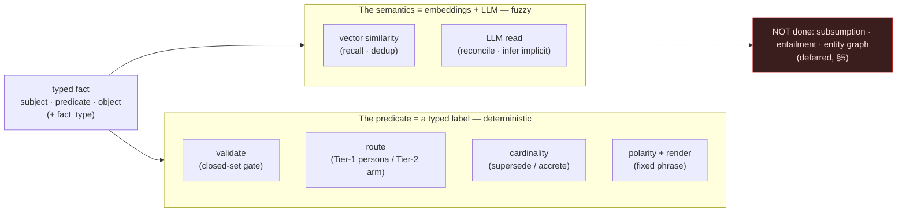

# CobbleCompanion — Ontology Contract & Governance

> **What it is:** the contract governing the companion's structured knowledge — the **fixed core
> types** the system depends on, and the **rules for the dynamic part** that grows as data. Per
> the documentation ownership rules (`AGENTS.md`), this doc owns the contract and its governance
> only; the catalog of leaf types that emerges over time is **data in the database**, never
> enumerated here. Data model/schema → `implementation.md` §1; memory mechanics →
> `companion-memory.md`.

## 1. Purpose & Position

Phase 1 gives the companion a **knowledge overlay**: typed facts extracted from the sources it
reads (`facts` table, `implementation.md` §1). The overlay is what makes semantic memory
*organized knowledge* rather than a search index — it powers entity-based metadata retrieval and
cross-source connection.

The **same typed-fact contract also models the user** (the User-Model workstream,
`development-plan.md` §4c; mechanism `companion-memory.md` §4). The user is a **privileged
entity**: facts whose subject is the user — `prefers`, `livesIn`, `bornOn`, `interestedIn`,
`believes` — are the *same* core types (§2) as facts about a source's entities, drawn from the
*same* ontology. There is **one ontology**, not two. What differs is only the **provenance
substrate** (invariant #1 below): a source-fact points at a verbatim `section`; a user-fact points
at the transcript `message`/`episode` it was learned from. User-facts live in their own
`user_facts` table (a distinct lifecycle — singular identity attributes, accreting beliefs,
editable, decaying — `implementation.md` §1), but share this contract verbatim.

Its position in the architecture is fixed by two invariants:

1. **The substrate is canonical; the overlay indexes it.** The overlay is an index *into* a
   canonical substrate, never a substitute for it. Every fact carries provenance pointing at the
   passage that supports it — a source `section` for a source-fact, a transcript `message` or
   `episode` for a user-fact. A fact that cannot point at its supporting substrate is not stored.
2. **The overlay is rebuildable.** Deleting and re-extracting all facts from their substrate
   (`sources.raw_text` for source-facts, the transcript for user-facts) must lose nothing
   canonical. A wrong fact is a quality bug, not data corruption.

> **How these typed fields are actually *used* downstream — and the deliberate limit on that use
> (the overlay is a controlled vocabulary, **not** a reasoning engine) — is §6.**

## 2. The Fixed Core (closed set)

Every fact has a `fact_type` drawn from a **closed set of core types**. Extraction validates
against this set (`packages/core/src/ingestion/ontology.ts`); a fact with an unknown core type
is dropped and logged, never stored.

| Core type    | Captures                                  | Shape (subject · predicate · object) |
|--------------|-------------------------------------------|--------------------------------------|
| `entity`     | A thing that exists and matters            | entity · — · what it is              |
| `attribute`  | A property of an entity                    | entity · property · value            |
| `relation`   | A connection between two entities          | entity · relation · entity           |
| `event`      | Something that happened                    | actor · action · target/outcome      |
| `definition` | What a term means in this source's context | term · — · meaning                   |

The **user as subject** uses these same types — no new core type is needed: an identity attribute
is an `attribute` (`user · bornOn · 1990`), a stated taste is an `attribute`/`relation`
(`user · prefers · aisle seats`), a connection is a `relation` (`user · worksAs · architect`), a
life event is an `event`. The user is just a privileged, well-known entity that the extractor may
name as a subject; leaf qualifications (a `prefers` that is a *food* vs a *travel* taste) follow
§3 unchanged.

Changing this set is a **contract change**: it requires updating the extraction validation, the
extraction prompt, this document, and consideration of facts already stored under the old set.
Do not add core types casually — most new needs are leaf types (§3).

## 3. The Dynamic Part (leaf types — rules, not a catalog)

Within a core type, extraction may qualify facts with finer-grained **leaf subtypes** (e.g. an
`entity` that is a *dish*, a *place*, a *person*). Rules:

- **Leaf types are data.** They live in fact rows (and future columns/tables), are queried from
  the database, and are never enumerated in documentation. This doc owns only the rules below.
- **Leaf types must refine, never escape, their core type.** A leaf is always a narrowing of
  exactly one of the five core types; anything that doesn't fit a core type is not storable.
- **Proposed bottom-up.** Pass 2 of ingestion (the enricher) may propose leaf qualifications
  from the text; they are accepted as data without contract changes.
- **Promotion is deliberate.** A leaf type only becomes load-bearing (i.e. code depends on it)
  through a contract change reviewed like a core-type change.

## 4. Provenance & Confidence Invariants

- **Every fact records its origin.** A source-fact's `facts.section_id` is non-nullable (the verbatim
  passage). A user-fact carries a **`source`** — `transcript` (learned in conversation; additionally
  pins the turn it came from), `auth_seed` (the name from sign-in), or `user_edit` (the user set it
  directly) (`implementation.md` §1). A fact whose origin cannot be named must not be stored; only a
  `transcript`-sourced fact pins a transcript turn, but every fact knows where it came from.
- **Confidence is advisory.** `confidence` (0–1, extraction self-reported) ranks and filters; it
  never gates storage by itself. For user-facts an explicit statement extracts at high confidence,
  an inferred preference at low — but confidence steers retrieval ranking and decay, never storage.
  **One deliberate exception (Phase 13): sensitive matters.** A low-confidence *inference* about a
  closed set of protected attributes (gender, age, health, religion, sexuality, ethnicity, political
  leaning) is **gated at write** — not persisted unless it clears a higher confidence bar; an explicit
  user statement always passes. Data-minimization for protected attributes outranks the
  "confidence never gates storage" default; a persisted sensitive fact carries a `sensitive` flag
  (`implementation.md` §1, `companion-memory.md` §4).
- **Current-state overlay, not a timeline (user-facts).** Because the user changes, a user-fact is
  **revised by the latest evidence**, not duplicated: a singular attribute (`name`, `bornOn`) upserts; a
  belief whose *same matter* takes a newer state is **replaced** — the new value becomes current and the
  old is dropped. `user_facts` is the semantic-style **"what's true now"** overlay; it is **not** a second
  home for history. The *timeline* of the self ("loved coffee, then quit" — both true across time) lives
  where it belongs, in **episodic memory** (the lossless transcript + consolidated episodes); retrieval
  reads the current overlay, the timeline is recovered from episodic. Reconciliation — `add` /
  `reinforce` / `replace` — is owned by the background reflection pass (`companion-memory.md` §4), not the
  inline writer, so write hygiene lives in one place. *(Phase 12 retained a superseded chain in this
  table; **Phase 13 drops it** — `superseded_at`/`superseded_by` removed — since the timeline is episodic
  memory's job, `development-plan.md` §4c.)* **Forgetting is graceful, not binary:** a Tier-2 belief fades
  as its salience decays and eventually stops surfacing — no delete needed; Tier-1 identity, which does
  **not** decay, is removed only by an explicit user **`deleteFact`** (a true purge for sensitive rows).
  There is **no tombstone** — a forgotten belief the transcript still supports may be re-learned, which is
  natural self-correction, not corruption (`companion-memory.md` §4, `implementation.md` §1).
- **Tenancy.** Source-facts are scoped by `companion_id` and cascade-delete with their companion,
  source, and section. **User-facts are scoped by `user_id`** — they are objective truths about the
  *person*, shared across any companion the user owns, learned *by* a companion (a
  `learned_by_companion_id` that nulls rather than cascades, so the fact outlives the companion). The
  per-companion piece is only the *synthesized* understanding (Tier-3 `user_persona`), not the facts
  (`implementation.md` §1; the truth/understanding split, `companion-memory.md` §4).

## 5. Governance & Evolution

- **Re-extraction is the upgrade path.** Improving the extraction prompt/model re-runs extraction
  over the canonical substrate — Pass 2 over existing sections for source-facts, the transcript for
  user-facts; the overlay is replaced, the canonical layers are untouched.
- **Quality is measured, not assumed.** The eval harness (`companion-memory.md` §5) is the gate
  for extraction changes — grounded recall and hallucination move measurably or the change is
  rejected. User-fact extraction has its own dataset (`user-extract`, `howto-run-evals.md`): an
  extraction prompt change that loses identity attributes or invents preferences fails the gate.
- **Deferred (recorded decisions):**
  - **Entity normalization** — entities are currently denormalized strings in
    `facts.subject`/`facts.object`. A normalized entity table with resolution/dedup is a future,
    additive evolution (it changes retrieval quality, not the contract).
  - **Cross-source relations** — relations whose subject and object come from different sources
    (knowledge-graph linking) build on entity normalization.

## 6. How typed facts are used — and what this overlay is *not*

> **Why this section.** "Typed fact overlay" invites a false expectation — that the system
> performs ontological *reasoning* (subsumption, entailment, graph queries). It does **not**. The
> types are a **controlled vocabulary** that routes, reconciles, and renders facts; the *semantic*
> work is carried by embeddings and the LLM. This section makes that division explicit.

### Two orthogonal typed axes

A fact carries **two** independent typed fields — don't conflate them:

- **`fact_type`** — the coarse **core type** (§2): one of the five closed kinds
  (`entity` … `definition`). Answers *what kind of statement is this?*
- **`predicate`** — the **relation** in `subject · predicate · object`. Answers *what specific
  relationship?* For a source-fact the predicate is proposed bottom-up (§3); for the **user as
  privileged entity** the predicate is itself drawn from a **closed, load-bearing set** — the
  Tier-1 identity predicates and Tier-2 belief predicates (enumerated in code, `@cobble/shared`;
  mechanism `companion-memory.md` §4).

So `user · prefers · aisle seats` is `fact_type = attribute`, `predicate = prefers`. The two axes
are set independently.

### What the predicate does (its jobs)

For the user-model predicates the predicate is **the whole index** — there is no symbolic layer
above it. It does five mechanical jobs, all routing/encoding, none inference:

| Role | What the predicate does | Example |
|---|---|---|
| **Validation tag** | Extraction validates the predicate against the closed set; an unknown one is **dropped and logged**, never stored (`core/src/user-model/extractor.ts`, mirroring core-type validation in `core/src/ingestion/ontology.ts`). | a belief whose attribute ∉ the Tier-2 set is discarded |
| **Tier routing** | The predicate alone decides a user-fact's path: **Tier-1** rides the persona prompt every turn; **Tier-2** goes to the retrieval arm and never the always-on prompt (`core/src/harness/context.ts`). | `livesIn` → persona; `prefers` → belief arm |
| **Cardinality** | Singular vs multi-valued is a property *of the predicate*: singular **supersedes**, multi-valued **accretes** (`MULTI_VALUED_PREDICATES`). | `name` replaces; `languages` accretes |
| **Polarity** | Sentiment rides the predicate, so no extra column is needed. | `prefers` vs `dislikes` |
| **Rendering** | Each predicate maps to a fixed natural-language phrase, used **symmetrically** for the write-side embedding text and the read-side recall line (`core/src/user-model/phrasing.ts`, `core/src/harness/context.ts`). | `interestedIn` → "the user is interested in …" |

### What this is *not* — no reasoning engine

The overlay is a typed vocabulary with **provenance and tenancy invariants** (§4), not a
description-logic or knowledge-graph engine. Concretely, the system does **not**:

- **reason over a type hierarchy** — no subsumption, no leaf-type entailment; a leaf only matters
  when code explicitly depends on it (§3), and then as a branch, not an inference;
- **query the live recall path by predicate** — Tier-2 recall is **embedding similarity + FTS**
  (`searchBeliefs`), not "select facts where predicate = X"; the predicate filters *tier*, not
  *relevance*;
- **resolve entities or traverse a graph** — `subject`/`object` are **denormalized strings**
  matched literally; entity normalization and cross-source relations are explicitly **deferred**
  (§5).

The genuinely *semantic* operations live elsewhere:

- **"is this the same matter?"** (dedup) → **vector similarity** over current beliefs
  (`findSimilarBeliefs`), not a predicate match;
- **"does this supersede that?"** (`add` / `reinforce` / `replace`) → **one LLM reconciliation
  read** (`core/src/user-model/reflector.ts`), not a rule;
- **"what implicit belief does this conversation support?"** → **LLM extraction** over the raw
  transcript, not pattern logic.

The predicate gives these operations a clean, typed surface to *act on*; it never does the
inferring itself. This is deliberate (§3, §5): types stay **data and labels**, so embeddings and
the LLM carry the fuzzy semantics where they outperform symbolic rules, and a predicate becomes
load-bearing only through a reviewed contract change.

