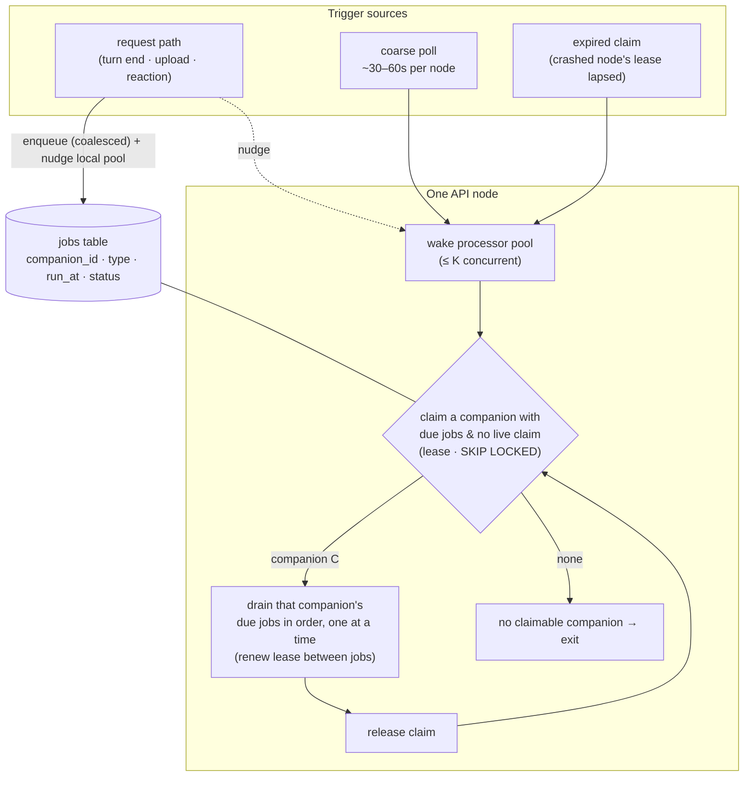

# Deliver: Stateless API & Horizontal Scalability

> **Status:** code-complete for the MVP (single-node). The stateless WS backend
> (D-A→D6 + cleanup) is delivered, green, and runs on one micro instance behind
> Caddy with no infra change. Queue/embodiment observability (Phase **C2**) ships —
> `GET /admin/queue`, admin-gated. Multi-node (D7 NLB, the §6.5 flip, Phase **C1** DB
> connection budget, the Q1 concurrency suite) is **deferred until scale is needed**.
> Working plan, not canonical architecture — fold the durable decisions into
> `docs/architecture.md` §6/§8 and delete superseded parts here when convenient.
>
> ### ▶ Resume here (the whole code side of Phase D is done — only ops remain)
>
> - **Branch:** `feat/ws-embodiment` (stacked on Phase B's `feat/horizontal-scalability`).
>   **PR #23** (based on the Phase B branch) carries all of the below.
> - **Delivered + pushed:** **D-A** (finish Phase B: queue + two-part upload),
>   **D1** (WS transport + handshake auth), **D2** (embodiment claim + fencing +
>   handoff), **D3** (route → WS methods), **D4** (cross-node delivery via
>   `companion_events`, incl. the **visibility-gap guard** — see below), **D5**
>   (presence from the claim), **D6** (web client onto
>   the single WS), and the **final cleanup** (HTTP routes + SSE + in-process bus
>   removed). Each phase has a `✅ DELIVERED` marker in §6. Migrations `0005`–`0008`.
> - **One surface.** The product runs entirely over the WS. The only HTTP routes
>   left are `/auth/config` (public bootstrap, pre-auth), the multipart file upload
>   (`POST /companions/:id/sources/file` — D-A's two-part upload), `/health`, and the
>   SPA static serve. Every test (incl. all seven phase-DoD suites) drives the
>   product over a WS test harness (`packages/api/src/test/ws-client.ts`).
> - **D7 / multi-node: DEFERRED (not needed for the MVP).** Decision 2026-06-17 —
>   the backend runs on **one micro instance** until scale is actually needed. No
>   NLB, no flip. The existing `infra/aws` deploy already serves the WS surface
>   (Caddy `reverse_proxy` upgrades WebSockets transparently; the 10s heartbeat keeps
>   sockets alive) — **no infra change for the MVP.** When scale is needed: NLB (L4)
>   - drain on deploy + the §6.5 flip, plus **Phase C1** (DB connection budget) and
>     the **Q1** real-Postgres concurrency suite first. **Phase C2 (queue/embodiment
>     observability) is DONE** — a read-only `GET /admin/queue` gated behind a
>     `users.is_admin` flag (migration `0009`); see §C below.
> - **WS surface map:** transport in `packages/api/src/ws/` (`register`,
>   `handshake`, `connection`, `dispatch`, `fencing`, `methods.ts`); per-domain
>   methods in `packages/api/src/ws/methods/` (incl. `presence.ts`). Envelope types
>   in `packages/shared` (`Ws*Message`). Web transport singleton in
>   `packages/web/src/api/ws.ts` (`wsClient`, `SupersededError`). Embodiment store +
>   claim-presence in `packages/core/src/embodiment/`; durable event log + bus in
>   `packages/core/src/events/` (the in-process bus is gone — the log is the sole sink).
> - **D4 visibility-gap guard (delivery correctness fix).** `companion_events.seq`
>   is a `bigserial` assigned at INSERT but visible at COMMIT, and commits can land
>   out of `seq` order — so the naïve `seq > cursor` reader could leap past a lower
>   seq that committed late and **drop the event permanently**. Fixed by stamping each
>   row's inserting transaction id (`xid`, migration `0010`) and gating live reads on
>   the visibility horizon: deliver only rows whose `xid <
pg_snapshot_xmin(pg_current_snapshot())`, so any row that could still have an
>   uncommitted predecessor is held back (correct because appends are single-statement
>   autocommit ⇒ `xid` order matches `seq` order). The connect cursor uses
>   `latestSettledSeq` for the same reason. `core/src/events/log.ts`; deterministic
>   guard test in `log.test.ts` (forces `xid` to model in-flight rows).
> - **Embodiment handoff fencing (designed, not yet built).** The WS lease is enforced
>   per-request but **not inside a running turn**, so a superseded connection's agent
>   loop can keep writing (two loops, one companion). Design updated in §5.2 (ULID
>   lease + per-iteration self-check + owner-fenced writes; new connection goes live
>   immediately, no blocking/NOTIFY). Build plan: `docs/plans/embodiment-handoff-fencing.md`.
> - **Known gap (Q1):** the job-queue lease-expiry test is a wall-clock flake on
>   PGlite under full-suite load (passes in isolation); claim/lease/fencing
>   concurrency **and the D4 gap-guard's true cross-commit interleaving** need a
>   real-Postgres/testcontainers suite before trusting at N nodes (PGlite is
>   single-connection, so the gap-guard test simulates the horizon via forced `xid`).
> - **Verification:** all packages typecheck; core 983 + 1 todo green; api 155 green;
>   db 29 green; web 139 green (modulo the Q1 flake).
>   core green modulo that one flake.

## 1. Goal

Run **N ≥ 2 API nodes** that scale horizontally, with **Postgres as the single
source of truth** and **no node holding authoritative state in memory**. A node can
die, deploy, or be added at any time and the system stays correct, because every
node reads from and writes to shared Postgres.

**Connections are the one deliberate exception to "no affinity."** Each client
holds a **permanent WebSocket pinned to one node** — the companion's live
_embodiment_ (§5.2) — so there _is_ connection-level affinity. But it costs no
durable state: a dropped connection re-establishes on **any** node and re-claims
from the DB. Affinity lasts only for the connection's life; authority always lives
in Postgres. (This reverses the earlier "no session affinity" framing — see §5.2
for why the product's one-embodiment-at-a-time rule makes affinity the right call.)

Concretely, "done" means:

1. **State is authoritative only in the DB.** Any node can host any connection and
   run any turn; nothing correctness-critical lives in a single node's heap.
2. **One embodiment per companion, enforced fleet-wide.** Exactly one live
   connection holds a companion at a time; moving rooms is a clean, fenced handoff
   (§5.2).
3. **Background work runs once, not N times**, and never corrupts shared state
   under concurrency (§5.1).
4. **Restart/scale-in is clean.** Killing a node drops its connections (clients
   reconnect + re-claim elsewhere) and releases or lets its in-flight work lapse;
   survivors pick up the slack; no orphaned state.

## 2. What is already stateless (the good news)

The **turn execution path is genuinely stateless by design** — this is invariant
#4/#5 in `docs/architecture.md` §4.7:

- Every turn loads companion identity + transcript from Postgres (Supabase,
  `pgvector`), assembles context, calls the LLM, and writes the result back.
  Nothing persists in process heap between requests.
- The transcript is append-only and the rendered conversation is _a projection
  of the transcript_ — no per-user in-memory session cache a turn depends on.
- All state is scoped by `user`/`companion` in Postgres; authorization is
  enforced at the API boundary.

So `POST /messages` could already be served by any replica today. The blockers
are **not** in the request/response path — they are in shared-state writes, the
background runners, and the realtime channel, enumerated next.

## 3. Problems (current, prioritised)

Two origins bring us here. Some problems **pre-date** the design — they were
always going to break at N nodes (**carried-over**). Others are **introduced by
the job-queue design** in §5 — the cost of adopting it (**design-induced**).

The **#** below is both **priority and recommended build order**. Note that
**build order ≠ release gate**: you cannot serve users from multiple nodes until
every _gate_ item is done, even ones built last.

### 3.1 The prioritised list

| #     | Problem                                                 | Origin         | Gate?                          |
| ----- | ------------------------------------------------------- | -------------- | ------------------------------ |
| **1** | Unsafe concurrent writes (e.g. wallet double-spend)     | carried-over   | ✅ release gate                |
| **2** | Background work runs N times → build the job queue (§5) | carried-over   | ✅ release gate                |
| **3** | Database connection / load budget on Supabase           | design-induced | feasibility — may constrain #2 |
| **4** | Queue observability                                     | design-induced | ops, before prod trust         |
| **5** | Cross-node live updates don't arrive (SSE fan-out)      | carried-over   | ✅ release gate (built last)   |
| **6** | SSE connection lifetime + load-balancer tuning          | carried-over   | config, rides with #5          |

Building #2 also carries its own internal correctness concerns (lease, retry,
graceful drain, turn-vs-background) — see §3.3.

### 3.2 Carried-over problems (detail)

**#1 — Unsafe concurrent writes.**
Read-modify-write code is safe with one process and can race with two. **Verified
update — the case we feared, the vitality/energy wallet, is already safe:** `spend`
is one atomic statement, `GREATEST(0, balance - tokens)` floored at zero
(`vitality-store.ts:103`), so concurrent debits cannot lose an update and the
balance never goes negative. The only residual is soft: the gate (`isEmpty()`) is
a separate read from the spend, so two turns can both pass it and run, driving the
wallet to 0 — an over-run by one turn's worth, never a corruption.

So #1 is a **confirmatory audit, not a known bug.** It splits three ways:

- **Background-only writes** (consolidation cursors, drive-weight nudges, reaction
  rewards, `last_seen_at`): the §5 companion claim already serializes these to one
  writer per companion — **covered by construction**, no change needed.
- **Turn-touched shared rows** (the inline growth high-water mark; any cursor a
  live turn writes): confirm each is a single atomic statement. The fix pattern
  for anything that isn't — the shape the wallet already uses:
  conditional (`… WHERE balance >= $cost`), compare-and-set
  (`SET cursor = $new WHERE cursor < $new`), or monotonic
  (`SET v = GREATEST(v, $new)`).

Making (or confirming) these writes atomic is what lets turns run **lock-free** in
#2 — turns never take the companion claim (the resolved fork in §3.3).

**#2 — Background work runs N times.**
Timers fire the slow background work (memory consolidation, proactivity,
ingestion, reaction learning) every few minutes, and an in-memory `Set` dedups it
_within one process_ (`packages/api/src/index.ts:502–532`,
`consolidation-runner.ts:26`). With N nodes, every node runs the timer and the
per-process dedup is blind to the others → the same work runs N times: N× the LLM
spend, duplicate "the companion reached out" notes, and write races. **The full
fix is the job queue designed in §5**, which also absorbs the node-local upload
queue (`packages/core/src/ingestion/runner.ts`) by making ingestion just another
job type.

**#5 — Cross-node live updates don't arrive.**
The "who's connected" list for live push (SSE) lives in one node's heap
(`InProcessCompanionEventBus`, `packages/core/src/events/bus.ts`). A reply
produced on node B is published to node B's list; a screen connected to node A
never hears it and only updates on refresh — realtime degrades to "refresh to
see it," the exact failure the channel exists to remove. **Design: §5.2** — rather
than patch the bus, the standing SSE channel is replaced by a single per-companion
**WebSocket embodiment**: there is only ever one connection, and its node pulls new
events from the shared DB, so there is no cross-node fan-out left to solve.
Deferred to last by choice, but a hard gate — without it, replies appear to vanish
at N nodes.

**#6 — Live connection vs. load balancer.**
The live connection is long-lived with a server heartbeat
(`packages/api/src/sse.ts:104`). It must survive an idle LB timeout and drain
cleanly on deploy/scale-in. **Design: §5.2** — a permanent WebSocket behind an
NLB, with reconnect-and-re-claim on drop (game UX), so this is connection tuning +
reconnect handling, not data loss. Rides with #5.

### 3.3 Concerns introduced by the job-queue design (§5)

Adopting §5 isn't free. Most of these are handled _inside building #2_; two of
them (#3 and #4 above) are promoted into the prioritised list because they are
independent gates.

- **Lease correctness.** A job outrunning its lease (slow LLM, GC pause) while the
  heartbeat slips lets another node re-claim the companion → the duplicate run the
  queue exists to prevent. A crashed processor's claim is also held until the
  lease lapses, delaying that companion.
- **Retry / poison jobs.** A failing job must retry with backoff _or_ go terminal;
  a permanently-failing job must not spin.
- **Graceful scale-in.** A shutting-down node must release its claims; if draining
  outlasts the deploy grace window, the claim lapses and another node resumes
  mid-work.
- **Turn-vs-background — OPEN DECISION.** The companion claim serializes
  _background_ work only. Does a live turn also take the claim (safe, but
  serializes turns behind slow background work — bad latency), or run claim-free
  and rely on #1's atomic writes? **Lean: claim-free + atomic writes.** Must be
  settled before building #2.
- **Schema + migration.** New `jobs` / `companion_claims` tables, and reconciling
  the existing `ingestion_jobs` table + in-memory runners into the unified model.
- **Accepted limitation (not a bug).** Coarse per-companion claims let a long
  `ingest` block that companion's `consolidate`. Tracked; revisit only if
  profiling shows starvation (split `ingest` into its own claim lane — §5.1.2).

## 4. Non-goals (for this pass)

- Multi-region / geo-distribution.
- Moving CPU-heavy ingestion (PDF parse/embedding) to a separate worker tier —
  related but tracked as its own workstream; here we only need the _queue_ to be
  fleet-coherent, not the _compute_ to be relocated.
- Autoscaling policy/metrics tuning (that follows once correctness holds).

## 5. Solution design

This section captures the **decided** direction, with rationale and the
alternatives we rejected. **Problem 2 is fully designed** below, and it absorbs
the upload sub-problem and narrows Problem 1 (§5.1.7). Problems 5 and 6 (live
updates) are not yet designed (§5.2). Problem 1's audit and Problems 3–4 are
scoped in §3 and resolved during the build.

---

### 5.1 Background work as a Postgres job queue — solves Problem 2

**Decision.** Replace the per-process `setInterval` sweeps + in-memory coalescing
`Set`s (`packages/api/src/index.ts:502–532`, `consolidation-runner.ts:26`, etc.)
with a **durable job queue in Postgres**, drained by **bounded pools of ephemeral
processors running on every node**, which claim work at **companion granularity**
under a **lease**. There is **no leader and no separate worker tier** — the
database _is_ the coordinator.

#### 5.1.1 First principles that drive the design

1. **Nothing here is sub-second latency-sensitive.** Every background job
   (consolidation, proactivity, ingestion, reaction learning) is "the companion
   thinks about what happened, slowly, off the request path." A few seconds — or
   for idle proactivity, a minute — of delay is fine. → A leader buys us nothing
   but a bottleneck and a single point of failure.
2. **The work is naturally partitionable by companion**, and the existing code
   already relies on a **single-writer-per-companion** invariant (enforced today
   by per-process promise chains for affect and a per-process coalescing `Set`).
   → If we make "claim a companion" the unit of mutual exclusion, that invariant
   becomes fleet-wide _for free_, and two ad-hoc in-process mechanisms collapse
   into one DB primitive.
3. **Event-driven triggering handles everything except "act when nothing is
   happening."** Idle-time proactivity is, by definition, the absence of events,
   so it cannot be purely event-driven — it needs a **clock**. That single fact
   (not "polling is bad") decides the trigger mechanism.

#### 5.1.2 The model



**a. Durable job queue.** A `jobs` row is one unit of background work for one
companion. Proposed shape (final field-level model lands in
`docs/implementation.md` when built):

```
jobs (
  id            uuid    primary key
  companion_id  uuid    -- partition / claim key
  type          text    -- 'consolidate' | 'motivation' | 'ingest'
                        -- | 'reaction_learn' | 'affect' | 'user_facts'
  payload       jsonb   -- type-specific (e.g. ingest → source_id)
  run_at        timestamptz  -- earliest eligible time (now() for immediate)
  status        text    -- 'pending' | 'done' | 'failed'
  attempts      int
  last_error    text
  created_at, updated_at  timestamptz
)
```

**b. Companion-granularity leased claim.** A processor claims a _companion_, not a
job. It then drains that companion's due jobs **serially, in `run_at` order**,
renewing the lease between jobs (heartbeat), and releases when the companion has
no more due work. The claim is a leased row (sketch — exact SQL settled at build;
the required _property_ is "exactly one live claim per companion across the
fleet"):

```sql
-- claim representation: companion_claims(companion_id pk, claimed_by, claimed_until)
-- acquire: pick a companion with due work and no live claim, lease it
--   SELECT … FROM jobs JOIN/ANTIJOIN companion_claims
--   WHERE status='pending' AND run_at <= now()
--     AND (claimed_until IS NULL OR claimed_until < now())
--   FOR UPDATE SKIP LOCKED LIMIT 1
--   → upsert companion_claims SET claimed_by=$node, claimed_until=now()+$lease
```

> **Why per-companion and not per-job or per-(companion,type):** claiming the
> whole companion preserves the single-writer-per-companion invariant by
> construction — no two processors ever touch one companion's derived state at
> once, fleet-wide. Per-`(companion,type)` would parallelize a companion's
> independent work but forces a standing **disjointness audit** of every shared
> write (the `companions` row is updated by `consolidate`, `motivation`, _and_
> `reaction_learn`; the `user_facts` + `userFactsThroughSeq` cursor by three
> paths). We accept coarse-grained head-of-line blocking (a long `ingest` delays
> that companion's `consolidate`) because ingest-before-consolidate is the
> _correct_ order anyway and affect is a soft signal. **`ingest` is the
> pre-identified candidate to split into its own claim lane later** if profiling
> shows it starving proactivity — it writes near-disjoint state (sections keyed
> by `source_id`).

**c. Coalescing.** Repeated triggers for the same companion must not pile up
duplicate pending jobs (today's job of the in-memory `Set`). A partial unique
index collapses them:

```sql
CREATE UNIQUE INDEX ON jobs (companion_id, type) WHERE status = 'pending';
-- each trigger upserts:
--   INSERT … ON CONFLICT (companion_id, type) WHERE status='pending'
--   DO UPDATE SET run_at = LEAST(jobs.run_at, EXCLUDED.run_at);
```

Five turns in a minute → **one** pending `consolidate` job (the cursor makes the
single run consolidate everything; the extra triggers are free no-ops).

**d. Triggering = coarse poll + local nudge + claim expiry.** Three mechanisms,
each with a distinct job:

| Mechanism                                   | Purpose                                                                                                                                                                                                      | Cost                                                                                                                              |
| ------------------------------------------- | ------------------------------------------------------------------------------------------------------------------------------------------------------------------------------------------------------------ | --------------------------------------------------------------------------------------------------------------------------------- |
| **Coarse periodic poll** (~30–60s per node) | The **clock** for idle-time work (proactivity). Also the safety net that picks up a future-dated job whose scheduling node died, and anything a launch-read would catch.                                     | One indexed query per node per interval — negligible. SKIP LOCKED means simultaneous polls partition cleanly, no thundering herd. |
| **Immediate local nudge on enqueue**        | The **latency path**: a request that inserts a `run_at = now()` job kicks its own node's pool so interactive-adjacent work (ingestion "reading…" status, post-turn reflection) doesn't wait a poll interval. | One in-process signal.                                                                                                            |
| **Claim expiry (lease)**                    | **Crash recovery**: a node dying mid-drain releases its companion after the lease lapses, and another node re-picks on its next poll/nudge.                                                                  | None beyond the lease column.                                                                                                     |

**e. Bounded ephemeral processor pool per node.** On a nudge or poll, a node
launches **up to K processors**; each claims a _distinct_ companion (SKIP LOCKED),
drains it, and exits when no claimable companion remains. **K is an
instantaneous-concurrency cap, not a cap on companions handled** — with 8
companions queued and K=4, a node runs 4 at a time, and as each finishes a fresh
processor picks up one of the remaining 4 until all 8 are drained. K is sized to
**resource ceilings** (DB connections via the Supabase pooler, the LLM
provider's concurrency/rate limit, box CPU/memory) — **never to companion
population**. The queue depth is unbounded and always fully drained.

#### 5.1.3 Job lifecycle

```mermaid
stateDiagram-v2
  [*] --> pending: enqueue (coalesced)
  pending --> pending: repeat trigger — bump run_at = LEAST(old, new)
  pending --> pending: wallet empty — bump run_at (this is "deferred"; no separate sweeper)
  pending --> done: processed OK
  pending --> failed: terminal error
  done --> [*]
  failed --> [*]
```



> The old **deferred-job sweeper disappears**: a job parked on an empty vitality
> wallet is simply a `pending` job whose `run_at` is pushed forward, re-picked by
> the normal poll once the companion is fed (feeding is a request → nudge).

#### 5.1.4 Mapping the existing background paths onto job types

The 17 async paths inventoried during planning collapse into a handful of job
types (file refs are starting points for the implementer):

| Existing path(s)                                                                                                              | Becomes                                                  | Notes                                                                                                                     |
| ----------------------------------------------------------------------------------------------------------------------------- | -------------------------------------------------------- | ------------------------------------------------------------------------------------------------------------------------- |
| Consolidation sweep + runner + service, and its cascade (personality evolver, user-model reflector, user-persona synthesizer) | job type **`consolidate`**                               | One coarse job; the existing internal cascade + cursors run _inside_ it, so ordering logic we already trust is preserved. |
| Motivation sweep + runner + engine; post-turn & return-detection triggers                                                     | job type **`motivation`**                                | The engine's gate still decides whether to actually act.                                                                  |
| Ingestion runner + deferred-job sweeper                                                                                       | job type **`ingest`**                                    | Absorbs the upload sub-problem (see §5.1.7). `payload` carries `source_id`.                                               |
| Reaction learner + reinforcement-from-delta                                                                                   | job type **`reaction_learn`**                            | `payload` carries the reaction/outcome id; outcome resolution is already an atomic claim.                                 |
| Post-turn affect perception (`harness.ts`, fire-and-forget)                                                                   | job type **`affect`** _(candidate — see open questions)_ | Moving it into the queue replaces the per-process affect promise chain with the fleet-wide companion claim.               |
| Post-turn user-fact capture (`harness.ts`, fire-and-forget)                                                                   | job type **`user_facts`** _(candidate)_                  | Same: replaces the per-user promise chain.                                                                                |
| Post-turn growth recompute (`message.routes.ts`, in-stream)                                                                   | **stays inline** in the turn                             | Token-free, idempotent (monotonic high-water mark), and part of the turn's own SSE response — not background.             |
| `consolidation.request()` / `motivation.request()` triggers                                                                   | **enqueue + nudge**                                      | The fire-and-forget "request" becomes a coalesced insert plus a local pool nudge.                                         |
| Harness background-task tracking + `whenIdle()` (graceful shutdown)                                                           | **pool drain-on-shutdown**                               | `onClose` stops accepting claims and drains the local pool before exit.                                                   |

#### 5.1.5 Decision log

| Decision          | Chosen                                                       | Why                                                                                                                                         | Rejected                                                                                                                                                                                                                |
| ----------------- | ------------------------------------------------------------ | ------------------------------------------------------------------------------------------------------------------------------------------- | ----------------------------------------------------------------------------------------------------------------------------------------------------------------------------------------------------------------------- |
| Coordinator       | Postgres job queue, **no leader**                            | No sub-second SLA; work partitions by companion; the DB is already the source of truth                                                      | **Leader election / separate worker** — serializes all background work through one node: bottleneck + SPOF, doesn't scale the work itself                                                                               |
| Claim granularity | **Per companion**, all types serial                          | Establishes single-writer-per-companion fleet-wide by construction; no disjointness audit needed                                            | **Per-`(companion,type)`** — more parallel but forces a standing shared-write disjointness audit; deferred to a future `ingest`-only split                                                                              |
| Claim primitive   | **Leased claim row**                                         | Pooler-safe; survives multi-second LLM runs; crash-safe via lease expiry                                                                    | **Session advisory locks** — break through Supabase's transaction-mode pooler and need a pinned connection held for the whole run                                                                                       |
| Coalescing        | Partial unique index on `(companion_id, type) WHERE pending` | Collapses repeat triggers to one job; replaces the in-memory `Set`                                                                          | **Insert-per-trigger** — queue clutter + wasted no-op runs                                                                                                                                                              |
| Triggering        | **Coarse poll + local nudge + claim expiry**                 | Idle proactivity needs a clock; a cheap poll _is_ that clock and also covers crash/future-job liveness; nudge gives low latency on activity | **LISTEN/NOTIFY or Redis pub/sub** — extra moving parts, only justified for precise future scheduling we don't need. **Precise in-memory timer** — cross-node visibility gaps when the scheduling node dies during idle |
| Processor count   | **Bounded ephemeral pool, K = concurrency cap**              | Sized to DB-connection + LLM-rate + CPU ceilings; queue depth stays unbounded and fully drained                                             | **One per node** (throughput-bound); **`companions ÷ nodes`** — scales with population (mostly idle) and blows connection + rate-limit ceilings                                                                         |

#### 5.1.6 Tunables (call out at implementation, set by measurement)

- **K** — processor-pool size per node. Start small (~4–8); raise only against an
  observed backlog, capped by connection/rate ceilings.
- **Lease duration + heartbeat interval** — lease must exceed the slowest single
  job's expected runtime with margin; heartbeat renews well inside it.
- **Poll interval** — ~30–60s. Bounds worst-case idle-proactivity latency.
- **`attempts` cap + backoff** — on `failed`, whether to retry (bump `run_at`) or
  go terminal; reuses the "failures are data" posture (`architecture.md` §4.8).

#### 5.1.7 What this resolves elsewhere

- **The upload sub-problem — fully absorbed.** Ingestion becomes the `ingest` job
  type. Fleet-coherent backpressure = count pending `ingest` jobs (not one node's
  in-memory array); the 429 ceiling becomes a fleet property. Crash recovery =
  lease expiry, replacing per-process `failInterruptedJobs()`. "Deferred" = a
  pending job with a pushed-out `run_at`.
- **Problem 1 (concurrent writes) — narrowed, not eliminated.** The companion
  claim _establishes_ single-writer-per-companion for all **queued** work, so the
  background-vs-background races (affect ordering, sweep-vs-sweep) are gone by
  construction. **What remains** (still owned by Problem 1's audit) is concurrency
  the claim does _not_ cover:
  - **Turn-vs-background:** a live turn appends transcript while a `consolidate`
    job reads the tail and advances a cursor. Likely safe (consolidation reads
    only committed rows; cursor advance is atomic) — **confirm**.
  - **Turn-vs-turn quota/vitality debits:** **confirmed atomic** —
    `vitality-store.ts:103` uses `GREATEST(0, balance - tokens)`, so concurrent
    debits can't lose an update (only the soft gate-then-spend over-run remains).
  - **Inline growth recompute** relies on a monotonic high-water mark — confirm
    its writes are atomic/idempotent under concurrent turns.

#### 5.1.8 Open questions for implementation planning

1. **Do `affect` and `user_facts` move into the queue, or stay inline on the
   serving node?** Queue = full single-writer guarantee but a harness refactor;
   inline = simpler but races with a concurrent background claim. **Recommend
   queue**, sequenced as a follow-up once the core queue exists.
2. **Turn-vs-background claim participation** — the open decision in §3.3. Lean:
   turns stay claim-free and rely on Problem 1's atomic writes.
3. **Exact claim SQL form** — claim-row upsert vs. SKIP-LOCKED candidate
   selection vs. a hybrid. Settle at build; the required property is "exactly one
   live claim per companion."

---

### 5.2 Live delivery & connections — the WebSocket embodiment model (solves Problems 5 & 6)

**Decision.** Replace the standing SSE event channel and its in-process bus
(`InProcessCompanionEventBus`, `packages/core/src/events/bus.ts`; route
`packages/api/src/routes/event.routes.ts`) with **one permanent WebSocket per
client that _is_ the companion's live embodiment.** All client↔server traffic —
every request and every event — flows over that single connection. **Connecting
claims the companion exclusively**; background events are delivered by a
**heartbeat-driven read from the shared DB**. This _dissolves_ both problems
instead of patching the fan-out.

#### 5.2.1 First principles

1. **The product already forbids the state P5/P6 fight.** A companion "embodies in
   **one surface at a time**" with **"no split-brain state to reconcile"**
   (`product-overview.md` §2.2). It is a **game, not a web page** — the companion
   _physically lives in one room_. So "many connections per companion" is not a
   case to support; it is a rule to **enforce**.
2. **One embodiment ⇒ one connection ⇒ affinity is free and correct.** With exactly
   one live connection per companion, connection-affinity _is_ companion-affinity.
   There is no cross-node fan-out (P5) because there is nothing to fan out to but
   that single connection, and its own node reads what it needs from shared
   Postgres.
3. **The latency-critical path is unaffected.** The user's own reply streams back
   over the same WS as the turn that produced it (co-located by construction). Only
   _unsolicited_ events (proactive notes, ingestion notes, reactions) come via the
   heartbeat read — and those tolerate seconds by nature, so eventual consistency
   is acceptable for them.

#### 5.2.2 The model

- **Transport.** Every client — web, device, **and service client** (a service
  client uses the _same per-connection mechanism_, not a shared connection) — opens
  one **permanent WebSocket** and sends _all_ requests / receives _all_ events over
  it, behind a **Network Load Balancer (L4)** that pins the TCP flow to one node
  for the connection's life.
- **Connecting claims the companion.** There is **no read-only connection** —
  establishing a connection takes exclusive embodiment. The claim is a DB row:
  `companion_id → owner (ULID) · node · generation · last_heartbeat`.
- **Ownership token = ULID lease.** The connection id is a **ULID**
  (timestamp-prefixed, lexically sortable), stored as the claim row's `owner`, so
  "newer wins" is just a string compare `new > current`. The ULID **is** the lease:
  whoever's ULID is the current `owner` holds the embodiment. (A DB-stamped monotonic
  `generation` rides alongside as a strict-ordering fallback, but the ULID compare is
  the operative rule.)
- **Fencing on the token — three surfaces.** Every path that could let a superseded
  ("zombie") connection act is gated by comparing its held ULID against the current
  `owner` in the DB:
  1. **Per-request** — each companion-scoped method checks `holds(companionId, owner)`
     before acting; a stale connection's new requests are rejected at once.
  2. **Per-agent-loop-iteration (the long-turn fence)** — a turn is not a single
     request; it is a multi-step agent loop that can run for seconds. So **at the top
     of every loop iteration the turn re-reads the lease and self-ends if a newer
     `owner` now holds it.** This is what lets the old connection stand down mid-turn
     without any external signal — it discovers the handoff by reading shared
     Postgres on its own cadence.
  3. **Owner-fenced writes (correctness backstop)** — the loop's state-mutating writes
     are conditional on still holding the lease (`… WHERE owner = $myOwner`), so the
     one step already in flight when the handoff lands cannot commit under a stale
     lease. This is what makes a non-idempotent write (e.g. the `driveWeights` nudge)
     safe even though the per-iteration check is only checked between steps.
- **Handoff = "the companion moves rooms."** A new connection **force-claims**
  (writes its newer ULID) and **goes live immediately** — the claim is a single DB
  upsert, so there is **no blocking, no acknowledgement, and no push/NOTIFY channel**.
  The previous connection **self-ends on its own**: its in-flight loop iteration
  finishes (its write fenced out if the lease already moved), the next iteration's
  lease check sees the newer `owner`, and it pushes `superseded` to its client and
  closes. The client presents this as the companion _physically moving_ to the new
  room — a deliberate, visible action (you cannot be in two rooms at once). The
  overlap is **bounded by one loop iteration** and made harmless by the owner-fenced
  writes; a holder that is *dead* (suspended phone, never runs another iteration) is
  collected by the TTL.
- **TTL = crash backstop only.** `last_heartbeat` + a TTL lets a _dead_ holder be
  reclaimed when it cannot self-fence (e.g. a backgrounded phone whose WS was
  suspended). Because handoff is always the **same user** reclaiming, the new
  connection force-claims immediately and fences the old via the token — it does
  **not** wait out the TTL on the critical path; TTL only garbage-collects. TTL is
  refreshed **on heartbeat, not per request** (no hot-row write amplification).
- **Delivery of background events.** Events produced by background runners on any
  node (§5.1) are written to the DB. The one active connection's node **reads new
  events since a cursor on each heartbeat** and pushes them over the WS — no
  cross-node fan-out, no replay buffer. The DB is the source; the heartbeat is the
  clock.
- **Ambient work never connects.** Cron / proactivity / automations act through the
  **job queue** (§5.1), never as a connection — so they never seize the room from
  the user's live device. Connections are always _interactive_ embodiments; the
  thing that must act without evicting the user is background work, by definition.

Handoff sequence (phone → laptop):

```mermaid
sequenceDiagram
  participant Old as Old conn (phone · node A)
  participant DB as Postgres (claim row)
  participant New as New conn (laptop · node B)

  Note over Old,DB: phone holds companion C (owner ULID₁), mid agent-loop turn
  New->>DB: force-claim C (owner ULID₂ > ULID₁)
  DB-->>New: claimed — you are the embodiment
  New->>New: go live immediately (no wait, no ack)
  Note over Old: current iteration finishes; its write is fenced out (owner ≠ ULID₁)
  Old->>DB: next iteration — re-read lease (owner ULID₁?)
  DB-->>Old: current owner = ULID₂ → you are superseded
  Old->>Old: end turn, push `superseded`, self-close
  Note over New: if phone was already dead (no next iteration), TTL is the backstop
```

#### 5.2.3 Decision log

| Decision           | Chosen                                                     | Why                                                                                                                                                                                                                | Rejected                                                                                                                                                                                                                                                     |
| ------------------ | ---------------------------------------------------------- | ------------------------------------------------------------------------------------------------------------------------------------------------------------------------------------------------------------------ | ------------------------------------------------------------------------------------------------------------------------------------------------------------------------------------------------------------------------------------------------------------ |
| Delivery transport | **One perm WebSocket per client; all traffic over it**     | Product allows one embodiment per companion (`product-overview.md` §2.2); a single connection makes delivery stateless (the node reads shared Postgres) and gives a natural place to serialize a companion's turns | **Client polls a `companion_events` table** — works and is simpler, but enforces no single-embodiment and doesn't serialize turns. **SSE + `LISTEN/NOTIFY`** — fixes fan-out but keeps a fragile push path and never models embodiment (and still leaves P6) |
| Routing            | **NLB (L4), flow-pinned**                                  | A perm WS is one TCP flow; the NLB pins it to a node for its life — exactly the affinity the embodiment needs                                                                                                      | **L7 / ALB** — can't pin an arbitrary app-level key; HTTP-aware overhead a single duplex socket doesn't need                                                                                                                                                 |
| Connect semantics  | **Connecting always claims; no read-only**                 | Simplest rule that matches "one room at a time" — any connection _is_ the embodiment                                                                                                                               | **Passive/observer connections** — an extra mode; a service read would still have to avoid evicting, complicating the rule                                                                                                                                   |
| Handoff            | **Force-claim + new goes live immediately; old self-ends via a per-iteration ULID-lease check**, shown as "moving rooms" | New never blocks (zero handoff latency) and needs no push channel; the old discovers the handoff by re-reading the ULID lease at each agent-loop iteration and stands down. Owner-fenced writes bound the overlap to one in-flight step; TTL collects a dead holder                                                                                 | **Negotiated transfer-ack (block new until old confirms or times out)** — adds handoff latency and needs the old alive to ack (a suspended phone hangs to the timeout); the timeout reopens the overlap anyway, so it still needs the write-fence — all cost, no extra safety. **NOTIFY-driven immediate kill** — prompt, but adds a cross-node push channel that the per-iteration lease check makes unnecessary |
| Ownership token    | **ULID** (DB `generation` if strictness ever needed)       | Sortable + timestamped → "newer wins" and zombie-fencing fall out for free                                                                                                                                         | **Opaque connection id** — unique but unordered; can't fence a revived zombie                                                                                                                                                                                |
| TTL                | **Heartbeat-refreshed; crash backstop only**               | Liveness without per-request write amplification; off the handoff critical path                                                                                                                                    | **Per-request TTL refresh** — hammers one hot row per companion for no added safety                                                                                                                                                                          |
| Service clients    | **Same per-connection mechanism as web/device**            | Uniform — a service client is just another room with its own connection and claim                                                                                                                                  | **Special service path** — only _ambient/automation_ work differs, and that belongs on the **job queue**, not a connection                                                                                                                                   |

#### 5.2.4 What this resolves

- **Problem 5 (cross-node delivery) — dissolved.** Only ever one connection per
  companion, so there is no fleet-wide fan-out. Its node pulls new events from the
  shared DB on the heartbeat; events written on any other node arrive with no
  cross-node push.
- **Problem 6 (connection vs. LB) — becomes ordinary.** A perm WS over an NLB with
  a heartbeat; deploys/scale-in drop connections and clients reconnect + re-claim
  (game UX: a brief "summoning / reconnecting" beat). No data loss — the transcript
  is the source of truth and the new connection loads a snapshot.

#### 5.2.5 Costs & deferred items (the price of all-over-WS)

- **The whole API moves onto WS.** Every REST route becomes a WS message type with
  request/response correlation and concurrent-request multiplexing over the one
  socket (effectively HTTP/2-over-WS), and **file uploads** (`source.routes`,
  multipart today) become binary-frame chunking. This is a large, invasive change —
  the main cost of the model, and why it sequences **after** §5.1.
- **Node failure = full client reconnect.** Losing the embodiment node halts that
  client until it reconnects elsewhere and re-claims; every rolling deploy bounces
  every active embodiment. Acceptable for a game, but the reconnect UX must be
  designed deliberately.
- **Atomic writes still required.** A background job (other node) and the active
  embodiment can write the same companion's rows, so Problem 1's atomic-write
  guarantee still stands — the WS only serializes the _conversational_ path.
- **Handoff overlap is bounded, not zero.** Because the new connection goes live
  immediately and the old self-ends only at its next agent-loop iteration, both can
  be live for **up to one in-flight iteration**. This is acceptable because (a) the
  old's write for that step is owner-fenced out, so it cannot commit under the moved
  lease, and (b) the two stream to _different_ clients (the old is being told it
  moved). A single long step (slow tool / LLM call) widens the window for that step
  only; nothing corrupts.

#### 5.2.6 Tunables

- **Heartbeat interval** — does quadruple duty (liveness, TTL refresh, supersession
  check, background-event read cadence) and sets worst-case unsolicited-event
  latency. Start ~5–15s.
- **Claim TTL** — crash-reclaim backstop; a small multiple of the heartbeat.

## 6. Implementation plan (draft)

> Phases follow the §3 priorities and are each **independently shippable while
> still single-node** — multi-node is only _enabled_ after Phase D and flipped on
> last (§6.5). The questions raised while drafting are **resolved in §7** and their
> decisions are folded into the phases below.

### 6.0 Conventions & grounding (from the code map)

- **Migrations** — Drizzle. Edit `db/src/schema.ts` → `pnpm db:generate` →
  `pnpm db:migrate` (`db/src/migrate.ts`). Config: `db/drizzle.config.ts`.
- **Tests** — real Drizzle over **in-memory PGlite** (`db/src/testing.ts`); API via
  Fastify `inject` + `FakeTokenVerifier` (`packages/api/src/test/helpers.ts`); LLM/
  embeddings faked. ⚠️ **PGlite is single-connection** — it cannot exercise
  `SKIP LOCKED`, lease races, or two-node contention (see Q1).
- **Wiring** — `AppDeps` (`packages/api/src/app.ts:67`) is the dependency bag;
  runners + sweeps + `onClose` are in `packages/api/src/index.ts:108–573`.
- **Already in place** — `messages.seq` (bigserial, indexed `(companionId, seq)`)
  supports cursor polling; `CompanionEventBus` is a clean swap seam; auth is a
  `CompositeVerifier` (Google + service token) usable once at a WS handshake.

### Phase A — Problem 1: atomic-write audit _(release gate, cheap)_

Confirm every per-companion mutation a **turn** performs is a single atomic
statement; convert any that isn't.

- Audit: vitality `spend`/`add` (`vitality-store.ts:94` — **confirmed atomic**);
  cursors (`consolidatedThroughSeq`, `userFactsThroughSeq`, …); `driveWeights`;
  `lastSeenAt`; growth high-water; reaction rewards.
- Convert any read-modify-write → conditional / compare-and-set / monotonic SQL.
- Tests: single-statement atomicity (PGlite ok); true 2-writer race → Q1.
- **DoD:** no turn-path write is read-modify-write; each field documented.

### Phase B — Problem 2: the job queue _(release gate, the bulk)_ — ✅ DELIVERED

**Delivered scope.** The job queue migrates the two `setInterval`-sweep N-times
offenders — **`consolidate` and `motivation`** (companion-keyed, tiny/no payload).
`reaction_learn` and `ingest` were **deliberately deferred** (see "Deferred" below)
because they are per-event work with external payloads, not duplicate-sweep
offenders, and need their own refactors.

- **B1 Schema** (`db/src/schema.ts`, migration `0004_lonely_gorgon`). `jobs`
  (`companion_id, type, dedupe_key, payload jsonb, run_at, status, attempts,
last_error, timestamps`) + partial unique index
  `(companion_id, dedupe_key) WHERE status='pending'` (coalescing). The
  **`dedupe_key`** discriminates per-event work from companion-wide work so
  distinct reactions don't collapse (a refinement over the planned
  `(companion_id, type)`). `companion_claims` (`companion_id pk, owner, generation,
claimed_until`) = the lease. `ingestion_jobs` kept as-is (not generalized — see
  Deferred). DB reset, no data migration (Q6).
- **B2 Core** (`packages/core/src/jobs/`). `DrizzleJobQueue` (coalescing enqueue,
  atomic claim via conditional `ON CONFLICT … WHERE claimed_until < now()`,
  next-due-job, mark done/failed, heartbeat renew, release, due count).
  `JobProcessorPool` (bounded ephemeral drain loops: claim → drain in `run_at`
  order → heartbeat between jobs → release → exit; coarse poll + tracked
  enqueue+nudge). `makeCompanionWorkRequester` adapts it to the `.request(id)`
  interface the routes/sweeps already call.
- **B3 Handlers.** `consolidate` → `ConsolidationService.consolidate`; `motivation`
  → `MotivationEngine.tick` (wired inline in `index.ts`).
- **B4 API wiring** (`index.ts`, `app.ts`, `test/helpers.ts`). The consolidation +
  motivation `setInterval` sweeps now **enqueue** (coalesced, idempotent across
  nodes) instead of poking in-process runners; the pool drains; `onClose` →
  `jobPool.close()`. The `ConsolidationRunner`/`MotivationRunner` classes are kept
  (still unit-tested) but no longer used in production wiring. The
  motivation-sweep `runner` type was relaxed to structural.
- **B5 Tests.** 10 PGlite tests (coalescing, per-event dedupe, exclusive claim,
  lease-expiry reclaim, distinct-companion fan-out, run_at gating, earliest-wins,
  heartbeat ownership, pool drain, failed-job isolation). Full suite green (168
  files / 1491 tests). Concurrent claim races remain a documented gap (Q1).
- **DoD met:** the consolidation + motivation in-process coalescing `Set`s are out
  of the production path; their work flows through the durable queue; single-node
  behavior unchanged.

**Deferred from Phase B → delivered in Phase D D-A:**

- **`reaction_learn`** and **`ingest`** were deferred from the initial Phase B PR and
  are now on the queue (see Phase D **D-A** below). The `driveWeights`-from-reaction
  race is closed; the in-memory `IngestionRunner` is gone.

### Phase C — Problems 3 & 4 _(overlaps B's tail)_

- **C1 DB budget — ⏸️ DEFERRED (with the multi-node flip).** Measure the Supabase
  connection ceiling; route queries through the transaction pooler; size pool/K/N
  with headroom; document. Only meaningful under real multi-node load, so it rides
  with D7.
- **C2 Observability — ✅ DELIVERED.** A read-only `/admin/queue` route returns a
  fleet-wide `QueueMetricsSnapshot` (`packages/core/src/jobs/queue-metrics.ts`,
  `DrizzleQueueMetricsReader`): pending depth total + by type, oldest **due**-pending
  age (the starvation canary), failed total + by type (poison), live job claims +
  the reclaimed (`generation>1`) subset (the failover signal), and live embodiments.
  All derived from shared Postgres (correct at N nodes); ages computed with the DB
  clock (no app↔db skew). A **reclaim** (takeover of a crashed/lapsed holder) is also
  logged at `warn` from `DrizzleJobQueue.tryClaim`. **Access:** gated behind auth
  **and** a new `users.is_admin` flag (migration `0009`) — an ordinary signed-in user
  gets 403, unauthenticated 401. Promote an operator out-of-band via
  `IdentityStore.setAdmin(userId, true)`. The route stays HTTP (not a WS method) so
  ops tooling — `curl`, a monitor, a dashboard scraper — can read it. Tests:
  `packages/core/src/jobs/queue-metrics.test.ts`,
  `packages/api/src/routes/admin.routes.test.ts`.

### Phase D — Problems 5 & 6: WebSocket embodiment _(release gate, the big rewrite)_ — IN PROGRESS

> **Scope.** A large, self-contained effort on its own branch
> (`feat/ws-embodiment`, stacked on Phase B's `feat/horizontal-scalability`): it
> rewrites the _entire_ client↔server transport onto WebSockets (big-bang, Q3),
> rewrites the web client, adds the embodiment claim + fencing + handoff, and adds
> NLB infra. Each sub-phase below is **independently shippable while still
> single-node** and committed separately.
>
> **Build-order note — D-A goes first.** The only Phase-B background path still
> blocked is `ingest` (its payload is file _bytes_, which need the two-part
> upload). `reaction_learn` is **not** blocked by WS at all — it only needs the
> awaitable-learner refactor. And the two-part upload (the D3 carve-out) is fully
> independent of the WS transport. So we pull that work forward as **D-A**, which
> _finishes Phase B_, closes the `driveWeights`-from-reaction race, and ships
> single-node — before any WS work.

**Decisions for this phase (defaults chosen; stated so they can be redirected):**

- **Byte storage for the two-part upload:** a Postgres `upload_staging` table
  (`bytea` + owner + `expires_at` TTL). Cleanest, no new infra, keeps the DB as the
  single source of truth (consistent with the whole design). Object storage (S3) is
  a later optimization, explicitly a non-goal here (§4).
- **Branch / PR:** `feat/ws-embodiment` off `feat/horizontal-scalability`; the
  Phase D PR is **based on the Phase B branch** (stacked) so its diff is clean while
  PR #22 is still open.

#### D-A — Finish Phase B: two-part upload + `ingest` & `reaction_learn` on the queue _(ships single-node)_ — ✅ DELIVERED

**Delivered (commits on `feat/ws-embodiment`).** `reaction_learn` (D-A.1) and `ingest`
(D-A.2) now run as durable, claim-serialised jobs; the in-memory `IngestionRunner`
and the deferred-job sweeper are removed; uploads stage bytes in `upload_staging`
and the `ingest` job reads them on any node. All four background paths
(`consolidate`, `motivation`, `reaction_learn`, `ingest`) flow through the queue.
Backpressure is a fleet-wide pending-`ingest` count; deferred jobs resume via
`sweepIngestion` (handler reads the held parse). Suite green (core 972, api 271).

- **Schema.** `upload_staging` (`id`, `owner_id` → users, `bytes bytea`,
  `byte_size`, `kind`, `expires_at`, `created_at`). Extend `JobType` with `ingest`;
  extend `JobPayload` with `sourceId`, `jobId`, `uploadId` (a _reference_, never
  bytes).
- **Two-part upload.** New stateless HTTP `POST /companions/:id/uploads`
  (multipart, any node, no embodiment): validate magic bytes (reuse
  `source.routes` validation), store bytes in `upload_staging`, return
  `{ uploadId, byteSize, kind }`. The file-source creation then takes an
  `uploadId` (no bytes): create source + `ingestion_jobs` row, enqueue an `ingest`
  job whose payload references the staging row.
- **`ingest` handler.** Fetches the staging bytes (or note/link from the source
  row), builds `IngestionRunParams`, runs the existing `IngestionPipeline.run`,
  deletes the staging row on success. Retires the in-memory `IngestionRunner`
  queue; **backpressure becomes a fleet-wide pending-`ingest` count** (replaces the
  per-process `isFull()` / `IngestionQueueFullError`, still a 429).
- **`reaction_learn` handler.** Refactor `ReactionLearner` to expose an awaitable
  `run(message, emoji)`; the reaction route **enqueues** (`reactionLearnDedupeKey`
  coalesces toggles) instead of fire-and-forget. Handler reconstructs the reactable
  message + runs the learner. Closes the documented `driveWeights`-from-reaction
  race (now claim-serialised like motivation).
- **DoD:** all four background paths (`consolidate`, `motivation`, `ingest`,
  `reaction_learn`) flow through the durable queue; `IngestionRunner` in-memory
  queue gone; single-node behaviour unchanged; suite green.

#### D1 — WS transport & handshake auth — ✅ DELIVERED

- WS endpoint `/ws` (`@fastify/websocket`), authenticated **once at the handshake**
  (`makeWsAuth` reuses the `CompositeVerifier`; bearer via header _or_ `?access_token=`
  for browsers); `userId` fixed for the connection's life. Envelope
  (`packages/shared`): `{id, method, params}` ⇄ `{id, result|error}` plus server-push
  `{event}`. `dispatchMessage` routes by method and is fired without awaiting, so
  requests multiplex concurrently over the one socket. Seed methods `ping` +
  `auth.me`; routes move onto the table in D3. **Additive** — HTTP routes stay
  mounted, so single-node behaviour is unchanged. Tests run against a real listener
  (5 cases); full api suite green (276).

#### D2 — Embodiment claim + fencing + handoff — ✅ DELIVERED

- `active_embodiment` table (`companion_id` pk, owner **ULID**, node, generation,
  `last_heartbeat`) + `EmbodimentStore` (`claim`/`renew`/`holds`/`release`/`current`).
  The handshake resolves + ownership-checks the `?companion=` param; on connect the
  socket **force-claims** with a `monotonicFactory` ULID (newer wins). A server-side
  **heartbeat** (`config.wsHeartbeatMs`) renews while the socket is open; when a
  newer connection takes the room, `renew` returns false → the prior connection
  **self-fences** (pushes `embodiment.superseded`, closes 4002). TTL
  (`config.wsClaimTtlMs`) is the crash backstop; `release` on clean close.
- **Fencing:** `requireEmbodiment` (used by D3's mutating methods) rejects a
  connection that doesn't hold the live claim (`not_embodied`) — a superseded zombie
  can't act. Proven now via the `embodiment.whoami` method.
- **D2′ turn serialization (Q5):** `WsConnection.runSerial` chains a connection's
  turn-producing messages so two agent loops can't run at once (all of a companion's
  turns arrive on one connection — no DB lock). D3's turn method uses it.
- Tests: `EmbodimentStore` unit (6) + WS integration (claim, fencing, handoff = 3).
  api suite green (279).

#### D3 — RPC-over-WS (big-bang, Q3) — ✅ WS METHODS DELIVERED (HTTP removed in final cleanup)

- Every route now has a WS method, organized as per-domain modules in
  `packages/api/src/ws/methods/` (`companions`, `messages`, `reactions`, `memory`,
  `episodes`, `sources`, `usermodel`, `proposals`, `inventory`, `activity`,
  `vitality`, `streaming`) spread into `buildWsMethods`. Companion-scoped methods
  fence on the embodiment binding (`companionOf`) instead of re-resolving ownership;
  per-user methods use `ctx.userId`; params validate with the routes' Zod schemas;
  coded errors (`bad_params`/`conflict`/`not_found`/`over_cap`/`not_embodied`).
- The 4 streaming routes (`messages.send`, `greeting.stream`, `proposals.confirm`,
  plus event delivery → D4) became **server-push chunk sequences** correlated by
  request id (`ctx.emit` → `{id, stream}` frames, terminal `{id, result}`), each run
  through `runSerial` (D2′). Uploads stay the HTTP two-part endpoint (D-A).
- **Strangler:** the HTTP routes + SSE stay mounted in parallel (suite stays green);
  the web client cuts to WS in D6 and the dead HTTP routes + SSE + their tests are
  removed as the **final cleanup**. WS-method tests: read/write/streaming-turn/
  fencing/params (5). api suite green (284).

#### D4 — Delivery via `companion_events` append-log (Q2) — ✅ DELIVERED

- New `companion_events` table (own monotonic `seq`) + `CompanionEventLog`
  (`append`/`readSince`/`latestSeq`). A `DurableCompanionEventBus` wraps the
  in-process bus and is swapped in as the `eventBus` everywhere — so **every existing
  publish point** (`PublishingMemoryStore.appendMessage`, reaction add/remove,
  `react-tool`) now appends to the durable log with **no publish-site changes**, and
  still fans to the in-process bus for same-node SSE through the transition.
- The embodiment heartbeat reads `companion_events` past the connection's cursor
  (initialised to `latestSeq` at connect; the client snapshots via `messages.list`
  for everything before, merging by id) and pushes each as a `companion` WS event —
  **the cross-node delivery fix (Problem 5)**: an event written on any node is read
  from shared Postgres by the holding node, no in-process fan-out to miss.
- **Strangler:** `InProcessCompanionEventBus` + the SSE route stay until the final
  cleanup. Tests: log unit (2) + WS delivery via heartbeat (1). Suites green
  (api 285, core 980).

#### D5 — Presence from the claim (Q7) — ✅ DELIVERED

- The `active_embodiment` row doubles as the presence signal: added `last_activity_at`
  - `tab_visible` columns. `EmbodimentPresenceStore` implements `PresenceStore` over
    it — `get` returns a signal only for a live claim (heartbeat within the TTL) → a
    dropped connection naturally reads absent; `recordActivity`/`recordHeartbeat` bump
    activity/visibility (best-effort). **Fleet-wide:** a turn on one node and a
    motivation tick on another read the same presence from shared Postgres. Production
    wiring swaps `InMemoryPresenceStore` → `EmbodimentPresenceStore`.
- `PresenceStore.get` is now async (DB read); the motivation engine awaits it.
  `InMemoryPresenceStore` stays as the engine's test fake (its `get` is now async
  too). Migration 0008. Tests: claim-backed presence (4) — present/absent/activity/
  TTL-lapse. (The HTTP heartbeat route stays through the strangler; it folds into the
  WS heartbeat at the final cleanup.)

#### D6 — Web client → WS — ✅ DELIVERED

- `packages/web/src/api/ws.ts` is the transport singleton: one WS per embodied
  companion, RPC correlation by id, streaming methods, and the live-event channel.
  `client.ts` keeps every exported signature (so `Chat.tsx` + all components/hooks
  are untouched) and only the multipart file upload stays HTTP (D-A's two-part
  upload). The subscribe → snapshot → merge-by-id flow in `Chat.tsx` is preserved;
  `companion_events` arrive as pushed `companion` events over the WS.
- Reconnect/re-claim UX: a takeover by a newer connection (another tab/device)
  yields the room — the owner stops reconnecting (no claim war) and `Chat.tsx`
  shows a "use here" banner that reclaims and force-claims back (`SupersededError`,
  `onEmbodimentMoved`, `reclaimEmbodiment`).
- Server-side support added: `presence.heartbeat` WS method (records tab visibility
  on the claim, D5; not a motivation trigger), and `auth.me` now returns the email
  (parity with `GET /auth/me`).
- Tests: `client.test.ts` rewritten for the WS transport over a drivable fake
  socket; new WS-method tests for `presence.heartbeat` + `auth.me`. No migration.

#### Final cleanup — remove the HTTP + SSE surface — ✅ DELIVERED

- All tests (incl. the seven phase-DoD acceptance suites) ported onto a WS test
  harness (`packages/api/src/test/ws-client.ts`); the per-route HTTP tests deleted
  (covered by core + WS-method + DoD coverage).
- Deleted the duplicated request/response routes (companion, message, reaction,
  memory, user-model, episode, proposal, inventory, presence, proactivity,
  proactive-activity, growth, usage, greeting) and the SSE event channel
  (`sse.ts` + the standing event route). The turn-running HTTP routes that bypassed
  embodiment serialization went with them.
- Kept the two non-WS routes: `/auth/config` (pre-auth bootstrap) and the multipart
  file upload; reduced `auth.routes`/`source.routes` to just those (moved source
  behaviors re-covered over WS in `source.routes.test`).
- Dropped `InProcessCompanionEventBus` + `CompanionSubscription`; narrowed
  `CompanionEventBus` to a publish-only sink; `DurableCompanionEventBus` appends to
  the log alone. Verification: core 974 + 1 todo, api 152, web 139 green.

#### D7 — NLB infra + flip to multi-node — ⏸️ DEFERRED (not needed for the MVP)

> **Decision (2026-06-17):** the MVP runs the whole backend on **one micro
> instance** — no NLB, no multi-node, until there are enough users to need scale.
> The Phase D code is correct single-node (one embodiment per companion, the
> `companion_events` log, and the job queue all work on one node), and the existing
> `infra/aws` deploy serves the WS surface as-is: **Caddy's `reverse_proxy`
> handles the WebSocket upgrade transparently** (forwards `Upgrade`/`Connection`,
> streams automatically — no config change), and there's no idle reaper that would
> drop an idle socket (the 10s app heartbeat keeps it live regardless). So nothing
> in `infra/` changes for the MVP.
>
> When scale is needed, the below applies — plus **session affinity** (an NLB is L4,
> so a reconnect can land on any node and re-claim from the DB; that's by design,
> §5.2) and the **Q1 real-Postgres concurrency suite** before trusting the flip.

- NLB (L4) in `infra/aws`; idle timeout > heartbeat; drain on deploy. Then §6.5
  flip: set N > 1, run under load, verify single-embodiment + handoff + no duplicate
  background work via the C2 metrics.

- **Phase DoD:** one embodiment per companion enforced fleet-wide; live delivery
  works cross-node; SSE bus + standing channel removed ✅ (the code-side DoD is met;
  the _fleet-wide_ claim is proven once N > 1 runs under load — D7 + Q1's real-PG
  concurrency suite).

### 6.5 Flip to multi-node

Not deployed anywhere and no back-compat required (Q8), so there is **no cutover or
dual-run** — build the cleanest version, reset the DB as needed, then set N > 1,
run under load, watch the C2 metrics, and verify single-embodiment + handoff + no
duplicate background work.

## 7. Decisions from review

All eight questions raised while drafting were resolved on review. One is deferred
as a documented known gap.

| #      | Question                      | **Decision**                                                                                                                                                                                                                                                      |
| ------ | ----------------------------- | ----------------------------------------------------------------------------------------------------------------------------------------------------------------------------------------------------------------------------------------------------------------- |
| **Q1** | Concurrency testing on PGlite | **Deferred — known gap.** No automated concurrency tests now (PGlite is single-connection, can't run `SKIP LOCKED` / lease races / two-node contention); **documented for the future** (real-Postgres / testcontainers suite). Logic stays unit-tested on PGlite. |
| **Q2** | Unified event cursor          | **One `companion_events` append-log** (own monotonic `seq`), written by every publish point; the WS heartbeat reads it by cursor.                                                                                                                                 |
| **Q3** | All-over-WS migration         | **Big-bang — all routes onto WS.** Uploads split in two: a stateless HTTP upload writes a doc record to shared storage; a WS reference message then enqueues the `ingest` job. Binary never crosses the WS.                                                       |
| **Q4** | Three "claims"                | **Separate, never mixed** — embodiment ownership, the job-queue companion-claim, and atomic writes are independent mechanisms with their own rows/semantics.                                                                                                      |
| **Q5** | Turn serialization            | **Yes — in-process per-companion turn chain** on the embodiment node (one connection, one node → no DB lock). Guards against rapid double-send running two agent loops.                                                                                           |
| **Q6** | `ingestion_jobs` migration    | **Generalize into `jobs`; no data migration** — DB is reset from scratch (not deployed).                                                                                                                                                                          |
| **Q7** | Presence in-memory            | **Derive presence from the `active_embodiment` claim** (live claim = present); drop `InMemoryPresenceStore`. Add `last_activity_at` only if a finer idle signal is needed.                                                                                        |
| **Q8** | Cutover / rollout             | **None needed** — not deployed, no back-compat. Build the cleanest version; reset the DB freely.                                                                                                                                                                  |

> **Known gap (Q1):** the queue's claim/lease/fencing concurrency is **not** covered
> by automated tests until a real-Postgres integration suite is added. Track as
> future work before this is trusted under real multi-node production load.

## 8. Phase A — atomic-write audit results

Audit run on review (branch `feat/horizontal-scalability`). **Verdict: the
turn-path is already concurrency-safe; every remaining read-modify-write is on a
background path that Phase B's companion claim serializes.**

### Turn-path (the actual Problem-1 gate) — clean

- **Vitality `spend`/`add`** (`quota/vitality-store.ts:103,124`) — **ATOMIC**
  (`GREATEST`/`LEAST` in SQL). The only per-companion field two concurrent _turns_
  write; safe.
- **Growth high-water** (`growth/growth-store.ts:66`) — **CAS** (guards on the
  bands it read; the loser writes nothing).
- **Proactive-outcome reward** (`motivation/reward-store.ts:201`) — **CAS**
  (`WHERE reward IS NULL RETURNING`).

→ **Phase A's DoD ("no turn-path RMW") is met as-is.** No turn-path conversion needed.

### Background-path RMWs — correctness owned by the Phase B claim

Written only by background paths (consolidation cascade, reflector, synthesizer,
motivation reinforce, reaction learning). Once those run as claim-serialized jobs
(§5.1), one processor touches a companion at a time, so they don't race. Listed
with the cheap hardening that would make each safe _independent_ of the claim:

| Field / site                                                            | Writers                                 | Note                                                                                                                                                                                                                      |
| ----------------------------------------------------------------------- | --------------------------------------- | ------------------------------------------------------------------------------------------------------------------------------------------------------------------------------------------------------------------------- |
| `consolidatedThroughSeq` (`memory/episodic-store.ts:162`)               | consolidation (in txn)                  | monotonic CAS `WHERE seq < $new`                                                                                                                                                                                          |
| `personaUpdatedThroughSeq` + `evolvedPersona` (`identity/store.ts:260`) | evolver                                 | CAS on the cursor                                                                                                                                                                                                         |
| `userFactsThroughSeq` (`identity/store.ts:271`)                         | reflector                               | monotonic CAS                                                                                                                                                                                                             |
| `userModelUpdatedThroughSeq` + `userPersona` (`identity/store.ts:278`)  | synthesizer                             | CAS on the cursor                                                                                                                                                                                                         |
| `driveWeights` jsonb (`identity/store.ts:300`)                          | motivation reinforce, reaction learning | **claim-covered** — the only _critical_ RMW today (lost personality learning under concurrent reactions); atomic-jsonb rewrite is fiddly, so rely on the claim (these become `affect`/`reaction_learn`/`motivation` jobs) |
| `message_reactions.reward` (`reactions/store.ts:148`)                   | reaction learning                       | claim-covered; low risk (companion reactions carry no reward)                                                                                                                                                             |
| belief salience / `recordBelief` (`user-model/store.ts:380,509`)        | reflector, reaction learning            | claim-covered + per-user transaction                                                                                                                                                                                      |

### Accepted last-writer-wins (no fix)

- `lastSeenAt` (`identity/store.ts:289`) — documented intentional LWW
  (`greeter.ts:224`); Phase D single-embodiment makes concurrent arrivals
  impossible anyway.
- `proactivityDial` (`identity/store.ts:293`) — user tuning; LWW is fine.

### Recommendation

- **Cursors:** apply monotonic CAS (`WHERE cursor < $new`) — 1-line each,
  transparent (no caller change; a stale advance becomes a safe no-op), makes the
  monotonic contract explicit and safe regardless of claim correctness. Cheap
  belt-and-suspenders.
- **`driveWeights` / belief / reaction reward:** no code change — correctness is
  delivered by the Phase B companion claim; re-confirm when those become job types.
- **`lastSeenAt` / `proactivityDial`:** accept LWW.

> **Decision point:** apply the cursor CAS hardening now (closing out Phase A), or
> fold all RMW handling into Phase B (where the claim makes it moot and the cursors
> are touched anyway)? See conversation.
